# Yritysasiakkaiden kylmäsähköposti ja laskeutumissivut

**Kolmen kampuksen urheiluopisto – analyysi ja suositukset**

Lopullinen versio 5.10.2026.

---

## 0. Tiivistelmä

### Keskeiset havainnot

- **Kolmen kampuksen urheiluopistolla on yritysmarkkinoilla harvinaisia vahvuuksia, mutta ostaja ei näe niitä.** Seitsemän villaa noin tunnin ajomatkan päässä Helsingistä, liikuntafysiologien tekemät kuntomittaukset, esteetön Pajulahti ja urheiluyhteisön kokouspaikka ovat asioita, joita kokoushotelleilla ei ole. Omilla yrityssivuilla näkyy kuitenkin vain yksi hinta, tarjouspyyntölomakkeessa on 12 kenttää, eikä asiakasarvioihin vastata (luku 2).
- **Yleinen hakukysyntä laskee nopeasti.** Tammi–elokuussa 2026 ”tyky päivä” -hakuja tehtiin 27 % ja ”kokouspaikka”-hakuja 51 % vähemmän kuin vuotta aiemmin. Saapuvaa kysyntää odottamalla urheiluopisto menettää asiakkaita, ja kohdennettu yhteydenotto korvaa sitä (luku 5).
- **Ensin kannattaa kirjoittaa kolmelle ryhmälle:** valtakunnallisille liitoille ja järjestöille (Pajulahti), 50–249 hengen yritysten HR-päälliköille (kuntokartoitus työpaikalla) ja 50–500 hengen yritysten johtoryhmille (Kisakallion villat). Jokainen ryhmä saa oman viestin: HR-päällikkö mitatun hyvinvoinnin, johdon assistentti villan ja lajiliitto kokouksen urheiluyhteisön keskellä (luvut 4 ja 7).
- **Suomalainen päättäjä vastaa lyhyeen ja konkreettiseen viestiin, jonka lähettäjä on nimetty ihminen.** Aiherivillä ovat tilaisuus ja kampus, tekstissä vastaanottajan oma tilanne, lähtöhinta, matka minuutteina ja yksi kysymys. Superlatiivit, luontokliseet ja ”huippu-urheilun opit työelämään” eivät erota, koska kilpailijat käyttävät samoja (luvut 3 ja 6).
- **Kylmäsähköposti on Suomessa sallittu, kun se tehdään oikein.** Nimettyyn työosoitteeseen saa lähettää vain, jos tarjous liittyy vastaanottajan tehtävään, ja peruste kirjataan ennen lähetystä. Viestit lähetetään yksitellen myyjän omasta postilaatikosta pelkkänä tekstinä ja ilman seurantaa. Tarkastelluista organisaatioista 83 % käyttää Microsoft 365:tä, joka merkitsee joukkopostin mainokseksi (luku 9).
- **Jokaisella sarjalla on oma laskeutumissivu.** Sen pääotsikko toistaa viestin tilaisuuden ja kampuksen, ja sivulla ovat sama hinta, sama yhteyshenkilö ja sama toimintakehote kuin viestissä. Tarjouspyyntölomake lyhenee 12 kentästä kahdeksaan, joista viisi on pakollisia (luku 10).
- **Arvonlisävero kerrotaan ostajan mukaan.** Yritysostaja vertailee verottomia hintoja, mutta liitolle, verottomalla alalla toimivalle yritykselle ja edustustilaisuudessa todellinen kustannus on verollinen hinta. Pakettiin kuuluu kaksi verokantaa (13,5 % ja 25,5 %), joten pelkästä ”alv 0 %” -hinnasta ostaja ei voi laskea laskun loppusummaa. Yrityksille näytetään veroton hinta ja verokannat, liitoille verollinen hinta ensin ja tarjouksessa molemmat verokannoittain (luvut 5.4 ja 10.5).
- **Kolme perusparia näyttää, miltä suositukset näyttävät käytännössä** (luvut 11 ja 12): kuntokartoitus työpaikalla, johtoryhmän strategiapäivä Kisakallion villassa ja liittokokous Pajulahdessa. Simuloidut ostajat vastaisivat ensimmäiseen viestiin, mutta eivät pyytäisi tarjousta ennen kuin hinta, omat huoneet, alustavan varauksen ehdot ja etäosallistuminen on vahvistettu [SIM]. Organisaatio on sittemmin vahvistanut Pajulahden hinnat, villan yksityiskäytön ja vastausajan (luku 14.4). Yksitoista lisäparia D–N kattaa muut segmentit ja palveluideat (luvut 11.7 ja 12.6). Kampanjasivut ovat konseptiluonnoksia, eikä niitä julkaista sellaisinaan.
- **Uusista palveluista kärjessä ovat työhyvinvoinnin vuosikumppanuus, johtoryhmän strategiapäivä villassa ja vuotuinen kuntokartoitus sopimuksella.** Kuntokartoitus pilotoidaan ensin, koska se tuo nopeimmin tuloa ja vaatii vähiten rakentamista. Ensimmäisen vuoden tulot ovat perustapauksessa noin 29 000–53 000 € palvelua kohden, joten pilotit ovat vielä oppimista (luku 8).
- **Aloituksen estää kolme asiaa:** Kisakallion ja kuntokartoituksen hinnat arvonlisäveroperusteineen sekä kaikkien hintojen kustannusperuste (Pajulahden hinnat vahvistettiin 5.10.2026), verkkotunnusten todennus ja tietosuojan dokumentointi. Kuntomittausten tulokset ovat terveyttä koskevia tietoja, joten HR-sarja odottaa hyväksyttyä testitietojen käsittelymallia (luvut 13 ja 14).

**90 päivän suunnitelma yhdellä silmäyksellä**

| | Nopea suunnitelma | Oletussuunnitelma |
|---|---|---|
| Päätökset | 26.–30.10.2026 | Viimeistään 13.11.2026 |
| Ensimmäinen viesti | 17.11.2026 | 12.1.2027 |
| Arviointi | 29.1.2027 | 19.3.2027 |

| Sarja | Kenelle | Kampus | Pääviesti |
|---|---|---|---|
| A | HR-päälliköt 80–250 hengen yrityksissä, ensin Uusimaa | Asiakkaan tilat; tyky-päivä Kisakalliossa tai Pajulahdessa | Henkilöstön kuntokartoitus työpaikalla, vapaaehtoisesti ja ryhmätason raportilla |
| B | Johdon assistentit 50–500 hengen yrityksissä | Kisakallio | Koko villa johtoryhmälle noin tunnin päässä Helsingistä |
| C | Lajiliittojen toiminnanjohtajat | Pajulahti | Liittokokous urheiluyhteisön keskellä: auditorio 136 hengelle, esteetön majoitus, juna ja bussi |

Tavoite 90 päivälle on 5–17 ehdotusta ja 1–7 varausta, joiden arvo on noin 25 000–120 000 € [H]. Vielä tärkeämpää ovat ensimmäiset suomalaiset vertailuluvut, joilla tämän raportin oletukset vahvistetaan tai hylätään.

### Suositukset

| Mitä | Kuka | Mihin mennessä |
|---|---|---|
| Nimeä suunnitelman omistaja ja anna hänelle valtuudet päättää hinnoista ja lähettäjien ajankäytöstä | Toimitusjohtaja | 26.10.2026 |
| Päätä Kisakallion ja kuntokartoituksen hinnat ja niiden arvonlisäveroperuste sekä kaikkien hintojen kustannusperuste; nimeä kolme lähettäjää; vastaa luvun 14.4 avoimiin kysymyksiin 1–10 | Yritysmyynnin vastuuhenkilö ja talous | 30.10.2026 |
| Päivitä Pajulahden kevätnosto; lisää DMARC-raportointi kolmekampusta.fi:hin | Verkkosisällöt ja IT | 30.10.2026 |
| Hyväksy kylmäsähköpostin toimintamalli ja testitietojen käsittelymalli | Tietosuojavastaava tai lakimies | 13.11.2026 |
| Rakenna kolme kampanjasivua ja pidä lähtöportin tarkistus | Verkkopalvelut ja yritysmyynnin vastuuhenkilö | 13.11.2026 |
| Aloita ensimmäinen aalto | Kolme lähettäjää | 17.11.2026 (oletussuunnitelmassa 12.1.2027) |
| Päätä kolmannesta aallosta ja palvelujen tuotteistamisesta | Johtoryhmä | 29.1.2027 (oletussuunnitelmassa 19.3.2027) |

Jos viikon 44 päätökset jäävät tekemättä, siirrytään oletussuunnitelmaan perjantaina 30.10.2026.

---

## 1. Tavoite, menetelmät ja lähteiden luotettavuus

### Keskeiset havainnot

- Selvityksen tavoite on kertoa, millä viestinnällä Kolmen kampuksen urheiluopisto voittaa suomalaisia yritys- ja yhteisöasiakkaita kylmäsähköpostilla ja niillä laskeutumissivuilla, joille viestit ohjaavat.
- Analyysi perustuu julkisiin lähteisiin: urheiluopiston omiin sivuihin ja esitteisiin, kilpailijoiden sivuihin, lakeihin ja viranomaisohjeisiin, tilastoihin, hakusanadataan ja asiakasarvioihin. Sisäistä aineistoa, kuten hinnastoja, myyntidataa tai asiakasrekisteriä, ei ollut käytössä.
- Päätösten kannalta tärkeimmät tiedot (11 tietoryhmää) tarkistettiin toiseen kertaan alkuperäislähteestä, ja kolme aukkoa täydennettiin strategiavaiheessa. Loppuarvioinnissa 5.10.2026 kaikki lakia, hintoja, kapasiteetteja ja yhteystietoja koskevat väitteet sekä suositusten taustaluvut tarkistettiin vielä kerran avaamalla lähde uudelleen.
- Heikoin kohta on suomalaisten ostajien käyttäytyminen. Ostopäätösten ajoituksesta, budjeteista ja kylmäsähköpostin vastausprosenteista ei ole julkista suomalaista tutkimustietoa. Nämä kohdat on merkitty hypoteeseiksi ja muutettu toteutuksen testeiksi.
- Strategiaa koeteltiin ennen raportin kirjoittamista simuloidulla ostajapaneelilla ja kriittisellä vertaisarviolla. Paneelin tulokset ovat simuloituja hypoteeseja, eivät tutkimustuloksia.

### 1.1 Tavoite ja rajaus

Raportti vastaa kolmeen kysymykseen:

1. Keille urheiluopiston kannattaa kirjoittaa ensin ja mistä kampuksesta ja tilanteesta?
2. Mitä viestin ja laskeutumissivun pitää sanoa, jotta ostaja pyytää tarjouksen?
3. Miten kylmäsähköposti tehdään Suomessa laillisesti ja niin, että se päätyy perille?

Lisäksi raportti arvioi uusia palveluja, joilla on suuri tuottopotentiaali, ja esittää 90 päivän toteutussuunnitelman. Analyysin kohteena on organisaation yritysmyynti (”Yritykset”). Kuluttajamyynti, ammatillinen koulutus ja vapaan sivistystyön koulutus rajattiin pois. Niitä sivutaan vain, kun ne rajoittavat yritysmyyntiä.

Raportissa urheiluopistosta käytetään sen omaa nimeä Kolmen kampuksen urheiluopisto ja kampuksista nimiä Pajulahti (Nastola, Lahti) ja Kisakallio (Lohja).

### 1.2 Menetelmät

| Vaihe | Mitä tehtiin | Tulos |
|---|---|---|
| Tutkimus | Kymmenen rinnakkaista selvitystä julkisista lähteistä: organisaatio ja saavutettavuus, palveluvalikoima, brändi ja tarjouspyyntöpolku, kilpailijat (urheiluopistot sekä hotellit, kartanot ja ohjelmapalvelut), ostajat ja markkinatilanne, kylmäsähköpostin laki ja toimitettavuus, laskeutumissivut, uudet palvelut | Noin 200 lähdettä, joista keskeiset liitteessä A |
| Hakusana- ja arvioaineisto | 133 hakusanan kuukausivolyymit ja trendit Google Suomesta; 250 uusinta Google-arviota molemmilta kampuksilta ja kilpailijoiden otokset; 30 arviota Booking.comista ja Tripadvisorista | Liitteet B ja C |
| Toimitettavuuskartoitus | 156 suomalaisen organisaation verkkotunnuksen postipalvelin- ja DMARC-tiedot sekä urheiluopiston omat verkkotunnukset | Luku 9 |
| Faktantarkistus | Päätöksille tärkeimmät 11 tietoryhmää luettiin uudelleen alkuperäislähteestä (laki, verotus, hinnat, ajoajat, omistus, huonemäärät, olympiastatus). Loppuarvioinnissa noin 70 lähdettä avattiin vielä kerran, ja yhdeksän kohtaa korjattiin | Ristiriidat ja käyttösäännöt luvussa 14 |
| Strategia-analyysi | Segmenttien, markkinointikulmien ja uusien palvelujen pisteytys painotetuin kriteerein; kampusten sopivuus; viestinnän runko | Luvut 4, 7 ja 8 |
| Simuloitu ostajapaneeli | Viisi tekoälyagenttia esitti tutkimusaineistoon perustuvia suomalaisia ostajapersoonia ja arvioi markkinointikulmat ja palvelukonseptit | Luku 7.4 (simuloitu) |
| Kriittinen vertaisarvio | Erillinen arvioija etsi strategiasta perustelemattomia väitteitä, yhdysvaltalaisia oletuksia, oikeudellisia riskejä ja toteutuskelvottomia ehdotuksia | Korjaukset luvuissa 2–14 |

### 1.3 Merkintäkäytäntö

| Merkintä | Merkitys |
|---|---|
| [V 12] | **Vahvistettu.** Tieto on tarkistettu liitteen A lähteestä 12. |
| [P] | **Päätelty.** Johtopäätös on tehty vahvistetuista tiedoista, ja perustelu kerrotaan tekstissä. |
| [H] | **Hypoteesi.** Oletus, joka testataan toteutuksessa. |
| [SIM] | **Simuloitu.** Tekoälyllä simuloidun ostajapaneelin reaktio. Kertoo, mitä kannattaa testata, ei sitä, mitä ostajat ajattelevat. |
| `[VAHVISTA: …]` | Tieto, joka urheiluopiston on vahvistettava ennen kuin sitä käytetään markkinoinnissa. Esimerkkisivuilla ja -viesteissä merkinnän sisällä on esimerkkiarvo (toimeksiantajan päätös 6.10.2026), joka ei ole urheiluopiston tieto. |
| Vakioteksti + `[VAHVISTA]` | Esimerkkisivuilla B–N tavanomainen malliteksti (esimerkiksi alustavan varauksen ehdot), joka on vahvistettava ennen käyttöä. |

Arviot ja laskelmat on merkitty arvioiksi, ja niiden oletukset kerrotaan samassa kohdassa. Kaikki lähteet on luettu 4.10.2026, ellei toisin mainita.

### 1.4 Lähteiden luotettavuus

| Lähdetyyppi | Esimerkkejä | Luotettavuus | Käyttö raportissa |
|---|---|---|---|
| Lait ja viranomaisohjeet | Finlex, Verohallinto, tietosuojavaltuutettu, Traficom, hankinnat.fi | Korkea | Sitovat säännöt ja käyttöohjeet |
| Tilastot ja tutkimuslaitokset | Tilastokeskus, Työterveyslaitos, Suomen Pankki, VM, ETLA, PTT | Korkea | Markkinan koko ja tilanne |
| Urheiluopiston omat sivut ja esitteet | kolmekampusta.fi, kokousesite 2026 | Korkea faktoissa, ristiriitoja luvuissa | Palvelut ja hinnat; ristiriidat on merkitty |
| Kilpailijoiden sivut | Vierumäki, Eerikkilä, Haikko, Lohja Spa ym. | Korkea hinnoissa sivun päivänä | Hintavertailu ja käytännöt |
| Hakusana- ja arvioaineisto | OpenSEO / DataForSEO, Google-arviot | Keskitaso (arvioidut volyymit, otokset) | Kysyntä, maine |
| Toimittajien kyselyt ja raportit | Cvent, Cendyn, Lyyti, Belkins, Instantly, Epassi | Matala–keskitaso; usein yhdysvaltalaisia tai globaaleja | Suuntaa antavat luvut, aina merkittynä |
| Opinnäytetyöt | Mäkelä 2023 (n = 21), Kemppainen 2024 (n = 11) | Matala otoskoko, mutta suomalainen | Ostajien ääni, ei yleistyksiä |
| Mediajutut | Yle, MTV, Tehy-lehti | Keskitaso | Taustaa ja esimerkkejä |

Ennen vuotta 2024 julkaistut lähteet on merkitty lähdeluetteloon. Niitä on käytetty vain silloin, kun uudempaa ei löytynyt.

### 1.5 Rajoitteet

- **Ei haastatteluja eikä sisäistä dataa.** Urheiluopiston myynti- ja varausdata kertoisi läpimenoajat, ryhmäkoot ja segmenttien osuudet paremmin kuin mikään julkinen lähde. Kysymykset ovat luvussa 14.
- **Ostajakäyttäytymisestä vähän suomalaista tietoa.** Päätösten ajoitus ja budjetit perustuvat osin toimittajien aineistoihin; ne on merkitty hypoteeseiksi.
- **Ei suomalaista kylmäsähköpostin vertailulukua.** Tavoitteet on asetettu oletuksina, ja ne kalibroidaan ensimmäisten noin 300 lähetyksen jälkeen.
- **Hinnat ja kapasiteetit ovat osin ristiriitaisia** urheiluopiston omissa lähteissä. Niitä käytetään vain vahvistettuina tai `[VAHVISTA]`-merkinnällä.
- **Roolit ja järjestelmät on oletettu.** Suosituksissa nimetyt roolit (esimerkiksi yritysmyynnin vastuuhenkilö ja tietosuojavastaava) ja asiakasrekisteri (CRM) ovat ehdotuksia. Julkisista lähteistä löytyi myyntipäälliköt ja avainasiakasvastaavat mutta ei myyntijohtajaa, eikä asiakasrekisterin tai tietosuojavastaavan olemassaoloa voitu tarkistaa. Organisaatio nimeää vastuuhenkilöt viikolla 44 (luku 14).
- **Kärkijärjestykset perustuvat osin simuloituihin pisteisiin.** Markkinointikulmien järjestystä muutettiin simuloidun paneelin perusteella, ja merkittävin muutos testataan oikeilla vastauksilla (luku 13.6).
- **Tämä ei ole oikeudellinen lausunto.** Lakia koskevat kohdat perustuvat lakitekstiin ja viranomaisohjeisiin; tietosuojavastaavan tai lakimiehen on hyväksyttävä toimintamalli ennen lähetyksiä.

### Suositukset

1. **Yritysmyynnin vastuuhenkilö ja markkinointipäällikkö:** käykää luvun 14 vahvistettavat asiat läpi viikolla 44 (26.–30.10.2026) ja nimetkää jokaiselle vastuuhenkilö.
2. **Tietosuojavastaava:** hyväksy luvun 9 toimintamalli (asemavaltuuden kirjaaminen, oikeutetun edun arviointi, tietosuojaselosteen päivitys) ennen ensimmäistä lähetystä.
3. **Myyntitiimi:** kirjaa ensimmäisen aallon jokainen vastaus, vastaväite ja tarjouspyyntö CRM:ään luvun 13 luokittelulla. Niistä syntyy ensimmäinen suomalainen vertailuaineisto, jolla tämän raportin hypoteesit vahvistetaan tai hylätään.

---

## 2. Nykytila yritysasiakkaan silmin: palvelut, kampukset, viestintä ja tarjouspyyntöpolku

### Keskeiset havainnot

- **Yrityksille myydään kahdelta kampukselta, ei kolmelta.** Pajulahti ja Kisakallio myyvät kokouksia, työhyvinvointipäiviä ja majoitusta. Mäkelänrinne ei myy yrityksille mitään; samassa rakennuksessa toimiva Urhea-halli Oy on erillinen yhtiö [V 1, 18, 37].
- **Rakennuspalikat ovat vahvoja ja harvinaisia, mutta niitä myydään yksitellen ja ilman hintaa.** Seitsemän villaa, testauslaboratoriot, Paralympiakomitean valmennuskeskus ja esteetön majoitus ovat asioita, joita kokoushotelleilla ei ole. Omilla yrityssivuilla näkyy kuitenkin vain yksi hinta: Tiimin virkistyspaketti 125 €/hlö [V 3, 4, 12, 33].
- **Pajulahden hinnat ovat edulliset, mutta ne näkyvät vain matkailusivustolla.** Visit Lahti kertoo päivän kokouspaketin hinnaksi alkaen 47 €/hlö ja yöpyvän kokouksen alkaen 127 €/hlö [V 28]. Organisaation omilta sivuilta näitä ei löydy, mutta organisaatio vahvisti 5.10.2026, että hinnat ovat voimassa ja sisältävät arvonlisäveron [V 138].
- **Viestintä on ystävällistä ja luontopainotteista mutta yleistä.** Yrityssivujen noin 4 500 sanassa ”luonto” toistuu 43 kertaa ja ”olympia” kahdesti [V 1–3].
- **Tarjouspyyntöpolku vuotaa.** Lomakkeessa on 12 kenttää, joista 7 pakollisia; mobiilissa upotettu lomake kutistuu noin 190 pikselin levyiseksi; Pajulahden Google-profiilin verkko-osoite pajulahti.com palauttaa virhesivun [V 5, 40].
- **Asiakasarviot ovat hyviä, mutta niihin ei vastata.** Kisakallion Google-arvio on 4,4 ja Pajulahden 4,3. Yhteenkään 250 viimeisimmästä arviosta ei ole vastattu [V 40].
- **Ostajat tuntevat kampusten nimet, eivät uutta organisaationimeä.** Hakuja tehdään kuukaudessa ”pajulahti” 6 600, ”kisakallio” 3 600 ja ”kolmen kampuksen urheiluopisto” 720 kertaa [V 41].

### 2.1 Kampukset yritysasiakkaan näkökulmasta

| | Kisakallio, Lohja | Pajulahti, Nastola (Lahti) |
|---|---|---|
| Ajomatka Helsingin rautatieasemalta | noin 53 min [V 38] | noin 94 min [V 38] |
| Muut ajomatkat | Helsinki-Vantaalta noin 53 min; Turusta noin 83 min [V 38] | Lahden keskustasta noin 21 min; Helsinki-Vantaalta noin 85 min [V 38] |
| Julkinen liikenne | Kampuksen pysäkille kolme vuoroa arkisin (perillä klo 8.04, 14.49 ja 16.14); Helsingistä yli 2 h 15 min [V 39] | Bussi 11 Lahden matkakeskukselta kerran tunnissa, 32–35 min; Helsingistä junalla ja bussilla noin 2 h [V 39] |
| Kokoustilat | Hotelli Omenatarhan kolme kokoustilaa (enintään 50 hlöä teatterimuodossa, avattu 2024); päärakennuksen auditorio (ilmoitettu 100 hlöä 70 m²:n tilaan) `[VAHVISTA: paikkamäärä]`; Rantamakasiini 100 hlöä [V 6] | Auditorio 136 hlöä, 139 m², päivänvalo; ”yli 20 erikokoista luento-, kokous- ja ryhmätyötilaa” [V 6, 7] |
| Villat | 7 villaa; Villa SSO 309 m², 24 hengen kokouspöytä, 10 vuodepaikkaa neljässä makuuhuoneessa (3 × 2 hh ja 1 × 4 hh), ulkoporeallas, anniskeluoikeudet [V 4, 8] | Ei villoja |
| Esteettömyys | Ei kuvattu suunnittelijalle; ”esteetöntä majoitusta” mainitaan kerran [V 2] | ”Kalliopaju-hotelli on täysin esteetön”; kaikki liikuntatilat saavutettavissa; induktiosilmukat [V 19] |
| Testaus ja palautuminen | Polkupyörätestit, joukkuetestit, kuntoilijan testipaketti 105 € [V 12] | Päälaboratorio (esim. suora maksimaalinen hapenottokyky 205 €), korkeanpaikan huoneet, palautumiskeskus [V 12] |
| Ruoka | Kisakallion Syke Oy; yritysten hinnat eivät näy [V 25] | Kanresta Oy (yhteiskunnallinen yritys); työhyvinvointi- ja virkistyspäivän menu 45 €/hlö [V 15, 25] |
| Erityinen asema | Curling-jää ja curlingin arvokilpailut (organisaation oma ilmoitus) [V 26] | Paralympiakomitean virallinen valmennuskeskus [V 33, 10]; organisaatio on Suomen ainoa olympia- ja paralympiavalmennuskeskus (organisaation vahvistus 5.10.2026) [V 138] |

Mäkelänrinteen kampuksella toimii Olympiavalmennuskeskus Helsinki [V 18, 34]. Tämä on käyttökelpoinen todiste osaamisesta, mutta Mäkelänrinne ei ole yritysten tapahtumapaikka. Simuloidussa paneelissa maininta sai ostajat kysymään, voiko tilaisuuden pitää Helsingissä, joten sitä ei käytetä kylmäsähköposteissa eikä kampanjasivuilla [SIM].

### 2.2 Hinnat, jotka ostaja löytää

| Tuote | Hinta | Missä näkyy | Huomio |
|---|---|---|---|
| Tiimin virkistyspaketti (luento, ohjattu aktiviteetti, aamiainen, lounas, kahvi) | 125 €/hlö, vähintään 10 hlöä | Oma Työhyvinvointi-sivu [V 3] | Arvonlisäveron käsittely ja kampus eivät selviä |
| Pajulahti: päivän kokouspaketti | alk. 47 €/hlö | Visit Lahti [V 28] | Ei omilla sivuilla; organisaatio vahvisti 5.10.2026, että hinta on voimassa ja sisältää arvonlisäveron [V 138] |
| Pajulahti: toiminnallinen kokous | alk. 63 €/hlö | Visit Lahti [V 28] | Sama |
| Pajulahti: kokous ja majoitus (2 pv, 1 yö) | alk. 127 €/hlö | Visit Lahti [V 28] | Sama |
| Pajulahti: työhyvinvointi- ja virkistyspäivän menu | 45 €/hlö, vähintään 10 hlöä | Oma tarjoilulista [V 15] | Arvonlisäveron käsittely ei selviä |
| Kisakallio: kahden päivän majoittuva kokous, 30 hlöä | 271 €/hlö sis. alv | Asiakasyhteisön sivuilla oleva esimerkkitarjous 2025 [V 29] | Vanhentunut, alennuskoodilla |
| Luennot | 550–750 €/luento | Oma PDF [V 14] | – |
| Testit | 27–205 €/hlö | Oma hinnasto [V 12] | – |

Verokannat ovat molemmilla kampuksilla samat; ne riippuvat palvelun lajista, eivät kampuksesta (toimeksiantajan tieto 4.10.2026) [V 134]. Majoitus-, ravintola-, ateria- ja liikuntapalvelujen verokanta on 13,5 % ja valmennuksen, opetuksen, testauksen ja elämyspalvelujen 25,5 % [V 87, 88].

### 2.3 Viestintä ja brändi

- **Sävy** on ystävällinen ja lupaa hyvää palvelua, mutta faktoja on vähän. Tyypillinen avaus on ”Pajulahti ja Kisakallio – kokous- ja hyvinvointipalvelut luonnon helmassa” [V 1].
- **Sanasto** on samaa kuin kilpailijoilla: ”luonto” 43, ”monipuoli-” 27, ”elämyksel-” 16, ”täyden palvelun” 8 kertaa. ”Tyky” ei esiinny kertaakaan, vaikka sitä haetaan enemmän kuin ”tyhyä” [V 1–3, 41].
- **Vahvin todiste on käyttämättä.** Olympia- ja paralympiatausta, testauslaboratoriot ja valmentajat näkyvät yrityssivuilla tuskin lainkaan. Hyvinvointikoulun asiakastarinat ja kokousesitteen asiakaslainaus ovat piilossa muualla [V 1–3, 7, 13].
- **Puhuttelu** on käytännössä sinuttelua (”Tutustu”, ”Kerro”) ja organisaatiolle monikon te-muoto (”teidän yrityksellenne”). Tämä vastaa nykyistä suomalaista käytäntöä; korjattavaa on vain johdonmukaisuus samalla sivulla [V 5, 120].
- **Brändi on hajallaan.** Instagramissa @kisakallio-tilillä on 11 000 ja @pajulahti1929-tilillä noin 7 000 seuraajaa, @kolmekampusta-tilillä noin 1 600. Google-profiilit, Booking ja Tripadvisor kulkevat vanhoilla nimillä [V 40, 42, 43].
- **Ristiriidat heikentävät luottamusta**: tapahtumakapasiteetiksi ilmoitetaan 300, 500 tai 2 000 henkeä, huonemääriksi 72 tai 121 ja 136 tai 151 [V 6, 7, 9].

### 2.4 Tarjouspyyntöpolku

| Kohta | Havainto | Vaikutus |
|---|---|---|
| Hakukone | Ei ensimmäisellä tulossivulla yleisillä hauilla (”kokoustilat lohja”, ”tyhy-päivä lohja”, ”virkistyspäivä lahti”); paras sijoitus 10. hakuun ”tyky-päivä lahti”. Kilpailijat ostavat näkyvyyden mainoksilla [V 45] | Saapuva kysyntä menee kilpailijoille |
| Laskeutuminen | Yrityssivun H1 on ”Yritykset”; mobiilissa ensimmäinen toimintakehote noin puolentoista näytön alapuolella [V 1] | Arvolupaus ja hinta puuttuvat ensimmäisestä näkymästä |
| Lomake | 12 kenttää, 7 pakollista (myös puhelinnumero ja kampus); ei budjetti-, kesto- tai joustavuuskenttää; tietosuojaselosteeseen ei ole linkkiä hyväksymiskohdan vieressä; yksi virheilmoitus englanniksi (”This is required.”) [V 5] | Kitka ja epäluottamus |
| Mobiili | Upotettu lomake noin 190 px leveä, kentät noin 175 px; erillisellä lomakesivulla käytettävä [V 5] | Moni mobiilikäyttäjä luovuttaa |
| Seuranta | Kaikki toimintakehotteet vievät samaan lomakkeeseen; piilokentissä ei ole sivua, kampusta tai kampanjaa [V 5] | Liidien lähdettä ei tiedetä ilman evästeitä |
| Vastausaika | ”olemme pian yhteydessä” [V 5] | Ostaja ei tiedä, milloin vastaus tulee |
| Ylläpito | ALE50 (päättyi 30.9.2026) näkyi vielä 5.10.2026 neljällä sivulla, ja se poistettiin samana päivänä; Pajulahden sivulla ”Kevään kokouspäivät varataan nyt” lokakuussa; pajulahti.com palauttaa virhesivun [V 1, 2, 26, 40] | Kertoo ostajalle huonosta ylläpidosta |

### 2.5 Asiakasarviot

| Alusta | Kisakallio | Pajulahti |
|---|---|---|
| Google | 4,4 (noin 285 arviota) | 4,3 (noin 1 330 arviota) |
| Booking.com | 8,3 (186); henkilökunta 8,6; vastine rahalle 7,9 | 7,5 (25); henkilökunta 9,1; vastine rahalle 7,3 |
| Tripadvisor | 3,4 (11), profiili omistamatta | 3,8 (11), profiili omistamatta |

Lähteet: [V 40, 42, 43]. Yksityiskohtainen analyysi on liitteessä C. Markkinoinnissa käytetään kokonaisarvosanoja lukumäärineen ja päivämäärineen, ei parhaita osa-arvosanoja.

Arvioissa kiitetään luontoa, monipuolisia liikuntamahdollisuuksia, ruokaa (erityisesti Pajulahden lounasta), saunaa ja henkilökuntaa. Kritiikki kohdistuu Pajulahden vanhimpiin majoitussiipiin, vastaanoton ruuhkiin ja huoneiden jakamiseen. Yritysvieraiden osuus arvioista on pieni, mutta heidän palautteensa on myönteistä: ”Erittäin hyvä paikka pitää niin yritysten ja muiden organisaatioiden työhyvinvointipäiviä tai kokouksia. Hyvät järjestelyt ja mukava henkilökunta.” (Google, Kisakallio, 2023) [V 40].

### Suositukset

Nämä korjaukset tehdään ennen ensimmäistä kylmäsähköpostia, koska viesti ohjaa vastaanottajan katsomaan juuri näitä sivuja ja profiileja.

| Mitä | Kuka | Mihin mennessä |
|---|---|---|
| Päivitä Pajulahden ”Kevään kokouspäivät” -nosto. Merkitse jatkossa jokaiseen kampanjaan päättymispäivä ja poista kampanja sivuilta samana päivänä (ALE50 poistettiin 5.10.2026) | Verkkosisällöistä vastaava | 30.10.2026 |
| Korjaa pajulahti.com ohjautumaan oikealle sivulle tai vaihda Google-profiilin osoite; päivitä molempien profiilien nimi ja kuvaus | Verkkopalvelut ja markkinointi | 6.11.2026 |
| Vastaa Googlen arvioihin (ensin kaikki yhden ja kahden tähden arviot) ja ota Tripadvisor-profiilit hallintaan | Asiakaspalvelupäällikkö | 13.11.2026, sen jälkeen viikoittain |
| Päätä, mitkä pakettihinnat julkaistaan omilla sivuilla ja millä arvonlisäverokäsittelyllä | Yritysmyynnin vastuuhenkilö ja talous | 6.11.2026 |
| Yhdenmukaista kapasiteetti- ja huonemäärät ja julkaise huonekohtainen kapasiteettitaulukko | Myyntipäälliköt | 13.11.2026 |
| Lisää lomakkeen viereen linkki tietosuojaselosteeseen, korjaa englanninkielinen virheilmoitus ja upotetun lomakkeen mobiiliasettelu | Verkkopalvelut | 13.11.2026 |

---

## 3. Kilpailuympäristö ja asemointi

### Keskeiset havainnot

- **Hintataso on läpinäkyvä, ja ostaja vertailee.** Päiväkokouksen hinnat ovat noin 59–85 €/hlö ja yöpyvän kokouksen noin 174–300 €/hlö. Tyky- ja virkistyspäivien hinnat vaihtelevat 36 eurosta 189 euroon henkeä kohden, ja ne ilmoitetaan eri arvonlisäveroperusteilla [V 47, 53–63, 65].
- **Lähimmät urheiluopistot tuotteistavat paremmin.** Vierumäen yrityssivu alkaa tavoitteesta (”Tilaa sille, mitä pitää saada aikaan.”), sillä on hinnoitellut teemapaketit ja kahdeksan nimettyä asiakasta. Eerikkilä kertoo yritysasiakkaidensa suositteluindeksin (NPS 84) ja lupaa, että ”Koko tapahtuma hoituu meillä yhden ihmisen kautta.” [V 46, 47]
- **”Huippu-urheilun opit työelämään” on jo kilpailijoiden viesti.** Kuortaneen valmennus, Eerikkilän johtajille suunnattu You.-valmennus ja Vierumäen Leijonaluola käyttävät samaa ajatusta [V 46–48]. Kolmen kampuksen urheiluopisto erottuu vain konkreettisilla resursseilla, ei iskulauseella.
- **Luonto ja ”alle tunnin päässä Helsingistä” eivät erota.** Ainakin neljä kilpailijaa lupaa saman ajomatkan, ja luonto on kaikkien mainoksissa [V 45, 53, 63, 64].
- **Esteettömyyttä ja yhdenvertaista osallistumista ei korosta yksikään tarkastelluista kilpailijoiden yrityssivuista.** Pajulahdella on tähän vahvempi näyttö kuin kenelläkään [V 19, 33; P].
- **Hankintakanavat ovat hotelleilla valmiina.** Haikko ja Holiday Club ovat Hanselin puitejärjestelyn toimittajia; Venuu on ensimmäisenä haussa ”tyky-päivä helsinki” [V 53, 56, 66, 45].
- **Ylläpito-ongelmia on muillakin.** Haikossa ja Messilässä näkyy vanhentuneita tarjouksia ja Eerikkilän sivuilla neljä eri lähtöhintaa samalle paketille [V 47, 53, 64]. Sivujen korjaaminen on nopea suhteellinen etu.

### 3.1 Hintavertailu

| Tuote | Alin | Ylin | Esimerkkejä |
|---|---|---|---|
| Puolen päivän kokous | 42 € (EnjoyNature) | 73 € sis. alv (Valo) | Lohja Spa 43 €, Siuntio 49 €, Vierumäki 48 €, Eerikkilä 63 € (72,95 € sis. alv) |
| Päiväkokous | 59 € (Scandic ja Holiday Club, alkaen) | 85 € sis. alv (Valo) | Siuntio 65 €, Vierumäki 65,50 €, Eerikkilä 68 € (78,62 € sis. alv), Lohja Spa 70 €, Wanha Satama 70 € |
| Yöpyvä kokous | 174 € (EnjoyNature) | 300 € (Kytäjä, kartano, vähintään 8 hlöä) | Lohja Spa 180 €, Siuntio 189 €, Valo 200 €, Eerikkilä villa 231 € (265 € sis. alv) |
| Tyky- tai virkistyspäivä | 36 € sis. alv (Harjula, 2 h) | 189 € alv 0 % (Hawkhill) | Haikko 60 € sis. alv (kampanja), Haltia 85–125 € + alv, Kolmen kampuksen urheiluopisto 125 € |
| Pajulahti (vertailun vuoksi) | 47 € päivä | 127 € yöpyvä | Visit Lahti, organisaation vahvistamat 5.10.2026; sis. alv [V 138] |

Lähteet: [V 47, 53–63, 65, 28]. Ellei arvonlisäverosta mainita, kilpailija ei kerro sitä.

### 3.2 Keskeiset kilpailijat

| Kilpailija | Kenen kanssa kilpailee | Vahvuus | Heikkous | Sivun laatu (1–5) [P] |
|---|---|---|---|---|
| Vierumäki (Suomen Urheiluopisto ja Holiday Club) | Pajulahti | Tuloslähtöinen sivu, teemapaketit hintoineen, 8 nimettyä asiakasta, lyhyt lomake | Pitkä sivu; maksullinen puhelinnumero | 4 |
| Eerikkilä | Kisakallio | NPS 84, yksi yhteyshenkilö, hinnat alv 0 % ja sis. alv, villat, You.-johtajavalmennus | Ristiriitaiset lähtöhinnat | 4 |
| Lohja Spa & Resort | Kisakallio | Selkein hintaporras Lohjan seudulla | Ei urheiluosaamista | 4 |
| Hotelli Siuntio | Kisakallio | Edullinen ja yksinkertainen; neljän kentän lomake | Ei näyttöä mittakaavasta | 3 |
| Haikko | Kisakallio | Kartano ja kylpylä, Hansel- ja CaPS-toimittaja | 17 kentän lomake, vanhentunut tarjous | 4 |
| EnjoyNature, Messilä | Pajulahti | Edullisuus (EnjoyNature), kartano ja rinteet (Messilä) | Suppea kapasiteetti, ei hintoja (Messilä) | 3 |
| Harjulan Yrityspalvelut | Pajulahti | Edulliset lyhyet päivät, Epassi ja Edenred käyvät | Suppea sisältö | 4 |
| Haltia, Hawkhill | Kisakallio | Esimerkkipäivät hintoineen | Ei majoituskapasiteettia (Haltia) | 4 |
| Varala, Kuortane, Santasport | Liitot, valmennus | Kokoussaunat (Varala), pitkät valmennusohjelmat (Kuortane, Santasport) | Etäisyys pääkaupunkiseudulta | 3 |
| Venuu ja ohjelmatoimistot | Kanava | Hallitsevat hakutuloksia | Eivät omista tiloja | – |

Lähteet: [V 46–66]. Sivun laatu on kirjoittajan arvio selkeydestä, hinnoista, näytöstä, lomakkeesta ja ajantasaisuudesta.

### 3.3 Missä Kolmen kampuksen urheiluopisto voittaa ja missä häviää

| Voittaa [P] | Häviää nyt [V] |
|---|---|
| Villat noin tunnin päässä Helsingistä (Kisakallio) | Hintojen näkyvyys: useimmat kilpailijat näyttävät lähtöhinnan |
| Kuntomittaus asiakkaan tiloissa tai kampuksella; laboratoriotestit kampuksilla | Tuotteistetut, nimetyt paketit |
| Esteettömyys ja paraurheilu (Pajulahti) | Nimetyt asiakkaat ja mitattu näyttö (NPS, asiakasmäärät) |
| Kaksi kampusta: Lohja ja Lahti | Hakunäkyvyys yleisillä hauilla |
| Liittojen ja urheiluyhteisön luonteva kokouspaikka | Hankintakanavat (Hansel, CaPS, Venuu – tilanne ei tiedossa) |
| Pajulahden hintataso (vahvistettu 5.10.2026) | Ajantasaiset sivut ja vastaukset arvioihin |

### 3.4 Asemointi

Analyysin perusteella suosittelemme seuraavaa asemointia (luvut 4 ja 7 perustelevat valinnan):

> Kolmen kampuksen urheiluopisto on kokous- ja hyvinvointipaikka työyhteisöille, johtoryhmille ja liitoille, jotka haluavat päivästä jäävän käteen muutakin kuin hyvän mielen. Pajulahdessa Lahdessa ja Kisakalliossa Lohjalla kokoukset, ruoka ja majoitus yhdistyvät mittaamiseen, palautumiseen ja ohjelmaan, johon jokainen pääsee mukaan. Teemme samaa työtä joka päivä urheilijoiden kanssa: olemme Suomen ainoa olympia- ja paralympiavalmennuskeskus, ja kuntomittaukset tekevät liikuntafysiologimme.

Asemointiteksti on tarkoitettu tähän raporttiin ja ”Tietoa meistä” -tyyppisiin teksteihin. Asema koskee koko organisaatiota (Olympiavalmennuskeskus Helsinki Mäkelänrinteen kampuksella ja Paralympiakomitean valmennuskeskus Pajulahdessa), joten sitä ei kirjoiteta yksittäisen kampuksen ominaisuudeksi [V 18, 33, 138]. Kampanjasivuilla ja kylmäsähköposteissa Olympiavalmennuskeskus Helsinkiä ei mainita (luku 7.4). Kehon kuntoindeksistä puhutaan kuntomittauksena, ei laboratoriotestinä; laboratoriosta puhutaan vain erikseen hinnoiteltujen laboratoriotestien yhteydessä [P].

Asemoinnilla on kolme viestipilaria:

1. **Valmennuskeskuksen menetelmät:** mittaaminen, palautuminen ja valmennus – päivä, josta jää käteen tuloksia.
2. **Kaikki pääsevät mukaan:** esteettömyys, eritasoiset aktiviteetit ja paraurheilu.
3. **Valmis ja selkeä:** valmiiksi suunniteltu ohjelma, näkyvä hinta ja nopea vastaus.

Luonto ja sijainti ovat taustaa, eivät pääviesti.

### Suositukset

1. **Yritysmyynnin vastuuhenkilö:** julkaise Pajulahden vahvistetut lähtöhinnat (47 / 63 / 127 €/hlö) omilla sivuilla 13.11.2026 mennessä ja päätä Kisakallion lähtöhinnat viikolla 44. Ilman hintaa urheiluopisto ei pääse ostajan vertailuun (luku 10).
2. **Markkinointipäällikkö:** ota käyttöön kolme viestipilaria kaikessa yritysviestinnässä marraskuusta alkaen. Älä aloita viestejä luonnolla tai ajomatkalla.
3. **Yritysmyynnin vastuuhenkilö:** selvitä tammikuussa 2027 Hanselin ja CaPSin seuraavat kilpailutusikkunat ja Venuu-näkyvyyden ehdot (luku 13).
4. **Myyntipäälliköt:** pyydä kolmelta tyytyväiseltä yritysasiakkaalta kirjallinen lupa asiakaslainaukseen 31.1.2027 mennessä ja aloita yritysasiakkaiden suositteluindeksin mittaus ensimmäisen aallon tilaisuuksista marraskuussa 2026. Nimetty näyttö on kilpailijoiden suurin etumatka.

---

## 4. Suomalaiset B2B-ostajat: segmentit, ostajapersoonat ja ostoprosessi

### Keskeiset havainnot

- **Kolme segmenttiä nousee ensisijaisiksi:** valtakunnalliset liitot ja järjestöt (pisteet 3,95 / 5), keskisuuret yritykset, joissa on 50–249 henkeä (3,90), sekä yritysten johtoryhmät (3,65). Mitattavaa hyvinvointia ostavat HR-päättäjät (3,55) tavoitetaan parhaiten keskisuurten yritysten kautta [P].
- **Markkina on lähellä kampuksia.** Kuudessa ydinmaakunnassa on 17 653 vähintään kymmenen hengen toimipaikkaa, mikä on 61 % koko maan määrästä. Uudellamaalla niitä on 9 702 [V 97].
- **Ostoryhmä muuttuu organisaation koon mukaan.** Pienessä yrityksessä toimitusjohtaja päättää ja usein myös varaa. Keskisuuressa yrityksessä varaaja (assistentti tai toimistopäällikkö) hoitaa käytännön, ja HR tai toimitusjohtaja omistaa budjetin ja perustelun. Suurissa organisaatioissa yksiköt ostavat omalla kustannuspaikallaan [P; V 104].
- **Raha on työnantajan omaa.** Kela ei korvaa virkistystoimintaa [V 93]. Julkisen sektorin virkistysbudjetit ovat 20–50 euroa henkeä kohden vuodessa, mutta koulutus- ja kehittämisbudjetit ovat erikseen [V 103, 104].
- **Liitot ovat luonteva ja lähes kilpailematon segmentti.** Kohdealueilla on 60 772 rekisteröityä yhdistystä, ja lajiliitot pitävät liittokokouksiaan urheiluopistoilla [V 98, 119]. Kukaan tarkastelluista kilpailijoista ei markkinoi niille omalla sivullaan [V 46–71; P].
- **Ostopäätösten ajoituksesta ja budjeteista ei ole suomalaista tutkimustietoa.** Ajoitukset perustuvat päätelmiin ja toimittajien aineistoihin, ja ne testataan toteutuksessa [H].

### 4.1 Markkinan koko

| Maakunta | Toimipaikat, 10–49 hlöä | 50–199 hlöä | 200+ hlöä | Yhteensä ≥ 10 hlöä |
|---|---|---|---|---|
| Uusimaa | 7 972 | 1 405 | 325 | 9 702 |
| Varsinais-Suomi | 2 245 | 308 | 34 | 2 587 |
| Pirkanmaa | 2 361 | 382 | 57 | 2 800 |
| Kanta-Häme | 693 | 84 | 11 | 788 |
| Päijät-Häme | 872 | 121 | 18 | 1 011 |
| Kymenlaakso | 672 | 85 | 8 | 765 |
| **Kuusi maakuntaa** | **14 815** | **2 385** | **453** | **17 653** |

Lähde: Tilastokeskus, toimipaikat 2024 [V 97]. Toimipaikka ei ole sama kuin yritys; vähintään kymmenen hengen yrityksiä on alueella arviolta 11 000–13 500 [P: toimipaikkojen osuus sovellettuna yritysmääriin].

Muut kohderyhmät:
- **Julkinen sektori:** 103 kuntaa, yhdeksän hyvinvointialuetta ja Helsinki ydinalueilla [V 97].
- **Järjestöt:** 13 848 palkattua henkilöstöä työllistävää voittoa tavoittelematonta yhteisöä koko maassa; Olympiakomitealla on 90 varsinaista jäsentä [V 97, 98].

### 4.2 Segmenttien pisteytys

Segmentit pisteytettiin kahdeksalla painotetulla kriteerillä asteikolla 1–5:

| Kriteeri | Paino |
|---|---|
| Sopivuus urheiluopiston vahvuuksiin kampuksittain | 20 % |
| Kaupan arvo | 15 % |
| Tavoitettavuus kylmäsähköpostilla (tiedot saatavilla, asemavaltuus selvä) | 15 % |
| Ostotiheys | 10 % |
| Volyymi kuudessa maakunnassa | 10 % |
| Kilpailun vähäisyys | 10 % |
| Ajoitus ensimmäiseen lähetysikkunaan (marras 2026 – helmi 2027) | 10 % |
| Näytön varmuus | 10 % |

| Segmentti | Pisteet | Luokka | Kotikampus | Perustelu lyhyesti |
|---|---|---|---|---|
| S5 Valtakunnalliset liitot ja järjestöt | **3,95** | Ensisijainen | Pajulahti | Paras sopivuus (auditorio 136, esteetön majoitus, juna- ja bussiyhteys, urheiluyhteisö) ja selvin tavoitettavuus; liittokokoukset ovat isoja ja toistuvia |
| S2 Keskisuuret yritykset 50–249 hlöä | **3,90** | Ensisijainen | Maantieteen mukaan | Ryhmäkoko sopii tiloihin; useita tilaisuuksia vuodessa; päätökset tehdään juuri ensimmäisen aallon aikana |
| S4 Johtoryhmät, yritykset 50–500 hlöä | **3,65** | Ensisijainen | Kisakallio | Seitsemän villaa noin tunnin päässä Helsingistä; vain harvalla kilpailijalla vastaava |
| S8 Mitattavan hyvinvoinnin ostajat (HR) | 3,55 | Toissijainen, toteutetaan S2:n sisällä | Pajulahti tai asiakkaan tilat | Testaus on valmis tuote, mutta ehdottamallamme 45–55 euron testihinnalla [H] 150 hengen asiakkaan vuosiarvo on vain noin 5 000 € ilman lisäpalveluja; luokka on alustava |
| S7 Päijät-Hämeen ja Kymenlaakson työnantajat | 3,50 | Toissijainen | Pajulahti | 20 minuuttia Lahdesta, mutta pienet kaupat, halvat paikalliset kilpailijat ja vain noin 230 vähintään 50 hengen toimipaikkaa |
| S1 Pienet yritykset 10–49 hlöä | 3,40 | Toissijainen | Kisakallio | Suuri volyymi, mutta pienet kaupat ja kovin kilpailu |
| S9 Tapahtumatoimistot | 3,25 | Toissijainen kanava | Molemmat | Vaatii nettohinnaston ja kapasiteettitiedot |
| S6 Julkinen sektori ja korkeakoulut: koulutus- ja kehittämispäivät | 3,10 | Toissijainen, pilotti | Pajulahti | Hintataso sopii, mutta hankintasäännöt ja julkisuusriski |
| S3 Suurten organisaatioiden tiimit | 2,95 | Ei nyt | Molemmat | Tiiminvetäjiä vaikea tunnistaa; toimittajarajoitukset |
| S10 Pohjoismaiset ja eurooppalaiset ryhmät | 2,50 | Ei nyt | Pajulahti | Englanninkieliset yrityssivut puuttuvat |

Järjestys pysyy samana, kun kaikki kriteerit painotetaan tasan. Jos Pajulahden hintoja ei voida julkaista, liitot pysyvät ensisijaisina (3,75), mutta julkinen sektori putoaa pois ensi vaiheesta (2,90) [P]. Täysi laskelma on työtiedostossa `work/strategy/segments.md`.

**Korjaus analyysin aikana:** mitattavan hyvinvoinnin ostajat pisteytettiin ensin ensisijaisiksi (3,70). Palveluanalyysi osoitti, että pelkän testauksen vuosiarvo 150 hengen asiakkaalle on noin 5 000 € (90 mitattua × 50 € + palautetilaisuus; 50 € on oma hintaehdotuksemme [H]), joten kaupan arvo laskettiin ja segmentti siirtyi toissijaiseksi [P; luku 8].

**Rajaus:** ruotsinkieliset ostajat (kaksikieliset kunnat Kisakallion lähialueella ja Helsingissä toimivat suomenruotsalaiset järjestöt) jäävät 90 päivän suunnitelman ulkopuolelle. Ruotsinkielisiin vastauksiin vastataan ruotsiksi, jos myynti pystyy, ja organisaatiolta kysytään, palveleeko se yritysasiakkaita ruotsiksi (luku 14).

### 4.3 Ostoryhmä ja ostoprosessi

| Koko | Käynnistää | Päättää budjetista | Varaa ja vertailee | Tyypilliset tilaisuudet |
|---|---|---|---|---|
| 1–9 hlöä | Omistaja | Omistaja | Omistaja | Strategiapäivä, pieni tiimipäivä |
| 10–49 hlöä | Toimitusjohtaja, johtoryhmä | Toimitusjohtaja | Assistentti tai toimistopäällikkö | Kick-off, strategiapäivä, virkistyspäivä, pikkujoulut |
| 50–249 hlöä | HR, johtoryhmä, työsuojelutoimikunta | HR-päällikkö tai toimitusjohtaja | HR-assistentti, toimistopäällikkö, johdon assistentti | Edellisten lisäksi koulutuspäivät, asiakastilaisuudet, hyvinvointiohjelmat |
| 250+ hlöä | Yksiköiden esihenkilöt, HR, markkinointi | Kustannuspaikan omistaja; hankinta puitesopimuksista | Tiimiassistentti, tapahtumakoordinaattori, toimisto | Tiimipäivät, osastojen kick-offit, johdon strategiapäivät, asiakastilaisuudet |

Lähteet: [V 104; P]. Vähintään 20 työntekijän työpaikalla on oltava työsuojelutoimikunta, ja yhteistoimintalaki koskee 1.7.2025 alkaen pääosin vähintään 50 hengen yrityksiä [V 135, 136].

**Mitä ostaja tarvitsee ennen tarjouspyyntöä:**
- Varaaja: valmis paketti lähtöhintoineen, kapasiteetti, esimerkkiaikataulu, matka-aika ja kuljetus, erikoisruokavaliot ja nopea vastaus. Kansainvälisessä kyselyssä alle 50 hengen tilaisuuksien suunnittelijoista 63 % vaatii vastauksen neljässä päivässä, ja heistä 39 % hylkää paikan, joka ei vastaa kahdessa päivässä [V 129, T].
- Budjetin omistaja: perustelu johdolle, sisältö, joka sopii kaikille, mitattavuus ja tietosuoja [P; V 105].
- Julkinen ostaja: oppimistavoitteet, kokonaishinta ilman arvonlisäveroa, verkkolasku ja tieto puitesopimuksista [P].
- Liitto: hinta jäsentä kohden täysihoidolla, auditorion koko, etäosallistuminen, esteettömyys sekä juna- ja bussiyhteys [P; V 119].

### 4.4 Ostajapersoonat

Kuusi persoonaa kattaa ensisijaiset segmentit, mitattavan hyvinvoinnin tarjouksen ja julkisen sektorin pilotin. Nimet ovat kuvitteellisia, ja persoonat ovat näyttöön perustuvia luonnoksia. Täydet kortit ovat liitteessä D.

| Persoona | Segmentti | Tehtävä | Mikä saa vastaamaan [H] |
|---|---|---|---|
| P1 Henna, HR-päällikkö, 80–250 hlöä | S2, S8 | Osoittaa johdolle ja henkilöstölle, että hyvinvointiin panostetaan uskottavasti eikä näennäisesti | Tunnistettu ongelma omin sanoin, valmis esimerkki ja vapaaehtoisuus sekä tietosuoja kerrottuna |
| P2 Mikko, toimistopäällikkö tai assistentti | S2 | Järjestää päivän, joka toimii, ilman että siitä tulee toinen työ | Valmis paketti hintoineen, päivämääräikkuna ja tarjous lähettää valmis ehdotus |
| P3 Laura, johdon assistentti, 100–500 hlöä | S4 | Löytää yksityisen paikan noin tunnin päästä Helsingistä ja varmistaa, että kaikki sujuu | Saatavuus, valmis 24 tunnin ohjelma, hintahaarukka ja nimetty yhteyshenkilö |
| P4 Jari, alle 50 hengen yrityksen toimitusjohtaja | S1, S4, S7 | Viedä tiimi tai johtoryhmä pois toimistolta ilman turhaa rahaa tai aikaa | Lyhyt viesti nimetyltä ihmiseltä, kokonaishinta ja kyllä/ei-kysymys |
| P5 Satu, liiton toiminnanjohtaja | S5 | Pitää liittokokous tai koulutusviikonloppu jäsenten hyväksymällä hinnalla ja ilman järjestelyongelmia | Viesti 9–12 kuukautta ennen kokousta ja tarjous varata päivä alustavasti |
| P6 Petri, hyvinvointialueen kehittämispäällikkö | S6 | Järjestää kehittämispäivä, jonka voi perustella veronmaksajille | Alan tilanne kerrottuna asiallisesti, oppimistavoitteet ja läpinäkyvä hinta talousarvion hyväksymisen jälkeen |

**Simuloitu ostajapaneeli [SIM].** Viisi tekoälyagenttia esitti persoonia P1, P3, P4, P5 ja P6 ja arvioi kahdeksan markkinointikulmaa ja kolme palvelukonseptia. Jokainen persoona valitsi juuri sille kirjoitetun kulman ja ohitti yleiset kulmat, ja jokainen kysyi ensimmäisenä hintaa. Paneeli paljasti myös neljä tarkistettavaa virhettä, jotka korjattiin (luku 7.4). Paneelin tulokset ovat hypoteeseja, eivät tutkimustuloksia. Paneelin johdon assistentti edusti noin 1 500 hengen pörssiyhtiötä ja pk-yrityksen toimitusjohtaja 40 hengen yritystä. Siksi johdon assistentin tilahavainnot (yksityisyys, makuuhuoneet, hintahaarukka, päivämäärät) koskevat johtoryhmäsegmenttiä mutta hankintahuomiot eivät, ja toimitusjohtajan arviot koskevat pieniä ja paikallisia yrityksiä eivätkä keskisuuria.

### 4.5 Ostopäätösten ajoitus ja budjetit

| Asia | Mitä tiedetään | Varmuus |
|---|---|---|
| Kick-offien päätökset | Tehdään marras–tammikuussa | [P] |
| Kevään tyky- ja virkistyspäivät | Päätetään loka–tammikuussa | [H] |
| Pikkujoulut | Varataan touko–syyskuussa; toimittajien mukaan yli 20 hengen ryhmät jopa 6–8 kuukautta etukäteen | [H; V 107, T] |
| Liittokokoukset | Päätetään noin 9–12 kuukautta etukäteen | [H] |
| Julkisen sektorin talousarvio | Hyväksyttävä vuoden loppuun mennessä seuraavalle vuodelle | [V 96] |
| Yritysten budjetit henkeä kohden | Vain toimittajien väitteitä (70–200 €/hlö) | [H; V 107, T] |
| Julkisen sektorin virkistysbudjetit | 20–50 €/hlö/v; esimerkkikunnassa 25 € todettiin niukaksi | [V 103, 104] |
| Tilaisuuksien koko | Pohjoismaisessa aineistossa 84 % tilaisuuksista alle 50 ja 92 % alle 100 osallistujan | [V 107, T] |

### Suositukset

1. **Yritysmyynnin vastuuhenkilö:** keskity ensimmäisessä aallossa (17.11.–17.12.2026) kolmeen ensisijaiseen segmenttiin: liitot (Pajulahti), keskisuurten yritysten HR (kuntokartoitus työpaikalla; ensin pääkaupunkiseutu ja Länsi-Uusimaa, Lahden seudulta enintään noin 40 yritystä) ja johtoryhmät (Kisakallion villat). Noin 100 yhteystietoa kuhunkin. HR-sarja lähtee vain, jos testitietojen käsittelymalli on hyväksytty 13.11.2026 mennessä; muuten se siirtyy toiseen aaltoon.
2. **Myyntitiimi:** kirjoita ensimmäisestä aallosta (17.11.2026) alkaen budjetin omistajalle ja varaajalle eri viestit. Älä lähetä samaa viestiä kahdelle saman organisaation henkilölle.
3. **Yritysmyynnin vastuuhenkilö:** aloita julkisen sektorin pilotti tammikuussa 2027 talousarvioiden hyväksymisen jälkeen, vain Pajulahdesta ja koulutus- tai kehittämispäivänä.
4. **Myynti ja CRM:n vastuuhenkilö:** kirjaa 2.11.2026 alkaen jokaisesta varauksesta segmentti, läpimenoaika, ryhmäkoko ja hinta henkeä kohden. Puolen vuoden kuluttua (toukokuussa 2027) tämän luvun hypoteesit voidaan korvata omalla datalla.

---

## 5. Markkinatilanne ja ostomotiivit 2026–2027

### Keskeiset havainnot

- **Kysyntä on tasaista, ei kasvavaa.** Ennusteiden mukaan bruttokansantuote kasvaa vuonna 2026 1,4–1,7 % ja vuonna 2027 1,5–1,9 %, mutta kotitaloudet kuluttavat yhä varovasti: PTT:n ennusteessa yksityinen kulutus kasvaa vain 0,8 % ja 0,7 %. Matkailu- ja ravintola-alan suhdannesaldo oli heinäkuussa 2026 –44 [V 109–113].
- **Yleisten hakujen määrä laskee nopeasti.** Tammi–elokuussa 2026 haettiin ”tyky päivä” 27 %, ”virkistyspäivä” 29 % ja ”kokouspaikka” 51 % vähemmän kuin vuotta aiemmin [V 41]. Odottamalla saapuvaa kysyntää urheiluopisto menettää asiakkaita.
- **Työelämän tilanne puoltaa hyvinvointia ja yhteistä tekemistä juhlimisen sijaan.** Vuosina 2019–2025 niiden työntekijöiden osuus, joilla ei ole työuupumuksen oireita, laski 79 prosentista 74 prosenttiin, ja todennäköisesti työuupuneiden osuus nousi 6 prosentista 9 prosenttiin. 30–45-vuotiailla osuus kasvoi 6 prosentista 13 prosenttiin [V 99]. Yksi sairauspoissaolopäivä maksaa työnantajalle keskimäärin 257–420 euroa [V 100].
- **Raha on työnantajan omaa.** Kela ei korvaa liikunta- ja virkistystoimintaa [V 93]. Koko henkilökunnalle suunnattu, tavanomainen ja kohtuullinen virkistystoiminta on työntekijälle verovapaa etu, eikä euromääräistä ylärajaa ole [V 86].
- **Yritysostaja ymmärtää verottoman hinnan, mutta se ei ole kaikille ostajille kustannus.** Pakettiin kuuluu kaksi arvonlisäverokantaa, 13,5 % ja 25,5 %, joten verollista hintaa ei voi laskea verottomasta. Liitolle, verottomalla alalla toimivalle yritykselle ja edustustilaisuudessa todellinen kustannus on verollinen hinta [V 88, 89, 141, 144] (luku 5.4).
- **Julkisen sektorin virkistysbudjetit ovat pieniä, koulutusbudjetit eivät.** Esimerkkikunnassa työyksikön tyky-toimintaan oli varattu 25 euroa työntekijää kohden vuodessa, ja Helsingin toimialalla pikkujouluihin 20 euroa osallistujaa kohden [V 103, 104]. Hankintatavan ratkaisee ostaja: kynnysarvoa verrataan hankinnan ennakoituun kokonaisarvoon, johon lasketaan myös säännöllisesti toistuvat samanlaiset hankinnat [V 90; P].
- **Ostopäätökset tehdään kuukausia ennen tapahtumaa.** Kevään kick-offeista ja tyky-päivistä päätetään loka–tammikuussa, liittokokouksista 9–12 kuukautta etukäteen [P, H; V 106, 107]. Tyky-hakujen huiput ovat syyskuussa, toukokuussa ja lokakuussa [V 41].
- **Vastuullisuus on ostokriteeri vain osalle.** Yritysvastuuraportointi (CSRD) koskee nykyisin alle 200:aa suomalaisyritystä [V 117], mutta julkiset hankkijat ja järjestöt kysyvät ympäristötoimista tarjousvaiheessa [V 91, 106].

### 5.1 Talous ja tapahtumabudjetit

| Ennustaja | Julkaistu | BKT 2026 | BKT 2027 | Muuta |
|---|---|---|---|---|
| Valtiovarainministeriö | 21.9.2026 | 1,6 % | 1,8 % | Työttömyys yli 10 % vuonna 2026 |
| Suomen Pankki | 15.9.2026 | 1,7 % | 1,6 % | ”Yksityisen kulutuksen elpyminen on vielä varovaista” |
| ETLA | 15.9.2026 | 1,7 % | 1,9 % | – |
| PTT | 10.9.2026 | 1,4 % | 1,5 % | Yksityinen kulutus 0,8 % ja 0,7 % |

Lähteet: [V 109–112].

Kasvua vetävät ennen kaikkea vienti ja investoinnit, ja yksityinen kulutus elpyy ennusteiden mukaan vain varovasti. Yritysten tapahtumabudjetit pysyvät siis todennäköisesti ennallaan, ja jokainen menoerä on perusteltava [P]. Työnantajien henkilöstöetubudjettien odotetaan kasvavan, mutta tieto on etupalvelujen tarjoajan omasta kyselystä [V 118, toimittajan aineisto]. Matkailu- ja ravintola-ala kertoo seitsemännestä peräkkäisestä heikosta vuodesta [V 113].

**Johtopäätös:** viestien pitää perustella, miksi päivä kannattaa järjestää juuri nyt ja mitä siitä jää käteen. Juhlava ”nyt on aika panostaa” -sävy ei sovi tilanteeseen [P].

### 5.2 Hakukysynnän muutos

| Hakusana | Hakuja kuukaudessa | Muutos (tammi–elo 2026 vs. 2025) |
|---|---|---|
| tyky päivä | 1 300 | –27 % |
| tyhy päivä | 1 000 | –24 % |
| pikkujoulut | 2 900 | –26 % |
| kick off | 880 | –16 % |
| virkistyspäivä | 320 | –29 % |
| kokoustilat helsinki | 590 | –29 % |
| kokouspaikka | 50 | –51 % |
| kuntokartoitus | 390 | –6 % |

Lähde: [V 41]. Koko aineisto on liitteessä B.

Todennäköisiä syitä on kaksi: säästöt ja tiedonhaun siirtyminen tekoälyavustajiin. Aineistosta ei vielä voi päätellä, kumpi painaa enemmän [P]. Molemmissa tapauksissa saapuva hakukysyntä pienenee, ja aktiivinen yhteydenotto korvaa sitä. Mitattavaa hyvinvointia kuvaava ”kuntokartoitus” on aineiston vakain hakusana, mikä tukee testaukseen perustuvia palveluja (luku 8) [P].

### 5.3 Työelämän tilanne ja ostomotiivit

| Motiivi | Näyttö | Mitä se tarkoittaa viestinnälle |
|---|---|---|
| Jaksaminen ja palautuminen | Ilman työuupumuksen oireita 79 % → 74 %; todennäköinen työuupumus 6 % → 9 %, 30–45-vuotiailla 6 % → 13 % (2019–2025) [V 99] | Palautuminen ja jaksaminen ovat ajankohtaisia aiheita, erityisesti 30–45-vuotiailla, mutta pelottelu ei sovi |
| Sairauspoissaolojen kustannus | 257–420 € poissaolopäivää kohden; noin 5 miljardia euroa vuodessa [V 100]; hyvinvointialueilla 16,1 sairauspoissaolopäivää työntekijää kohden [V 101] | Yksi lähteistetty luku kontekstiksi, ei lupausta säästöistä |
| Yhteinen päivä hybridityön keskellä | Etätöitä teki 35 % palkansaajista (2023) [V 115]; toivottu toimistopäivien määrä 2,53 viikossa [V 114, kiinteistöyhtiön kysely] | Päivä, jona koko tiimi on samassa paikassa |
| Muutoksen jälkeinen luottamus | Kunnat ja hyvinvointialueet irtisanoivat vuonna 2025 noin 1 640 henkeä [V 102] | Ei viestinnän aiheeksi; tieto auttaa ymmärtämään julkisen sektorin tilannetta |
| Kaikille sopiva sisältö | Työntekijät kritisoivat näennäisiä päiviä ja toivovat ”Erilaisia vaihtoehtoja eri elämäntilanteissa oleville” [V 105] | Eritasoiset aktiviteetit ja esteettömyys |
| Alkoholikeskeisyyden väheneminen | Tyky-päivät ovat muuttuneet lyhyemmiksi ja hyvinvointipainotteisemmiksi [V 104; vanha lähde 2019] | Hyvinvointi ja kehittäminen juhlan sijaan |

### 5.4 Verotus ja arvonlisävero

- **Virkistystoiminta:** ”Työnantajan järjestämä tavanomainen ja kohtuullinen, koko henkilökunnalle suunnattu virkistys- ja harrastustoiminta on työntekijöille verovapaa etu.” Kohtuullisuutta arvioidaan työntekijäkohtaisella vuosikustannuksella, eikä euromääräistä rajaa ole [V 86].
- **Päivän nimellä ei ole merkitystä**, mutta ohjelman on oltava koko henkilökunnan saavutettavissa: etu ei ole verovapaa, jos se suunnataan vain ennalta määritellyille henkilöille [V 86].
- **Liikunta- ja kulttuurietu (400 euroa vuodessa)** on työntekijän oma etu, eikä sillä voi maksaa työnantajan järjestämää päivää [V 86]. Ehdotettua 540 euron korotusta ei ollut vahvistettu voimaan 4.10.2026, eikä sitä pidä mainita markkinoinnissa.
- **Asiakastilaisuudet** ovat edustusta: kokousohjelma ja tavanomainen lounas ovat täysin vähennyskelpoisia, mutta ilta-ohjelmasta, saunasta ja yöpymisestä vain 50 %, eikä niiden arvonlisäveroa voi vähentää [V 89].
- **Arvonlisäverokannat** ovat molemmilla kampuksilla samat: 13,5 % majoitus-, ravintola-, ateria- ja liikuntapalveluista sekä ohjatuista liikuntatunneista; 25,5 % valmennuksesta, opetuksesta, testauksesta, elämys- ja virkistyspalveluista sekä alkoholista [V 87, 88]. Pakettihinnassa on siis useita verokantoja, ja yritysostaja vertailee verottomia hintoja [P].

**Ymmärtääkö yritysostaja hinnan ilman arvonlisäveroa?**

Arvonlisäverovelvollinen yritys ymmärtää verottoman hinnan, koska se on yrityksen todellinen kustannus. Liitolle, verottomalla alalla toimivalle yritykselle ja edustustilaisuuden järjestäjälle kustannus on kuitenkin verollinen hinta, eikä sitä voi laskea verottomasta hinnasta, jos verokantojen jakoa ei kerrota [P].

- **”Alv 0 %” tarkoittaa hintaa ilman arvonlisäveroa, ei verotonta myyntiä.** Kokous-, majoitus-, ruoka- ja ohjelmapalvelut ovat arvonlisäverollisia myös yritykselle myytäessä, ja vero lisätään laskulle. Varsinainen nollaverokanta koskee vain erikseen säädettyä myyntiä, kuten vientiä EU:n ulkopuolelle [V 88]. Merkintä on yritysmyynnissä vakiintunut, mutta sen voi lukea myös niin, ettei veroa makseta lainkaan [P].
- **Verollista hintaa ei voi päätellä verottomasta.** Esimerkiksi 100 euron veroton pakettihinta on verollisena 113,50–125,50 € sen mukaan, miten hinta jakautuu verokantoihin. Pajulahden 127 euron verollinen hinta on vastaavasti verottomana 101,20–111,89 € [P; V 88, 138].
- **Kilpailijoiden hinnat eivät ole keskenään vertailukelpoisia.** Osa kilpailijoista ilmoittaa hinnan verottomana, osa verollisena ja osa ei kerro arvonlisäverosta mitään (luku 3.1). Jos ostaja vertaa Pajulahden päiväkokousta (47 € sis. alv, verottomana noin 37–41 €) kilpailijan 59 euron verottomaan hintaan, hän aliarvioi hintaeron noin 6–10 eurolla henkeä kohden [P].

Ostajan todellinen kustannus riippuu siitä, voiko se vähentää arvonlisäveron tai saada sen palautuksena:

| Ostaja ja tilaisuus | Arvonlisäveron vähennys tai palautus | Ostajan kustannus |
|---|---|---|
| Yritys: oma kokous, koulutus tai strategiapäivä (sarja B) | Vähennetään, kun hankinta liittyy arvonlisäverolliseen liiketoimintaan [V 140] | Veroton hinta |
| Yritys: koko henkilöstön tai yksikön virkistys- tai tyky-päivä | Voidaan vähentää yleiskuluna, kun tilaisuuksia on kohtuullinen määrä ja työnantaja määrää ajan ja paikan. Vähennysoikeus arvioidaan aina tapauskohtaisesti, eikä se koske puolisoita [V 140] | Yleensä veroton hinta |
| Yritys: asiakas- tai edustustilaisuus | Ei vähennetä [V 89] | Verollinen hinta |
| Yritys, jonka oma myynti on arvonlisäverotonta, esimerkiksi terveyden- ja sairaanhoito, sosiaalihuolto, koulutus, rahoitus tai vakuutus | Ei vähennetä, jos yritys ei ole arvonlisäverorekisterissä [V 144] | Verollinen hinta |
| Lajiliitto tai muu yleishyödyllinen yhdistys: liittokokous (sarja C) | Yhdistys on arvonlisäverovelvollinen vain elinkeinotoiminnastaan ja vähentää vain siihen kohdistuvien hankintojen veron [V 141]. Liittokokous kuuluu yleensä yhdistyksen omaan toimintaan [P] | Yleensä verollinen hinta |
| Kunta tai hyvinvointialue | Saa vähennyskelvottomien hankintojen arvonlisäveron palautuksena [V 142] | Veroton hinta |
| Työntekijä tai liiton jäsen maksaa itse, esimerkiksi oman huoneensa | Ei vähennystä; markkinoinnissa ilmoitetaan kokonaishinta veroineen [V 143] | Verollinen hinta |

**Johtopäätös.** Sarjoissa A ja B ostaja on yleensä arvonlisäverovelvollinen yritys, joten veroton hinta kertoo sille kustannuksen. Kun hinnan alla kerrotaan, että siihen lisätään arvonlisävero 13,5 % tai 25,5 % palvelun mukaan, ostaja tietää myös, että laskun loppusumma on suurempi, eikä ylläty tarjousvaiheessa. Sarjassa C verollinen hinta on liitolle olennaisin luku, joten se näytetään ensin (luvut 10.5 ja 12) [P].

### 5.5 Julkinen sektori ja hankinnat

- Hotelli- ja ravintolapalvelujen kansallinen kynnysarvo on 300 000 euroa ja yleisten palvelujen 60 000 euroa [V 90]. Kynnysarvoa verrataan hankinnan ennakoituun kokonaisarvoon, johon lasketaan myös säännöllisesti toistuvat samanlaiset hankinnat, eikä hankintaa saa pilkkoa. Ohjelmapainotteinen kehittämispäivä voi kuulua yleisiin palveluihin. Hyvinvointialue, joka ostaa useita kehittämispäiviä vuodessa, voi siis ylittää kynnysarvon, vaikka yksittäinen päivä olisi pieni [P].
- **Urheiluopisto ei neuvo ostajaa hankintatavassa.** Se kertoo hinnan arvonlisäverottomana ja eriteltynä ja osallistuu kilpailutukseen, jos sellainen on tulossa [P].
- Hanselin kokous- ja tapahtumapalvelujen sekä majoituspalvelujen puitejärjestelyt ovat voimassa vuoteen 2026 (optiokaudet 2028 asti), eikä niihin voi enää liittyä [V 91]. Seuraava kilpailutus on todennäköisesti vuosina 2027–2028 [P].
- Järjestöt kilpailuttavat toisinaan kurssipalvelunsa: Allergia-, Iho- ja Astmaliitto julkaisi elokuussa 2026 EU-hankinnan kurssien täysihoito- ja tilapalveluista [V 92].

### 5.6 Kausirytmi

| Tilaisuus | Tapahtuu | Päätös tehdään | Viestin ajoitus |
|---|---|---|---|
| Kick-off | tammi–maaliskuu | marras–tammikuu [P] | loka–marraskuu ja tammikuun alku |
| Kevään tyky- ja virkistyspäivä | huhti–kesäkuu | loka–tammikuu [H] | marraskuu ja tammi–helmikuu |
| Strategia- ja tiimipäivät | elo–syyskuu | maalis–toukokuu [H] | helmi–huhtikuu |
| Pikkujoulut | marras–joulukuu | touko–syyskuu [H; V 107, T] | touko–elokuu (vuoden 2026 pikkujoulut ovat jo myöhässä) |
| Liittokokous | usein syksyllä tai keväällä | 9–12 kk etukäteen [H] | noin vuotta ennen |
| Julkisen sektorin kehittämispäivät | kevät | talousarvion hyväksymisen jälkeen joulukuussa [V 96; P] | tammi–helmikuu |

Lähetyksiä vältetään syyslomaviikoilla 42–43, joululomalla (noin 21.12.2026–6.1.2027), talvilomaviikoilla 8–10 vuonna 2027 ja heinäkuussa [V 95].

### Suositukset

1. **Markkinointipäällikkö:** rakenna 13.11.2026 mennessä valmistuvat viestit ja kampanjasivut perustelun varaan (mitä päivästä jää käteen, mitä se maksaa henkeä kohden), ei juhlatunnelman varaan. Käytä kerrallaan enintään yhtä lähteistettyä lukua, esimerkiksi poissaolopäivän hintaa.
2. **Yritysmyynnin vastuuhenkilö:** aloita ensimmäinen lähetysaalto marraskuussa 2026 (kevään kick-offit ja tyky-päivät) ja toinen tammikuussa 2027 (julkinen sektori ja kevään päivät). Älä tavoittele vuoden 2026 pikkujouluja kylmäsähköpostilla.
3. **Talous ja myynti:** jaa pakettihinnat verokantoihin viikolla 44 (30.10.2026 mennessä) ja merkitse jokaiseen 13.11.2026 jälkeen julkaistavaan hintaan, sisältääkö se arvonlisäveron (Pajulahden vahvistetut hinnat: sis. alv). Näytä yrityksille veroton hinta ja sen alla rivi ”Hintoihin lisätään arvonlisävero 13,5 % tai 25,5 % palvelun mukaan”. Näytä liitoille verollinen hinta ensin. Erittele tarjouksessa molemmat hinnat ja vero verokannoittain. Noudata luvun 10.5 merkintätapaa. Älä lupaa verovapautta tai vähennysoikeutta; viittaa Verohallinnon ohjeeseen.
4. **Yritysmyynnin vastuuhenkilö:** seuraa Hilmaa ja Hanselin kilpailutuskalenteria kuukausittain järjestöjen kurssihankintojen ja seuraavan puitejärjestelyn varalta.

---

## 6. Miten suomalaiselle B2B-päättäjälle kannattaa viestiä

### Keskeiset havainnot

- **Selvityksen työhypoteesit pitävät pääosin paikkansa.** Suomalaiset päättäjät poistavat yleisiä myyntiviestejä päivittäin ja ottavat vakavasti viestit, joista näkee, että lähettäjä on perehtynyt heidän organisaatioonsa [V 122]. Lyhyyttä, konkreettisuutta ja maltillista sävyä tukee useampi lähde, mutta kontrolloitua suomalaista tutkimusta asiasta ei ole [P].
- **Sinuttelu on nykyisin neutraali ja kohtelias tapa puhutella lukijaa, mutta yritystä ei sinutella** [V 120, 121]. Henkilöä puhutellaan kohteliaasti sinutellen ilman sinä-pronominia, ja organisaatiosta puhutaan monikossa (”Järjestättekö…?”).
- **Superlatiivit ja luontokliseet eivät erota**, koska lähes kaikki käyttävät niitä [V 1–3, 45]. Luottamus syntyy tarkistettavista tiedoista: hinnasta, minuuteista, kapasiteetista, sertifikaateista ja nimetystä ihmisestä [P; V 127].
- **Ostaja ajattelee tilaisuutta, ei tilaa.** Tyky-päivää haetaan 26 kertaa useammin kuin kokouspakettia [V 41]. Aiherivin ja otsikon kannattaa nimetä tilaisuus ja kampus.
- **Yksi lähteistetty luku riittää.** Uupumuksella tai muutosneuvotteluilla pelottelu kääntyy itseään vastaan; luku toimii taustana, ei lupauksena [P].

### 6.1 Työhypoteesit ja niiden arvio

| Hypoteesi | Näyttö | Arvio |
|---|---|---|
| Suomalainen B2B-ostaja palkitsee lyhyen viestin | Päättäjät kertovat poistavansa myynnillisiä viestejä päivittäin ja arvostavat perehtyneisyyttä [V 122, n = 21]; 8 päättäjää 11:stä suosii kylmäkontaktissa sähköpostia [V 123, n = 11]; toimittajien aineistoissa alle 80 sanan viestit menestyvät [V 125, T] | **Tuettu**, mutta näyttö on pientä ja osin kansainvälistä |
| Konkreettiset faktat ja luvut toimivat | Hinta on B2B-ostajalle tärkein verkosta etsitty tieto [V 127, Vanha]; tapahtumasuunnittelijat päättävät tilatietojen, kuvien ja pohjapiirrosten perusteella [V 129, T]; lähes kaikki kilpailijat näyttävät lähtöhinnan [V 46–63] | **Tuettu** |
| Ostaja ei luota superlatiiveihin | Suomalaiset päättäjät pitävät luotettavuutta tärkeimpänä syynä valita kotimainen toimittaja (68 %) [V 131, toimeksiantajana merkin omistaja]; superlatiivit ovat todistamattomia, ja kilpailijat käyttävät samoja [V 46–64] | **Päätelty**: suoraa suomalaista koetta ei ole |
| Moderni suomalainen B2B-sähköposti sinuttelee | Kielitoimisto: sinuttelu on ”usein neutraali ja kohtelias” [V 120]; yritystä ei sinutella [V 121]; urheiluopiston omat sivut sinuttelevat jo [V 1–5] | **Vahvistettu** |

### 6.2 Kahdeksan periaatetta

| Periaate | Käytännössä | Esimerkki (malli, ei valmis teksti) |
|---|---|---|
| 1. Aloita vastaanottajan tilanteesta | Ensimmäinen virke lähtee vastaanottajan tilanteesta, ei lähettäjästä. Peruste yhteydenotolle kerrotaan erikseen viestin lopun lakisääteisessä osiossa (luku 9.2) | ”Jos ensi vuoden suunnitelmaan haetaan jotain, josta jää käteen muutakin kuin hyvä mieli, ehdotan…” |
| 2. Nimeä tilaisuus, kampus ja paikka | Aiheriville tilaisuus ja kampus; tekstiin paikkakunta | ”Liittokokous 2027 Pajulahdessa” |
| 3. Yksi tarjous, yksi todiste, yksi kysymys | Viestissä on vain yksi toimintakehote | ”Lähetänkö valmiin ehdotuksen maaliskuulle noin 40 hengelle?” |
| 4. Näytä hinta | Lähtöhinta henkeä kohden, arvonlisäveromerkintä ja vähimmäisryhmä | ”alk. 47 €/hlö (sis. alv), vähintään 10 hengen ryhmälle [VAHVISTA]” |
| 5. Kerro matka minuutteina | Nimetystä lähtöpaikasta, pyöristettynä | ”noin tunnin ajomatka Helsingin keskustasta” |
| 6. Puhuttele oikein | Kohtelias sinuttelu ilman pronominia; organisaatio monikossa | ”Voit vastata suoraan tähän viestiin.” / ”Järjestättekö…?” |
| 7. Käytä yhtä lähteistettyä lukua | Lähde mainitaan virkkeessä; ei lupausta vaikutuksesta | ”EK:n selvityksen mukaan yksi sairauspoissaolopäivä maksaa työnantajalle keskimäärin 257–420 euroa.” |
| 8. Lähettäjä on ihminen | Nimi, titteli, suora puhelinnumero, organisaatio ja Y-tunnus | Ks. luku 9 |

### 6.3 Sanat, joita kannattaa käyttää

| Sana tai ilmaus | Miksi |
|---|---|
| tyky-päivä, tyhy-päivä, virkistyspäivä, kick-off, kehittämispäivä, liittokokous | Sanat, joilla ostajat hakevat ja puhuvat [V 41] |
| Pajulahdessa Lahdessa, Kisakalliossa Lohjalla | Kampusnimet tunnetaan paremmin kuin organisaation nimi [V 41] |
| alk. … €/hlö (alv 0 %), Hinta sisältää:, vähintään 10 hengen ryhmälle | Ostajan tuntema hintakieli [V 47, 54, 67] |
| koontiraportti, 20 testiä kahdessa tunnissa (vain mittauspisteiden määrän kanssa) | Urheiluopiston omaa, mitattavaa kieltä [V 11] |
| kävelymatkan päässä toisistaan | Konkreettinen hyöty organisaation omasta tekstistä [V 1] |
| johon jokainen pääsee mukaan, koko henkilökunnalle | Yhdenvertaisuus ja verotuksen ehto samassa [V 86] |
| mutkattomalla urheiluopistohengellä | Organisaation oma, vaatimaton sävy [V 7] |
| Kolmen kampuksen urheiluopisto on Suomen ainoa olympia- ja paralympiavalmennuskeskus | Organisaation vahvistama asema, jota kilpailijat eivät voi käyttää [V 138] |

### 6.4 Sanat, joita kannattaa välttää

| Sana tai ilmaus | Miksi |
|---|---|
| luonnon helmassa, upeat puitteet, elämyksellinen, inspiroiva | Sama sanasto kuin kaikilla kilpailijoilla [V 1–3, 45] |
| ainutlaatuinen, ykköspaikka, paras, huikea, täydellinen | Todistamattomia superlatiiveja |
| ”Suomen ainoa olympia- ja paralympiavalmennuskeskus” yksittäisen kampuksen ominaisuutena (esimerkiksi ”Kisakallio on…”) | Asema koskee koko organisaatiota; kirjoita ”Kolmen kampuksen urheiluopisto on…” [V 138] |
| Olympiavalmennuskeskus Helsinki kampanjaviesteissä ja -sivuilla | Ostaja olettaa, että tilaisuuden voi pitää Helsingissä [SIM; V 18] |
| työkyky (Kehon kuntoindeksistä), kuntokatsastus | Mittaus kertoo kunnosta ja kehonkoostumuksesta, ei työkyvystä; ”katsastus” kuulosti simuloidusta julkisen sektorin ostajasta työntekijöiden tarkastamiselta [V 11; SIM] |
| saavutettavissa (esteettömyydestä) | Monitulkintainen; kirjoita ”esteetön” [SIM] |
| reilu tunti Helsingistä (Pajulahti), alle tunnin päässä (yleisesti) | Pajulahteen on noin 94 minuuttia; ”alle tunnin” lupaa moni [V 38, 53, 63] |
| verovapaa tyky-päivä, liikuntaedulla tiimipäivään | Lupaa verotuksen lopputuloksen tai väärän etuuden [V 86] |
| Hyvinvoiva henkilöstö on tärkein voimavara | Klisee, jota käyttävät useat toimijat [V 3, 46] |
| Lyhyt kysymys…, Toivottavasti tämä viesti tavoittaa sinut hyvin, Nykypäivän hektisessä työelämässä | Käännösenglantia ja tyhjiä avauksia |
| Kirjoitan…, koska vastaat… (avausvirkkeenä) | Kuulosti simuloiduista ostajista käännösenglannilta ja profiloinnilta; peruste kerrotaan lakisääteisessä osiossa [SIM] |
| räätälöity juuri teille, kokonaisvaltainen, synergia, kustannustehokas | Konsulttisanastoa ilman sisältöä |
| huutomerkit, ”sinä” kirjoitettuna, ”Arvoisa asiakas” | Kuluttajasävy, liian osoittelevaa, liian muodollista [V 120] |
| Kokemus jää mieleen…, jopa 36 hengen ryhmänä, Tuomme tämän osaamisen teidän päiväänne | Mainosmaista tai käännösenglantia; ”jopa” pienen luvun kanssa liioittelee [SIM] |
| Tämä on viimeinen viestini… | Yhdysvaltalaisen myyntisarjan painostava lopetus [P] |

### Suositukset

1. **Markkinointipäällikkö:** ota luvun 6 sanalistat ja periaatteet käyttöön kaikessa yritysviestinnässä marraskuusta 2026 alkaen ja käy kampanjasivujen tekstit läpi niiden avulla ennen julkaisua.
2. **Verkkosisällöistä vastaava:** yhtenäistä puhuttelu (sinuttelu ilman pronominia, organisaatio monikossa) tarjouspyyntölomakkeessa ja yrityssivuilla 13.11.2026 mennessä.
3. **Myyntitiimi:** kirjoita ensimmäisestä aallosta (17.11.2026) alkaen parhaille kohteille (enintään 30 % aallosta) yksi vastaanottajaa koskeva, julkisesta lähteestä tarkistettu rivi ja muille segmenttitason rivi (luku 9.6). Ilman tällaista riviä viesti on yleinen, ja se poistetaan lukematta.
4. **Markkinointipäällikkö:** poista yrityssivuilta todistamattomat superlatiivit (esimerkiksi ”Yritystilaisuuksien ykköspaikka!”) ja lähteettömät luvut (”noin 1 500 € työntekijää kohden”) 31.1.2027 mennessä.

---

## 7. Markkinointikulmat: arvio ja priorisointi

### Keskeiset havainnot

- **Kaksikymmentä markkinointikulmaa arvioitiin** neljällä kriteerillä kolmen ensisijaisen segmentin kannalta. Pisteiltään kärjessä ovat **paralajit tasaavat lähtökohdat (3,70), kaikki pääsevät mukaan (3,55), mitattu hyvinvointi (3,50) ja valmiiksi suunniteltu päivä (3,45)**. Seuraavana oleva avoin hinta (3,35) otettiin käyttöön sääntönä, ja villa johtoryhmälle (3,30) on johtoryhmien paras kulma. Ensimmäisen aallon pääkulmat valittiin segmentin parhaan kulman mukaan: mitattu hyvinvointi HR-päälliköille, villa johtoryhmille ja liiton kokous urheiluyhteisön keskellä lajiliitoille [P].
- **Paras kulma riippuu segmentistä.** HR-päällikölle se on mitattu hyvinvointi, varaajalle valmiiksi suunniteltu päivä, johtoryhmän assistentille villa ja lajiliitolle urheiluyhteisön kokouspaikka [P; SIM].
- **Luonto ja ajomatka eivät erota.** Ne saivat matalimmat erottuvuuspisteet, koska lähes kaikki kilpailijat käyttävät niitä [V 1–3, 45, 53, 63].
- **Hinnan näkyvyys on sääntö, ei kulma.** Se on suurin kilpailuero, mutta Pajulahden hintoja ei ollut arvioinnin aikaan vahvistettu, joten kulman näyttöpisteet jäivät mataliksi. Organisaatio vahvisti hinnat 5.10.2026, mikä vahvistaa kulman näyttöä [V 138]. Hinta tai `[VAHVISTA]`-merkintä tulee jokaiseen viestiin ja sivulle [P].
- **”Huippu-urheilun opit työelämään” on jo kilpailijoiden viesti** [V 47, 48]. Valmennuskeskuksen osaaminen toimii todisteena mitatun hyvinvoinnin takana, ei pääviestinä [P].
- **Simuloitu ostajapaneeli vahvisti, että viesti on kirjoitettava segmentille** ja paljasti neljä tarkistettavaa virhettä, jotka korjattiin ennen esimerkkejä [SIM]. Paneeli myös laski paralajit-kulman relevanssia. Koska persoonat ovat tekoälyagentteja ja perustuvat samaan aineistoon kuin kulmat, kulmaa ei hylätä vaan se testataan oikeilla vastauksilla kolmannessa aallossa [SIM; P].

### 7.1 Arviointimenetelmä

| Kriteeri | Paino | Mitä mitataan |
|---|---|---|
| Relevanssi segmentille | 45 % | Osuuko kulma ostajan päätehtävään ja laukaisijaan |
| Erottuvuus | 25 % | Voiko kulman sanoa vain Kolmen kampuksen urheiluopisto (5) vai sanovatko kaikki saman (1) |
| Näyttö | 20 % | Onko kulman tueksi vahvistettuja, käyttökelpoisia tosiasioita nyt |
| Riski (5 = pieni) | 10 % | Uskottavuus-, oikeudellinen ja maineriski |

Kulman kokonaispisteet ovat kolmen ensisijaisen segmentin (S2, S4, S5) pisteiden keskiarvo. Paneelin jälkeen otettiin käyttöön nyrkkisääntö: kulmaa, jolle yksikään segmentin simuloitu persoona ei antanut relevanssia 4 tai enemmän, ei käytetä ensimmäisen aallon pääkulmana. Kriittinen vertaisarvio huomautti, että simuloidut pisteet eivät riitä hylkäämään kulmaa, joten nyrkkisääntö testataan: paralajit-kulma on pääkulmana yhdessä kolmannen aallon sarjassa (luku 13.6) [P; SIM].

### 7.2 Kaikki kulmat

| Kulma | Ydinviesti (työversio) | Erottuvuus | Näyttö | Riski | Keskisuuret yritykset | Johtoryhmät | Liitot | Yhteensä |
|---|---|---|---|---|---|---|---|---|
| Paralajit tasaavat lähtökohdat | Paralajin kokeilu tasaa lähtökohdat: kunto tai ikä ei ratkaise | 5 | 4 | 3 | 3,70 | 3,70 | 3,70 | 3,70¹ |
| Kaikki pääsevät mukaan | Päivä, johon jokainen pääsee mukaan: esteetön majoitus ja eritasoiset aktiviteetit | 4 | 4 | 4 | 4,00 | 2,65 | 4,00 | 3,55 |
| Mitattu hyvinvointi | Tyky-päivä, josta jää käteen mittaustulokset ja vertailukohta | 4 | 5 | 3 | 4,10 | 3,20 | 3,20 | 3,50 |
| Valmiiksi suunniteltu päivä | Aikataulu, ohjelma ja hinta mietitty valmiiksi | 3 | 4 | 4 | 4,20 | 3,30 | 2,85 | 3,45 |
| Avoin hinta ja hyvä vastine | Hinnat näkyvät etukäteen; Pajulahden päiväpaketti alle markkinatason | 4 | 2 | 3 | 3,50 | 2,60 | 3,95 | 3,35² |
| Villa johtoryhmälle | Koko villa johtoryhmälle: kokouspöytä, sauna, illallinen ja yö | 3 | 4 | 4 | 2,85 | 4,20 | 2,85 | 3,30 |
| Kaikki samassa paikassa | Kokous, ruoka, majoitus, sauna ja ohjelma kävelymatkan päässä | 2 | 3 | 4 | 3,30 | 3,30 | 3,30 | 3,30¹ |
| Valmis ehdotus nopeasti | Valmis ehdotus yhden arkipäivän kuluessa | 3 | 1 | 3 | 3,50 | 3,05 | 3,05 | 3,20 |
| Liiton kokous urheiluyhteisön keskellä | Liiton kokous paikassa, jossa urheiluyhteisö leireilee ja kouluttautuu | 4 | 4 | 4 | 2,65 | 2,65 | 4,00 | 3,10 |
| Valmennuskeskuksen menetelmät työhön | Kuormitus, palautuminen ja mittaaminen työyhteisön arkeen | 3 | 4 | 2 | 3,10 | 3,55 | 2,65 | 3,10¹ |
| Luonto ja palautuminen | Järvi, rantasauna ja metsäpolut kokoustilan vieressä | 1 | 4 | 4 | 2,80 | 3,25 | 2,80 | 2,95 |
| Esihenkilöiden jaksaminen | Esihenkilöille oma päivä palautumisesta ja johtamisesta | 3 | 4 | 2 | 3,10 | 3,55 | 2,20 | 2,95 |
| Työkyvyn talous | Poissaolopäivä maksaa työnantajalle keskimäärin 257–420 € | 3 | 4 | 2 | 3,55 | 2,65 | 2,20 | 2,80 |
| Voitot jäävät urheiluun | Säätiöiden omistama yhtiö, joka ei jaa osinkoa | 3 | 3 | 2 | 2,45 | 2,45 | 3,35 | 2,75 |
| Lähellä Helsinkiä | Kisakallio noin tunnin ajomatkan päässä | 1 | 4 | 3 | 2,70 | 3,15 | 2,25 | 2,70 |
| Asiakastilaisuus, johon tullaan | Illallinen Rantamakasiinissa ja curling samana iltana | 3 | 3 | 3 | 3,00 | 2,55 | 2,55 | 2,70 |
| Yhteinen päivä hybridityön keskellä | Päivä, jona koko tiimi on samassa paikassa | 2 | 2 | 4 | 3,10 | 2,65 | 2,20 | 2,65 |
| Koulutusosaaminen | Luennoitsijat suurimmasta liikunta-alan ammatillisen koulutuksen järjestäjästä | 3 | 3 | 2 | 2,45 | 2,45 | 2,90 | 2,60 |
| Vastuullisuus | Ekokompassi; Pajulahteen junalla ja bussilla | 2 | 4 | 3 | 2,50 | 2,05 | 2,95 | 2,50 |
| Verotehokas virkistys | Koko henkilöstön virkistys on verovapaa etu, kun ehdot täyttyvät | 2 | 4 | 1 | 2,75 | 1,85 | 1,85 | 2,15 |

¹ Ei ensimmäisen aallon pääkulmaksi nyrkkisäännön mukaan: yksikään simuloitu persoona ei antanut sille relevanssia 4 tai enemmän. Käytetään tukevana todisteena; paralajit-kulma testataan pääkulmana kolmannessa aallossa.
² Sovelletaan sääntönä kaikissa viesteissä.

Lähteet: työtiedosto `work/strategy/angles.md`; näyttö [V 1–33, 41, 46–71, 86–100].

### 7.3 Pääkulmat segmenteittäin

| Segmentti | Pääkulma | Tukikulmat | Esimerkkipari |
|---|---|---|---|
| Keskisuuret yritykset, HR (budjetin omistaja) | Mitattu hyvinvointi | Kaikki pääsevät mukaan; avoin hinta | A (luvut 11–12) |
| Keskisuuret yritykset, varaaja | Valmiiksi suunniteltu päivä (paneeli ei testannut) | Kaikki samassa paikassa; avoin hinta | D (luku 11.7) |
| Keskisuuret yritykset, markkinointi (asiakastilaisuudet) | Asiakastilaisuus, johon tullaan | Avoin hinta; edustuksen verosäännöt kerrottuna | E (luku 11.7); kolmas aalto 16.3.–22.4.2027 |
| Johtoryhmät | Villa johtoryhmälle | Luonto taustana; avoin hinta | B |
| Lajiliitot | Liiton kokous urheiluyhteisön keskellä (kolmannessa aallossa kokeillaan paralajit-kulmaa) | Kaikki pääsevät mukaan; paralajit | C |
| Muut liitot ja järjestöt | Kaikki pääsevät mukaan (alustava; paneeli ei testannut) | Avoin hinta; vastuullisuus | F (luku 11.7) |
| Julkinen sektori | Kaikki pääsevät mukaan, sisältönä kuormitus ja palautuminen vuorotyössä | Avoin hinta; vastuullisuus | G (luku 11.7); pilotti tammikuussa 2027 |

### 7.4 Simuloidun ostajapaneelin tulokset [SIM]

Viisi tekoälyagenttia esitti näyttöön perustuvia ostajapersoonia ja arvioi kulmat ja palvelukonseptit asteikolla 1–5 (relevanssi / uskottavuus / kiireellisyys). **Tulokset ovat simuloituja hypoteeseja, eivät tutkimustuloksia.** Ne muuttivat strategiaa vain, kun ne paljastivat tutkimusaineistosta tarkistettavan heikkouden tai kun kaikki asianomaiset persoonat olivat samaa mieltä.

| Persoona [SIM] | Valitsi | Pisteet | Tärkein vastaväite |
|---|---|---|---|
| HR-päällikkö, 220 hlöä, Espoo | Mitattu hyvinvointi ja kuntokartoitus | 5 / 3 / 4 ja 5 / 4 / 4 | Pajulahteen on liian pitkä matka; tietosuoja ja vapaaehtoisuus pitää kertoa |
| Toimitusjohtaja, 40 hlöä, Hollola | Kuntokartoitus työpaikalla | 5 / 4 / 4 | Kokonaishinta ja vuorotyöhön sopiva aikataulu puuttuvat |
| Johdon assistentti, pörssiyhtiö (noin 1 500 hlöä) | Villa johtoryhmälle | 5 / 4 / 4 | Kymmenen vuodepaikkaa voi tarkoittaa jaettuja huoneita |
| Lajiliiton toiminnanjohtaja | Liiton kokous ja liittopaketti | 5 / 4 / 3 ja 5 / 3 / 4 | Etäosallistuminen ja etä-äänestys on kerrottava konkreettisesti |
| Kehittämispäällikkö, hyvinvointialue | Valmennuskeskuksen menetelmät (kehittämispäivän sisältönä) | 4 / 3 / 3 | Virkistys, sauna ja villa näyttävät veronmaksajien rahojen tuhlaukselta |

**Paneelin paljastamat ja korjatut virheet:**
1. **”Työkyky” on liian suuri lupaus.** Kehon kuntoindeksi mittaa kehonkoostumusta, kuntoa ja puristusvoimaa, ei työkykyä. Viesteissä puhutaan kunnosta ja kehonkoostumuksesta [V 11; P].
2. **Luvut eivät täsmänneet.** ”Noin 10 minuuttia henkeä kohden” ja ”20 testiä kahdessa tunnissa” tarkoittavat vähintään kahta rinnakkaista mittauspistettä (20 × 10 min = 200 min). Viesteissä käytetään vain toista lukua tai mittauspisteiden määrä vahvistetaan [V 11; P].
3. **Mäkelänrinne hämmentää.** Kun viestissä mainitaan Olympiavalmennuskeskus Helsinki, ostaja kysyy, voiko kokouksen pitää Helsingissä. Maininta jätettiin pois sähköposteista ja tapahtumapaikan sivuilta [V 18; SIM].
4. **Villa SSO:n kymmenen vuodepaikkaa ovat neljässä makuuhuoneessa** (kolme kahden hengen ja yksi neljän hengen huone), eikä villassa ole yhden hengen huoneita. Oman huoneen haluavat majoittuvat hotelliin [V 4, 8, 138].

Paneeli liputti myös ilmauksia, jotka kuulostavat mainokselta tai käännösenglannilta, esimerkiksi ”Kokemus jää mieleen…”, ”jopa 36 hengen ryhmänä” ja ”Tuomme tämän osaamisen teidän päiväänne”. Ne on lisätty vältettävien sanojen listaan (luku 6.4).

### 7.5 Pääkulmien ydinviestit (työversiot)

- **Mitattu hyvinvointi:** ”Tyky-päivä, jonka jälkeen tiedätte, missä kunnossa henkilöstö on. Kehon kuntoindeksi mittaa kehonkoostumuksen, kuntoarvion ja puristusvoiman, ja kahdessa tunnissa ehdimme mitata 20 henkeä [VAHVISTA: mittauspisteiden määrä], joko teidän tiloissanne tai kampuksella. Osallistuminen on vapaaehtoista.”
- **Villa johtoryhmälle:** ”Johtoryhmä saa Kisakalliossa koko villan käyttöönsä. Villa SSO:ssa on 24 hengen kokouspöytä, sauna ja ulkoporeallas, ja ruoka tarjoillaan villaan. Ajomatka Helsingin keskustasta on noin tunti.”
- **Liiton kokous urheiluyhteisön keskellä:** ”Pajulahdessa järjestetään paraurheilun huippuleirejä, ja auditorioon mahtuu 136 henkeä. Kalliopajun hotelli on täysin esteetön, ja Lahden matkakeskukselta pääsee bussilla kerran tunnissa.”
- **Kaikki pääsevät mukaan:** ”Henkilöstöpäivä toimii vain, jos jokainen pääsee mukaan. Pajulahdessa Kalliopajun hotelli on täysin esteetön, liikuntatilat ovat esteettömiä, ja ohjelmaan voi valita aktiviteetteja rentoutuksesta paralajeihin.”
- **Valmiiksi suunniteltu päivä:** ”Tiimipäivä, jonka aikataulu, ohjelma ja hinta on mietitty valmiiksi: aamiainen klo 8.30, 90 minuutin luento, lounas, ohjattu aktiviteetti ja iltapäiväkahvi klo 13.30, 125 € henkeä kohden vähintään 10 hengen ryhmälle [VAHVISTA: alv ja kampus].”

### Suositukset

1. **Markkinointipäällikkö:** rakenna 13.11.2026 mennessä jokainen kampanja yhden pääkulman varaan taulukon 7.3 mukaan. Älä yhdistä kaikkia kolmea viestipilaria samaan viestiin.
2. **Myyntipäälliköt:** käytä ensimmäisestä aallosta (17.11.2026) alkaen luontoa, sijaintia ja valmennuskeskuksen statusta vain tukena, kun pääviesti on jo kerrottu.
3. **Yritysmyynnin vastuuhenkilö:** vahvista Kisakallion lähtöhinnat viikolla 44. Pajulahden hinnat ja lupa käyttää ilmausta ”Suomen ainoa olympia- ja paralympiavalmennuskeskus” vahvistettiin 5.10.2026 [V 138]; molemmat kantavat useampaa kulmaa.
4. **Markkinointipäällikkö:** testaa toisessa aallossa (tammikuu 2027), kumpi toimii HR-päälliköillä paremmin pääkulmana: mitattu hyvinvointi vai kaikki pääsevät mukaan (luku 13).
5. **Markkinointipäällikkö:** kokeile kolmannessa aallossa (16.3.–22.4.2027) paralajit-kulmaa liittojen pääkulmana ja kirjaa tulos päätöslokiin (luku 13.6).

---

## 8. Uudet palvelut, joilla on suuri tuottopotentiaali

### Keskeiset havainnot

- **Urheiluopisto myy vahvimmat rakennuspalikkansa halvalla ja yksitellen.** Luento maksaa 550–750 €, kuntoilijan testipaketti 105 € ja tiimin virkistyspaketti 125 €/hlö. Monikuukautista ohjelmaa, vuosisopimusta tai johdon tuotetta ei ole, ja sivu ”Johtamisosaamisen kehittäminen” on tyhjä [V 3, 12, 14, 27].
- **Kilpailijat ovat jo nousseet arvoketjussa** samalla tarinalla: Eerikkilän You.-valmennus johtoryhmille, Kuortaneen yli kymmenen vuotta toiminut Omaksi parhaaksi -valmennus ja Varalan vuosikumppanuudet [V 47–49].
- **Kaksikymmentäkaksi ideaa pisteytettiin kuudella kriteerillä, ja pisteet tarkistettiin kriittisen vertaisarvion jälkeen.** Kärkikolmikko on **työhyvinvoinnin vuosikumppanuus (4,00), johtoryhmän strategiapäivä villassa (3,85) ja vuotuinen kuntokartoitus sopimuksella (3,80)**. Liittojen ja järjestöjen kokouspaketti (3,75) on nykyisten kokouspalvelujen myyntipaketti eikä uusi palvelu. Sille laadittiin kuitenkin suunnitelma, koska se on esimerkkiparin C perusta [P].
- **Kuntokartoitus pilotoidaan silti ensin.** Se tuo ensimmäisen laskun noin kolmessa kuukaudessa, vaatii vähiten rakentamista, kun testitietojen käsittelymalli on valmis, ja avaa tien vuosikumppanuuteen. Vuosikumppanuutta tarjotaan aluksi vain nykyisille asiakkaille, koska sen näyttö on ohut [P].
- **Ensimmäisen vuoden tulot ovat pieniä.** Perustapauksessa 12 kuukauden tulot ovat noin 41 000 € (kuntokartoitus), 29 000 € (villa), 53 000 € (vuosikumppanuus) ja 50 000 € (liittopaketti). Luvut ovat arvioita ja menevät osittain päällekkäin, joten niitä ei voi laskea yhteen. Ne ovat oppimisvaiheen pilotteja. Jos kaikki portit läpäistään ja myyntikapasiteetti kasvaa, kolmannen vuoden havainnollistava taso on kuntokartoituksessa noin 100 000–300 000 €, vuosikumppanuuksissa 160 000–420 000 € (osin päällekkäin kuntokartoituksen kanssa) ja villapäivissä 75 000–120 000 € [H, ei ennuste].
- **Kova raja:** yrityksen tilaama koulutus ja valmennus on maksullista palvelutoimintaa, joka pidetään erillään valtionavustetusta toiminnasta. Testaus, valmennus ja opetus ovat 25,5 %:n arvonlisäverokannassa, ja mittaustulokset ovat terveyttä koskevia tietoja. Kuntokartoitusta ei myydä ennen kuin testitietojen käsittelymalli on hyväksytty [V 94, 87, 76; P].

### 8.1 Pisteytys

| Kriteeri | Paino |
|---|---|
| Tuottopotentiaali | 25 % |
| Sopivuus resursseihin ja segmentteihin | 20 % |
| Kysynnän näyttö | 20 % |
| Toteutettavuus | 15 % |
| Aika ensimmäiseen tuloon | 10 % |
| Riski (5 = pieni) | 10 % |

| Sija | Idea | Pisteet | Ratkaisu |
|---|---|---|---|
| 1 | Työhyvinvoinnin vuosikumppanuus | **4,00** | Nykyisille asiakkaille tammikuusta 2027 (esimerkkipari H, luku 11.7) |
| 2 | Johtoryhmän strategiapäivä villassa | **3,85** | Paketoi heti (esimerkkipari B) |
| 3 | Vuotuinen kuntokartoitus sopimuksella | **3,80** | Pilotoi ensin (esimerkkipari A) |
| 4 | 3–12 kuukauden hyvinvointivalmennus | 3,75 | Myöhemmin, kuntokartoituksen jatkoksi (esimerkkipari I, luku 11.7) |
| – | Liittojen ja järjestöjen kokouspaketti Pajulahdessa | 3,75 | Myyntipaketti nykyisistä palveluista (esimerkkipari C) |
| 5 | Kuljetus Helsingistä Kisakallioon | 3,30 | Paketoi heti (poistaa vastaväitteen) |
| 6 | Avoimet hyvinvointiaamut ja -illat | 3,20 | Myöhemmin (esimerkkipari J, luku 11.7) |
| 7 | Viikkoliikunta paikallisille työnantajille | 3,10 | Myöhemmin, Päijät-Häme (esimerkkipari K, luku 11.7) |
| 8 | Tapahtumatoimistojen nettohinnasto | 3,00 | Myöhemmin, kumppanikanava |
| 9 | Johdon suorituskykyohjelma 6–12 kk | 2,90 | Odottaa (esimerkkipari L, luku 11.7) |
| 10 | Luennoitsijapalvelu | 2,85 | Luentolista hintoineen sivulle (esimerkkipari M, luku 11.7) |
| 11 | Edullinen 1–3 tunnin moduuli julkiselle sektorille | 2,80 | Ei nyt |
| 12–21 | Suuret urheilupäivät, työterveyshuollon kumppanuus, esihenkilövalmennus, Kelan Kiila-kurssit, korkeanpaikan paketit, työnantajakuvakumppanuudet, tilauskoulutus, päästötiedot kokouksille, kansainväliset ryhmät, Helsingin päivätuote Urhean kanssa | 2,00–2,75 | Odottaa, kunnes organisaatio vastaa niiden avoimiin kysymyksiin; kansainvälisten ryhmien tarjousta kokeillaan esimerkkiparissa N (luku 11.7) |

**Pisteiden tarkistus.** Kriittinen vertaisarvio huomasi, että kuntokartoituksen tuottopotentiaali ja toteutettavuus sekä liittopaketin kysynnän näyttö ja toteutettavuus oli pisteytetty omaa arviointiasteikkoa korkeammiksi. Korjauksen jälkeen kuntokartoitus laski 4,20:stä 3,80:een ja liittopaketti 4,10:stä 3,75:een [P]. Kun kriteerit painotetaan tasan, villa nousee ensimmäiseksi (4,00), ja vuosikumppanuus ja kuntokartoitus jakavat toisen sijan (3,83). Täysi laskelma on työtiedostossa `work/strategy/new-services.md`.

### 8.2 Liiketoimintasuunnitelma 1: vuotuinen kuntokartoitus sopimuksella (pilotoidaan ensin)

| Osa | Sisältö |
|---|---|
| Kohde | HR-päälliköt organisaatioissa, joissa on 80–1 000 henkeä. Aluksi 80–250 hengen yritykset pääkaupunkiseudulla ja Länsi-Uudellamaalla mittauksella asiakkaan tiloissa; Lahden seudulta enintään noin 40 yritystä |
| Tarjous | 12 kuukauden sopimus: Kehon kuntoindeksi kaikille halukkaille (kehonkoostumus, kuntoarvio, puristusvoima), henkilökohtainen yhteenveto, ryhmätason koontiraportti, 45 minuutin palautetilaisuus ja uusintamittaus 12 kuukauden kuluttua. Lisäksi valinnaiset testit (esim. kuntoilijan testipaketti 105 €) [V 11, 12] |
| Toteutus | Liikuntafysiologit molemmilta kampuksilta; asiakkaan tiloissa tai kampuksella; 20 testiä kahdessa tunnissa [V 11] `[VAHVISTA: mittauspisteiden määrä]`. Rakennettava: hinnasto, sopimusmalli, testitietojen käsittelymalli ja raporttipohja |
| Hinnoittelu [H] | 55 € (20–49 mitattua), 50 € (50–149) ja 45 € (150+) henkeä kohden, alv 0 %. Vertailu: oma InBody-mittaus 31 € [V 12]; Vierumäen InBody 32–36 € ja kuntokartoitus 96–109 € [V 46] |
| Tuloarvio 12 kk [P] | Kaava: sopimukset × (henkilöstö × osallistumisaste × hinta + palautetilaisuus tai luento). Matala: 3 × 100 × 0,5 × 45 € ≈ 7 000 € (palautetilaisuus sisältyy hintaan). **Perus: 8 × (150 × 0,6 × 50 € + 650 €) ≈ 41 000 €.** Korkea: 15 × (250 × 0,7 × 55 € + 650 €) ≈ 154 000 € |
| Kapasiteetti [P] | Perustapaus vaatii noin 72 mittaustiimin tuntia eli noin 12 päivää; korkea noin 44 päivää tammi–huhtikuussa |
| Rajoitteet | Kehonkoostumus ja puristusvoima ovat terveyttä koskevia tietoja (tietosuoja-asetuksen 9 artikla) [V 76; P]. Ennen myyntiä hyväksytään testitietojen käsittelymalli: rekisterinpitäjän ja käsittelijän roolit, käsittelyperuste (työsuhteessa suostumus ei välttämättä ole vapaaehtoinen), vaikutustenarviointi, lain yksityisyyden suojasta työelämässä (759/2004) tarkistus, ryhmäraportin vähimmäiskoko ilman alaryhmiä, työntekijän tiedote ja terveyskysely ennen bioimpedanssimittausta (esim. sydämentahdistin, raskaus). Testaus on 25,5 %:n verokannassa [V 87]. Ei lääketieteellisiä lupauksia eikä ”työkyky”-väitteitä |
| Ensimmäinen validointi | Kuusi haastattelua HR-päälliköiden kanssa 16.11.–18.12.2026 ja maksullinen pilotti parhaille. **Portti 31.1.2027 (nopea suunnitelma) tai 19.3.2027 (oletussuunnitelma):** vähintään kaksi maksettua pilottia vähintään 45 eurolla mitattua kohden ja vähintään 40 mitattua kussakin sekä yksi kirjallinen sitoumus uusintamittaukseen |
| Suurin riski | HR-päättäjät ostavat testauksen kertaluonteisesti mutta eivät sitoudu toistuvaan mittaukseen |

### 8.3 Liiketoimintasuunnitelma 2: johtoryhmän strategiapäivä villassa

| Osa | Sisältö |
|---|---|
| Kohde | 6–10 hengen johtoryhmät ja hallitukset yrityksissä, joissa on 50–500 henkeä, pääkaupunkiseudulla ja Länsi-Uudellamaalla. Varaaja on johdon assistentti ja päättäjä toimitusjohtaja; pienissä yrityksissä toimitusjohtaja varaa itse |
| Tarjous | ”Johtoryhmän strategiapäivä villassa (24 h)” Villa SSO:ssa: 24 hengen kokouspöytä, näyttö, sauna, ulkoporeallas, ruoka tarjoiltuna villaan ja anniskeluoikeudet. Villa on varauksen ajan vain ryhmän käytössä. Yöpyminen neljässä makuuhuoneessa (3 × 2 hh ja 1 × 4 hh), eikä villassa ole yhden hengen huoneita [V 138]; oman huoneen tarvitseville yhden hengen huoneet Hotelli Omenatarhasta (majoitushinnaston yhden hengen huone 145 €/vrk; yritysryhmän hinta ja saatavuus `[VAHVISTA]`) [V 9]. Valinnaisesti luento (550–750 €), palautumisharjoitus tai luontopolku sekä tilausbussi Helsingistä `[VAHVISTA]`. Ei kuntotestausta johtajille [V 4, 8, 14; SIM] |
| Toteutus | Seitsemän villaa ja Kisakallion avainasiakasvastaavat. Rakennettava: hintahaarukka, 24 tunnin esimerkkiohjelma, talven ja kevään menut, arkipäivien saatavuus tammi–maaliskuulle ja elo–syyskuulle, kampanjasivu ja alustavan varauksen ehdot |
| Hinnoittelu [H] | Ehdotus 230–320 €/hlö/24 h alv 0 %, vähintään 6 henkeä. Vertailu: Eerikkilän kahden päivän villakokous alkaen 231 €/hlö alv 0 % ja Kytäjän majoittuva kokous alkaen 300 €/hlö [V 47, 53–63]. Verokannat vaihtelevat: majoitus ja ateriat 13,5 %, alkoholi ja luennot 25,5 % [V 87, 88] |
| Tuloarvio 12 kk [P] | Kaava: villapäivät × osallistujat × hinta. Matala: 4 × 8 × 230 € ≈ 7 000 €. **Perus: 12 × 9 × 270 € ≈ 29 000 €.** Korkea: 24 × 10 × 320 € ≈ 77 000 €. Perustapaus vaatii 12 arkiyötä vuodessa Villa SSO:ssa, korkea 24, mikä voi törmätä vapaa-ajan varauksiin |
| Rajoitteet | Vain Villa SSO:lla on anniskeluoikeudet [V 4, 8]; Kisakallioon pääsee käytännössä vain autolla tai tilausbussilla [V 39]; villapäivä ei ole koko henkilöstön virkistystä, joten verovapaudesta ei puhuta [V 86]; hinta lasketaan täysistä kustannuksista |
| Ensimmäinen validointi | Esimerkkipari B noin sadalle johdon assistentille ja pienen yrityksen toimitusjohtajalle ensimmäisessä aallossa sekä viisi haastattelua johdon assistenttien kanssa. **Portti 31.1.2027 tai 19.3.2027:** vähintään kaksi alustavaa varausta ja yksi vahvistettu varaus vähintään vahvistetulla hinnalla, ja vähintään kolme viidestä haastatellusta pitää villaa tavallisen paikkansa veroisena |
| Suurin riski | Johdon assistentti pitää urheiluopistoa leirikouluna eikä kartanon veroisena. Kuvat, makuuhuoneiden jako ja menu ratkaisevat [SIM] |

### 8.4 Liiketoimintasuunnitelma 3: työhyvinvoinnin vuosikumppanuus

| Osa | Sisältö |
|---|---|
| Kohde | 100–250 hengen yritykset, jotka ovat jo asiakkaita (pilotti- tai toistuvat asiakkaat) |
| Tarjous | Vuoden alussa sovittava suunnitelma 3–5 kosketuspisteellä (esim. kick-off tai johtoryhmän villapäivä, vuotuinen kuntokartoitus, koko henkilöstön tyky-päivä ja luennot), yksi yhteyshenkilö, kehyshinnasto, neljännesvuosilaskutus ja vuosiyhteenveto |
| Toteutus | Nykyiset avainasiakasvastaavat (Kisakallio 2, Pajulahti 1) [V 2]; rakennettava suunnitelmapohja, kehyssopimus ja varattavat päivät |
| Hinnoittelu [H] | Komponenttien listahinnat −5 %. Vähimmäisarvo 10 000 € vuodessa, mutta ei ensimmäisenä vuonna pilottiasiakkaille (simuloidun paneelin palaute) |
| Tuloarvio 12 kk [P] | Vakioasiakas (150 hlöä): tyky-päivä 120 × 125 € + kuntokartoitus 90 × 50 € + johtoryhmän villapäivä 10 × 231 €² + kaksi luentoa × 650 € = 23 110 € −5 % ≈ 22 000 €. Matala: 1 pieni asiakas × 11 900 € × 0,8 ≈ 10 000 €. **Perus: 3 × 22 000 € × 0,8 ≈ 53 000 €.** Korkea: (3 × 22 000 € + 3 × 35 900 €) × 0,9 ≈ 156 000 €. Perustapaus sisältää noin 10 800 € testausta, jota ei saa laskea kahteen kertaan |
| Rajoitteet | Isot päivät kilpailevat leirien ja koulutusten kanssa; laskut on eriteltävä verokannoittain; yrityksen tilaama sisältö on maksullista palvelutoimintaa |
| Ensimmäinen validointi | Suunnitelma esitellään viidelle nykyiselle HR-asiakkaalle tammikuussa 2027. **Portti 31.1.2027 tai 19.3.2027:** vähintään kaksi viidestä allekirjoittaa suunnitelman tai aiesopimuksen, jossa on vähintään kolme kosketuspistettä |
| Suurin riski | HR-päättäjät eivät sitoudu vuodeksi etukäteen, tai kumppanuus vain alentaa hintaa ostoksille, jotka olisi tehty muutenkin |

² Oletus [H]: markkinan vertailuhinta (Eerikkilän kahden päivän villakokous alkaen 231 €/hlö alv 0 %, 10 hengen ryhmä) [V 47]. Korvataan organisaation omalla villahinnalla `[VAHVISTA: villahinta]`.

### 8.5 Myyntipaketti: liittojen ja järjestöjen kokouspaketti Pajulahdessa

Paketti kokoaa nykyiset kokous-, majoitus- ja ruokapalvelut yhdelle segmentille. Se ei ole uusi palvelu, mutta sille laadittiin suunnitelma, koska siitä tehdään esimerkkipari C.

| Osa | Sisältö |
|---|---|
| Kohde | Lajiliitot ja urheilujärjestöt, ammattiliitot ja ammatilliset yhdistykset sekä valtakunnalliset järjestöt, joilla on kurssitoimintaa |
| Tarjous | Kolme valmista kokonaisuutta: liittokokous (1–2 päivää, auditorio 136 hengelle, ryhmätilat, majoitus ja täysihoito), koulutusviikonloppu jäsenille tai valmentajille ja hallituksen strategiaseminaari. Lisäksi paralajit, rantasauna ja luento [V 6, 10] |
| Toteutus | Nykyinen henkilöstö ja tilat; rakennettava hinnasto arvonlisäveroineen, alustavan varauksen ehdot, etäosallistumisen ratkaisu (oma laitteisto tai kumppani) ja kaksi esimerkkiohjelmaa |
| Hinnoittelu | Kahden päivän kokous majoituksineen alkaen 127 €/hlö ja päiväkokous alkaen 47 €/hlö. Organisaatio vahvisti 5.10.2026, että Visit Lahden hinnat ovat voimassa ja niihin sovelletaan Suomen tavanomaisia arvonlisäverokantoja [V 28, 138]. Luvut sisältävät arvonlisäveron [V 138]. Jos koko 127 € olisi 13,5 %:n verokannassa, veroton hinta olisi noin 112 €; todellinen veroton hinta riippuu siitä, mikä osa hinnasta on 25,5 %:n verokannassa [P]. Jäsenten itse maksamat huoneet ovat kuluttajahintoja, ja ne näytetään arvonlisäverollisina. Markkinataso: yöpyvä kokous noin 174–300 €/hlö [V 53–63]. Ei jäsenalennusta lähtöhinnan alle |
| Tuloarvio 12 kk [P] | Kaava: tilaisuudet × osallistujat × päivät × veroton tulo osallistujapäivää kohden. Matala: 2 × 40 × 2 × 56 € ≈ 9 000 € (127 € sis. alv, noin 112 € verottomana). **Perus: 6 × 60 × 2 × 70 € ≈ 50 000 €.** Korkea: 12 × 80 × 2 × 85 € ≈ 163 000 €. Suurin osa marraskuussa varattavista liittokokouksista pidetään vasta syksyllä 2027 |
| Rajoitteet | Hybriditekniikkaa ei ole julkaistu; huonemäärät ovat ristiriitaisia; viikonloput kilpailevat urheiluleirien kanssa; osa järjestöistä kilpailuttaa kurssipalvelunsa [V 92]; alle markkinatason olevien hintojen on katettava täydet kustannukset, eikä halvempaa hintaa käytetä viestin kärkenä (luku 14) |
| Ensimmäinen validointi | Kahdeksan haastattelua (neljä lajiliittoa, kaksi ammattiliittoa, kaksi järjestöä) ja kylmäsähköposti vähintään 60 liitolle. **Portti 31.1.2027 tai 19.3.2027:** vähintään neljä kirjallista tarjouspyyntöä ja vähintään yksi alustava varaus tai varaus vähintään vahvistetulla lähtöhinnalla. Etäosallistumisratkaisu rakennetaan vain, jos vähintään neljä kahdeksasta haastatellusta pitää sitä välttämättömänä |
| Suurin riski | Liitot eivät vaihda kokouspaikkaa yhden yhteydenoton perusteella, koska hallitus päättää ja tottumukset ovat vahvoja |

### 8.6 Simuloidun paneelin palaute palvelukonsepteista [SIM]

| Konsepti | Kohderyhmän persoona | Pisteet (R/U/K) | Havainto |
|---|---|---|---|
| Kuntokartoitus sopimuksella | HR-päällikkö ja pk-yrityksen toimitusjohtaja | 5 / 4 / 4 molemmilla | Konkreettisin konsepti; tietosuoja, malliraportti ja vuorotyöhön sopiva aikataulu ratkaisevat. ”Kuntokatsastus” kuulosti julkisen sektorin persoonasta työntekijöiden tarkastamiselta |
| Liittopaketti | Lajiliiton toiminnanjohtaja | 5 / 3 / 4 | Maksuton alustava varaus on ratkaiseva, koska hallitus päättää paikasta; etä-äänestys on kerrottava konkreettisesti |
| Vuosikumppanuus | Kaikki | 2–3 / 2–3 / 1–2 | 10 000 euron vähimmäisarvo ennen kokeilua näyttää talousjohtajasta tai hankinnasta helpolta kieltäytyä |

R = relevanssi, U = uskottavuus, K = kiireellisyys. Villapäivää paneeli arvioi markkinointikulmana (luku 7.4), ei palvelukonseptina.

### Suositukset

1. **Yritysmyynnin vastuuhenkilö ja testausvastaava:** vahvistakaa viikolla 45 (2.–6.11.2026) testaajien vapaat päivät tammi–huhtikuulle 2027, mittauspisteiden määrä ja Kehon kuntoindeksin ryhmähinta. Ne ratkaisevat, voiko kuntokartoitusta myydä sopimuksena.
2. **Tietosuojavastaava tai lakimies:** hyväksy testitietojen käsittelymalli (roolit, käsittelyperuste, vaikutustenarviointi, 759/2004, ryhmäraportti, työntekijän tiedote, terveyskysely) 13.11.2026 mennessä. Ilman sitä kuntokartoituksen sarja siirtyy toiseen aaltoon.
3. **Kisakallion myyntipäällikkö:** päätä viikolla 44 villapäivän hintahaarukka, Villa SSO:n arkipäivien saatavuus tammi–maaliskuulle 2027 ja Hotelli Omenatarhan yhden hengen huoneiden hinta ja saatavuus villaryhmille, koska villassa ei ole yhden hengen huoneita.
4. **Pajulahden myyntipäällikkö:** hinnoittele liittopaketti täysien kustannusten pohjalta (alv 0 % ja sis. alv) ja päätä etäosallistumisen ratkaisu 13.11.2026 mennessä.
5. **Johtoryhmä:** päättäkää porttien tulosten perusteella (helmikuussa 2027 nopeassa tai maaliskuussa 2027 oletussuunnitelmassa), mitkä palvelut tuotteistetaan pysyvästi. Avainasiakasvastaavat esittelevät vuosisuunnitelman viidelle nykyiselle HR-asiakkaalle tammikuussa 2027.

---

## 9. Kylmäsähköpostistrategia

### Keskeiset havainnot

- **Laki sallii kylmäsähköpostin yritykselle, mutta henkilölle vain rajatusti.** Organisaation yleiseen osoitteeseen saa lähettää suoramarkkinointia, ellei se ole kieltänyt sitä. Nimettyyn työsähköpostiin saa lähettää ilman ennakkosuostumusta vain, jos tarjous liittyy olennaisesti henkilön työtehtäviin (asemavaltuus). Tämä arvio on tehtävä ja kirjattava ennen lähettämistä [V 72–75].
- **Jokaisen viestin on oltava tunnistettavissa markkinoinniksi**, lähettäjän on näyttävä ja kieltäytymisen on oltava helppoa ja maksutonta. Ensimmäisessä viestissä kerrotaan lisäksi tietolähde sekä oikeus vastustaa suoramarkkinointia, ja vastustamisoikeus esitetään muusta tiedosta erillään [V 72, 76].
- **Avaamisen ja klikkausten seuranta jätetään pois.** EDPB:n ohjeen mukaan seurantapikselit ja -linkit kuuluvat evästesääntelyn piiriin, joka vaatii Suomessa suostumuksen [V 78, 72].
- **Suomalaisten organisaatioiden posti kulkee useimmiten Microsoft 365:n kautta.** Tarkastelluista 149 verkkotunnuksesta 83 % käytti sitä. Heinäkuusta 2026 alkaen palvelu merkitsee joukkopostiksi luokitellut viestit mainoksiksi, joten viestit lähetetään yksitellen myyjän omasta postilaatikosta pelkkänä tekstinä [V 44, 80].
- **Urheiluopiston verkkotunnukset tarvitsevat korjauksia ennen lähetyksiä.** kolmekampusta.fi:n DMARC-tietueesta puuttuu raportointiosoite, eikä kisakallio.fi:llä ja pajulahti.fi:llä ole DMARC-tietuetta lainkaan [V 44].
- **Suomalaista vertailulukua vastausprosenteille ei ole.** Suunnitteluoletus on 1–4 % vastauksia ja 0,5–1,5 % myönteisiä vastauksia tavoitettua yhteystietoa kohden, ja oletukset korvataan ensimmäisten noin 300 yhteystiedon tuloksilla [H; V 124, 125].

### 9.1 Kenelle saa lähettää

| Osoite | Esimerkki | Sääntö |
|---|---|---|
| Organisaation yleinen osoite | info@, toimisto@, henkilosto@ | Sallittu, ellei organisaatio ole kieltänyt; kieltomahdollisuus jokaisessa viestissä [V 72] |
| Nimetty työosoite, tehtävä liittyy tarjoukseen | HR-päällikölle tyky-päivästä, liiton toiminnanjohtajalle liittokokouksesta | Sallittu, kun asemavaltuus on arvioitu ja kirjattu ennen ensimmäistä viestiä [V 74] |
| Nimetty työosoite, tehtävä ei liity tarjoukseen | Ohjelmistokehittäjä, myyjä | Vaatii ennakkosuostumuksen: ei lähetetä [V 73] |
| Yksityinen osoite tai sosiaalisesta mediasta löydetty osoite | @gmail.com, henkilökohtainen verkkotunnus | Ei koskaan [V 72] |

**Asemavaltuus persoonittain:** HR-päällikkö (tyky-päivä, kuntokartoitus), toimistopäällikkö tai assistentti (kokous- ja tapahtumajärjestelyt, jos tehtävä näkyy julkisesti), johdon assistentti (johtoryhmän strategiapäivä), alle 50 hengen yrityksen toimitusjohtaja, liiton toiminnanjohtaja (liittokokous) ja julkisen sektorin kehittämispäällikkö (vain koulutus- ja kehittämispäivät). Suuren yrityksen toimitusjohtajalle ei kirjoiteta, koska tilaisuuksien järjestäminen ei ole hänen tehtävänsä [P; tietosuojavastaavan vahvistettava].

### 9.2 Tarkistuslista

**Ennen lähettämistä**
1. Jokaisesta yhteystiedosta on CRM:ssä nimi, titteli, työsähköposti, organisaatio, Y-tunnus, lähde päivämäärineen, yhden rivin asemavaltuusarvio ja tarkistajan nimikirjaimet.
2. Yhdestä organisaatiosta yksi yhteyshenkilö kerrallaan.
3. Oikeutetun edun arviointi on kirjattu ja tietosuojavastaavan hyväksymä; seloste käsittelytoimista on päivitetty [V 76, 77, 79].
4. Tietosuojaselosteessa on oma osio mahdollisista asiakkaista: lähteet nimeltä, käsittelyperuste, säilytysaika ja vastustamisoikeus.
5. Yksi yhteinen kieltolista koskee kaikkia myyjien postilaatikoita, CRM:ää ja uutiskirjejärjestelmiä.
6. Mahdollisia asiakkaita ei koskaan lisätä uutiskirjelistoille, koska uutiskirjeet perustuvat suostumukseen.

**Jokaisessa viestissä**
1. Lähettäjänä on nimetty ihminen omalla kolmekampusta.fi-osoitteellaan.
2. Aiherivi kertoo rehellisesti tarjouksen (tilaisuus ja kampus); ei VS- tai Re-etuliitteitä.
3. Yksi virke kertoo, miksi viesti liittyy vastaanottajan tehtävään.
4. Ensimmäisessä viestissä tietolähde, rekisterinpitäjä ja vastustamisoikeus omana kappaleenaan; kaikissa viesteissä kieltomahdollisuus.
5. Ei seurantapikseleitä, seurattavia linkkejä, liitteitä eikä kuvia; enintään yksi verkko-osoite.

**Lähettämisen jälkeen**
1. Sarja pysähtyy ensimmäiseen ihmisen kirjoittamaan vastaukseen.
2. Kielto kirjataan kieltolistalle saman työpäivän aikana, viimeistään 48 tunnin kuluessa.
3. Kysymykseen ”mistä saitte tietoni?” vastataan yhden työpäivän kuluessa tarkalla lähteellä ja päivämäärällä [V 75].
4. Vastaamattomat yhteystiedot poistetaan 12 kuukauden kuluttua viimeisestä viestistä `[VAHVISTA: säilytysaika]`.

**Malli ensimmäisen viestin lakisääteisistä tiedoista (luonnos):**

> Löysin yhteystietosi [lähde ja päivämäärä]. Otin yhteyttä, koska tehtäväsi liittyy [tehtävä]. Henkilötietojen rekisterinpitäjä on Kolmen kampuksen urheiluopisto oy.
>
> Voit milloin tahansa kieltää yhteystietojesi käytön suoramarkkinointiin vastaamalla tähän viestiin ”ei kiitos”. Emme sen jälkeen ota enää yhteyttä.
>
> Kerromme tietojen käsittelystä tarkemmin edellä mainitulla sivulla kohdassa ”Miksi sain tämän viestin?”.

Viestin ainoa verkko-osoite on leipätekstissä ja vie kampanjasivun alkuun, jolloin vastaanottaja näkee ensin tarjouksen ja löytää tietosuojaosion samalta sivulta (luku 11.6).

Vastaaminen ”ei kiitos” on lainmukainen kieltotapa; erillistä peruutuslinkkiä ei tarvita [V 74].

### 9.3 Lähetystekninen toteutus

| Sääntö | Arvo | Peruste |
|---|---|---|
| Lähettäjä | Myyntipäällikön tai avainasiakasvastaavan oma postilaatikko kolmekampusta.fi-verkkotunnuksessa | Tunnistettava ihminen; päättäjät arvostavat viestiä, joka on ”oikeasti kirjoitettu, juuri minulle” [V 122] |
| Ei lähetetä | kisakallio.fi, pajulahti.fi, pajulahti.com, uusi samannäköinen verkkotunnus | Heikko todennus; samannäköinen verkkotunnus muistuttaa tietojenkalastelua [V 44; P] |
| Työkalu | Outlook ajastettuna ja CRM:n tehtävälista; ei markkinoinnin sähköpostipalvelua (SendGrid, Mailgun, LianaMailer, Mautic) | Joukkopostin tunnusmerkit siirtävät viestin mainoskansioon [V 80; P] |
| Muoto | Pelkkä teksti; ei kuvia, logoa, liitteitä eikä HTML-pohjaa | Sama |
| Määrä | Ensimmäisellä viikolla enintään 10, toisella 20 ja sen jälkeen 30 uutta viestiä postilaatikkoa kohden päivässä ja vain niin monta kuin ehditään vastata | Varovainen kasvatus [V 81; P] |
| DNS ennen lähetystä | kolmekampusta.fi:hin DMARC-raportointi ja kahden viikon raportit luettuina; DMARC kisakallio.fi:lle, pajulahti.fi:lle ja pajulahti.com:lle; DKIM tarkistettu | [V 44, 82] |
| Testilähetys | Ennen jokaista sarjaa kahteen omaan testipostilaatikkoon (toinen Microsoft 365, toinen Gmail); todennus ja saapuminen pääkansioon tarkistetaan | [P] |

### 9.4 Viestin rakenne ja pituus

| Viesti | Päivä | Leipätekstin pituus | Sisältö | Toimintakehote |
|---|---|---|---|---|
| 1 | 0 | 50–110 sanaa | Syy kirjoittaa (vastaanottajan tilanne ja tilaisuus), miksi juuri tämä kampus, konkreettinen tarjous ja yksi todiste | Yksi kysymys tai yksi linkki |
| 2 | 4–7 | 40–80 sanaa | Yksi uusi tieto: esimerkkiohjelma, vastaus todennäköisimpään vastaväitteeseen, päivämääräikkuna tai ”Hinta sisältää” | Yksi |
| 3 | 12–14 | 30–60 sanaa | Neutraali lopetus: oikea henkilö tai myöhempi ajankohta; ei ”viimeinen viestini” -lopetusta | Yksi, sitten sarja päättyy |

Pituus vaihtelee persoonan mukaan: pienen yrityksen toimitusjohtajalle 50–80 sanaa, liiton toiminnanjohtajalle 80–110 sanaa, koska kapasiteetti, esteettömyys ja kulkuyhteydet ratkaisevat [P]. Lakisääteiset tiedot eivät sisälly sanamäärään. Liitoille viestit lähetetään päivinä 0, 9–11 ja 21–25, koska kokouspaikasta päätetään 9–12 kuukautta etukäteen eikä kiirettä ole [P].

**Ensimmäisen viestin runko:**
1. ”Hei [Etunimi],”
2. Avaus (enintään 20 sanaa): tilaisuus ja vastaanottajan tilanne.
3. Miksi tämä kampus: matka-aika nimetystä lähtöpaikasta.
4. Tarjous: paketti, kampus ja paikka, lähtöhinta arvonlisäveromerkintöineen (luku 10.5) tai `[VAHVISTA]` ja yksi vahvistettu tosiasia.
5. Yksi toimintakehote.
6. ”Ystävällisin terveisin”, nimi, titteli omalla rivillään, organisaatio, puhelinnumerot ja Y-tunnus.
7. Lakisääteiset tiedot.

**Kielletyt avaukset:** ”Toivottavasti voit hyvin”, ”Nimeni on …”, ”Haluaisin esitellä …”, ”Olemme Suomen johtava …”, ”Lyhyt kysymys”, ”Pahoittelen häiriötä”. **Kielletyt jatkoviestit:** ”Halusin vain varmistaa, että sait viestini”, ”Nostan tätä viestiä”, ”Ehditkö jo katsoa?”.

### 9.5 Aiherivi

- 3–8 sanaa ja enintään 60 merkkiä.
- Tilaisuus (tyky-päivä, kick-off, liittokokous, strategiapäivä, kuntokartoitus) ja kampus tai vastaanottajan organisaatio.
- Vain ensimmäinen sana ja erisnimet isolla; ei huutomerkkejä, superlatiiveja, prosentteja eikä ”ilmainen” tai ”tarjous voimassa” -ilmauksia.
- Esimerkkejä (malleja, ei valmiita tekstejä): ”Kevään tyky-päivä Pajulahdessa”, ”Liittokokous 2027 Pajulahdessa – auditorio 136 hengelle”, ”Missä pidätte vuoden 2027 liittokokouksen?”, ”Johtoryhmän strategiapäivä Kisakallion villassa”, ”Henkilöstön kuntokartoitus työpaikallanne”.
- Kuntokartoituksen ”20 testiä kahdessa tunnissa” kuuluu leipätekstiin mittauspisteiden määrän kanssa, ei aiheriville.

### 9.6 Personointi

| Sallittu (julkiset tiedot) | Kielletty |
|---|---|
| Yrityksen verkkosivut, tiedotteet, työpaikkailmoitukset, vuosi- ja vastuullisuusraportit, YTJ ja Kauppalehti, liiton säännöt ja kokouskutsut, kuntien ja hyvinvointialueiden talousarviopäätökset | Henkilökohtainen sosiaalinen media, tieto verkkosivuilla käynnistä (”huomasimme, että vierailit sivuillamme”), yksityiselämä, yrityksen talousvaikeudet tai muutosneuvottelut, vastaanottajan kirjoittamat arviot |

Parhaille kohteille (enintään 30 % aallosta) kirjoitetaan yksi tutkittu rivi, muille segmenttitason rivi. Testi: jos toisen organisaation nimen vaihtaa viestiin, viestin pitää kuulostaa väärältä [P].

### 9.7 Sarja ja ajoitus

- Enintään kolme viestiä 12–14 päivän aikana (liitoille 3–4 viikon aikana) ja tarvittaessa yksi puhelu julkaistuun työnumeroon toisen ja kolmannen viestin välissä [V 74; P].
- Lähetykset tiistaista torstaihin klo 8.00–10.00 [H; V 124, 125].
- Lähetyskatko: syysloma (viikot 42–43), joululoma (18.12.2026–11.1.2027), talviloma (viikot 8–10 vuonna 2027), pääsiäinen, juhannus ja heinäkuu [V 95; P].

| Segmentti | Ensimmäiset viestit | Tilaisuudet |
|---|---|---|
| Keskisuuret yritykset | 17.11.–3.12.2026 ja 12.1.–4.2.2027 (HR-sarja vain hyväksytyllä testitietojen käsittelymallilla) | Kevään kick-offit, tyky-päivät ja kuntokartoitukset |
| Johtoryhmät | 17.11.–3.12.2026 ja 16.3.–22.4.2027 | Tammi–maaliskuun ja elo–syyskuun strategiapäivät |
| Liitot | 17.–24.11.2026 ja 12.1.–4.2.2027 | Syksyn 2027 liittokokoukset ja kevään 2027 koulutukset |
| Asiakastilaisuudet (markkinointi) | 16.3.–22.4.2027 | Elo–syyskuun asiakasillat Kisakalliossa |
| Julkinen sektori (pilotti) | 12.1.–4.2.2027 | Kevään 2027 kehittämispäivät |

### 9.8 Toimintakehotteet

| Tyyppi | Malli | Kenelle |
|---|---|---|
| Valmis ehdotus | ”Lähetänkö valmiin ehdotuksen maaliskuulle noin 40 hengelle?” | Varaaja, pienen yrityksen toimitusjohtaja |
| Esimerkkiohjelma ja hinta | ”Lähetänkö esimerkkiohjelman ja hinnat?” | HR-päällikkö, julkinen sektori |
| Alustava varaus | ”Varaanko teille alustavasti kaksi vaihtoehtoista päivää?” | Johdon assistentti (ensimmäinen viesti), liitot (toinen viesti) |
| Kyllä/ei | ”Onko vuoden 2027 liittokokouksen paikka jo päätetty?” | Liitot (ensimmäinen viesti), muut (kolmas viesti) |
| Linkki kampanjasivulle | ”Ohjelma, hinnat ja tilat:” ja osoite omalla rivillään | Toinen viesti |
| Oikea henkilö | ”Kuka teillä vastaa kevään tyky-päivän järjestelyistä?” | Kolmas viesti |

Liitoille alustavaa varausta ei tarjota ensimmäisessä viestissä, koska ennen kysymystä kokouksen ajankohdasta se voi tuntua tungettelevalta [P]. Tapaamispyyntö ei sovi ensimmäiseen viestiin. Ostaja haluaa hinnan, tiedot ja nopean vastauksen, ja kokous lisää hänen työtään [P; V 122].

### 9.9 Vastausten käsittely

- **Vastauslupaus:** jokaiseen vastaukseen ja tarjouspyyntöön vastataan kahden arkipäivän kuluessa (organisaation päätös 5.10.2026) [V 138]. Sisäinen tavoite on vastata samana tai seuraavana arkipäivänä, koska kaksi arkipäivää on juuri sillä rajalla, jonka jälkeen osa ostajista luopuu paikasta. Kansainvälisessä kyselyssä alle 50 hengen tilaisuuksien suunnittelijoista 63 % vaatii vastauksen neljässä päivässä, ja heistä 39 % hylkää paikan, joka ei vastaa kahdessa päivässä [V 129, T].
- **Myönteinen vastaus:** vahvista enintään kolme asiaa (ajankohta, henkilömäärä, majoitus) ja lähetä ehdotus kahden arkipäivän kuluessa.
- **Kielto:** kirjataan heti, ei vasta-argumentteja.
- **Poissaoloviesti:** ei ole vastaus. Sijaiselle voi kirjoittaa vain, jos hänen tehtävänsä liittyy tarjoukseen ja peruste kirjataan [V 75].
- **”Lähetä esite”:** lähetä kampanjasivun linkki ja kolmen rivin tiivistelmä, ei 9,15 megatavun esitettä.

### 9.10 Mittaaminen

Kaikki lasketaan postilaatikosta, CRM:stä ja lomaketiedoista ilman seurantaa: tavoitetut yhteystiedot, palautuneet viestit, ihmisten vastaukset, myönteiset vastaukset, kiellot, valitukset, lähetetyt ehdotukset, tarjouspyynnöt kampanjasivuilta ja varaukset euroina. Tarjouspyynnöt yhdistetään sarjaan kampanjasivun osoitteen ja lomakkeen piilokenttien avulla, ei henkilökohtaisilla tunnisteilla [V 78].

| Mittari | Suunnitteluoletus | Hälytysraja |
|---|---|---|
| Ihmisten vastaukset tavoitettua yhteystietoa kohden | 1–4 % | ei yhtään ihmisen vastausta 150 yhteystiedon jälkeen |
| Myönteiset vastaukset | 0,5–1,5 % | vastauksia tulee, mutta yksikään ei ole myönteinen 150 yhteystiedon jälkeen |
| Kiellot | enintään 2 % | yli 2 % |
| Palautuneet viestit | enintään 2 % | yli 3 % |
| Valitukset | 0 | kaksi samassa sarjassa: sarja keskeytetään |
| Vastauslupaus pidetty (kahden arkipäivän kuluessa) | vähintään 95 % | kaksi poikkeamaa viikossa |

Hälytysrajat ovat väljiä, koska pienet määrät vaihtelevat sattumalta: jos todellinen vastausprosentti on 1 %, sadasta yhteystiedosta ei tule yhtään vastausta noin joka kolmannella kerralla [P]. Lähteet: [H; V 124, 125]. Ainoa pohjoismainen vertailuluku on Tanska (0,73 % vastauksia lähetettyä viestiä kohden, toimittajan aineisto) [V 124].

### Suositukset

1. **IT-päällikkö:** lisää DMARC-raportointi kolmekampusta.fi:hin viikolla 44 ja DMARC-tietueet kisakallio.fi:lle, pajulahti.fi:lle ja pajulahti.com:lle viikolla 45. Tarkista DKIM ja SPF-tietueen hakujen määrä.
2. **Tietosuojavastaava:** hyväksy oikeutetun edun arviointi, asemavaltuuden kirjaustapa, säilytysaika ja tietosuojaselosteen uusi osio 13.11.2026 mennessä. Vahvista samalla, ettei seurantaa käytetä.
3. **Yritysmyynnin vastuuhenkilö:** nimeä kolme lähettäjää ja heidän sijaisensa viikolla 44 ja varmista, että kahden arkipäivän vastauslupaus pitää myös lomien aikana. Ehdotus: Kisakallion kaksi avainasiakasvastaavaa (HR-sarja ja johtoryhmät) ja Pajulahden myyntipäällikkö (liitot); kummallakin kampuksella yksi myyjä jää hoitamaan saapuvia tarjouspyyntöjä ja pikkujoulukauden toimituksia.
4. **Lähettäjät:** käytä työtiedoston `work/strategy/cold-email-playbook.md` sääntöjä ja tarkistuslistaa jokaisessa sarjassa ja tee testilähetys ennen ensimmäistä viestiä.
5. **Yritysmyynnin vastuuhenkilö:** lue jokainen vastaus ensimmäisten noin 300 yhteystiedon jälkeen (viimeistään 18.12.2026) ja korvaa suunnitteluoletukset havaituilla luvuilla.

---

## 10. Laskeutumissivustrategia

### Keskeiset havainnot

- **Jokaisella sähköpostisarjalla on oma sivunsa.** Sivun pääotsikko toistaa viestin tilaisuuden, kampuksen ja paikan, ja sivulla näkyvät sama hinta, sama lähettäjä ja sama toimintakehote kuin viestissä [H; V 127]. Yleinen ”Yritykset”-sivu ei sovi viestin linkiksi: sen pääotsikko on ”Yritykset”, ja puhelimessa ensimmäinen toimintakehote on noin puolentoista näytön alapuolella [V 1].
- **Ensimmäisen näkymän on vastattava viiteen kysymykseen myös 375 pikselin puhelimessa:** mitä, missä, kenelle, paljonko ja miten tarjous pyydetään [P; V 127].
- **Tapahtumasuunnittelijat päättävät tilatietojen, kuvien ja pohjapiirrosten perusteella** (kansainvälisessä kyselyssä 50 %, 48 % ja 46 %) [V 129, T]. Huonekohtaista kapasiteettitaulukkoa ei urheiluopistolla nyt ole [V 6].
- **Lomake lyhenee 12 kentästä kahdeksaan, ja pakollisia kenttiä on viisi.** Puhelinnumero, Y-tunnus ja kampusvalinta poistuvat pakollisista [V 5, 127, 128].
- **Evästeistä kieltäytymisen on oltava yhtä helppoa kuin suostumisen**, eikä analytiikkaa, chattia tai markkinointiautomaatiota saa ladata ennen suostumusta [V 83, 84].
- **Sivut rakennetaan WCAG 2.2 AA -tasolle, eikä niissä käytetä harmaata tekstiä.** Saavutettavuusselostetta ei urheiluopiston sivustolta löytynyt [V 24, 85].

### 10.1 Viestin ja sivun yhteensopivuus

| Viestissä | Sivulla | Testi |
|---|---|---|
| Lähettäjän nimi ja titteli | Nimetty yhteyshenkilö, sama ihminen | Nimi näkyy sivulla |
| Tilaisuus aiherivillä | Pääotsikon ja sivun otsikon ensimmäinen sana | Sama sana (tyky-päivä ≠ virkistyspäivä) |
| Kampus ja paikka | Molemmat pääotsikossa | Esim. ”Pajulahdessa Lahden Nastolassa” |
| Paketti ja hinta | Ensimmäinen pakettikortti, sama hinta ja arvonlisäveromerkintä | Täsmälleen sama |
| Toimintakehote | Pääpainikkeen teksti (”Pyydä valmis ehdotus”, ”Pyydä tarjous”, ”Pyydä alustava varaus”) | Vastaa viestin kehotetta |
| Osoite | `/fi/yritykset/<tilaisuus>-<kampus>`, ei seurantaparametreja | Osoite kertoo tilaisuuden ja kampuksen |

### 10.2 Sivun rakenne

| Järjestys | Osio | Sisältö |
|---|---|---|
| 1 | Yläpalkki | Organisaatio ja kampus, puhelinnumero linkkinä ja 3–4 linkkiä (esim. Majoitus, Saapuminen, Yhteystiedot); ei koko sivuston päävalikkoa |
| 2 | Pääosio | Pääotsikko (tilaisuus, kampus ja paikka), alaotsikko, faktarivi (lähtöhinta arvonlisäveroineen ja vähimmäisryhmä, ryhmäkoko, matka-aika nimetystä lähtöpaikasta), pääpainike, puhelinnumero, vastauslupaus ja kuva paikasta |
| 3 | Todisterivi | 3–4 tarkistettavaa asiaa päivämäärineen (ks. 10.6) |
| 4 | Hinnat ja paketit | 2–3 korttia: nimi, kesto, ”Hinta sisältää”, lähtöhinta, vähimmäisryhmä ja ”Lopullinen hinta vahvistetaan tarjouksessa” |
| 5 | Esimerkkiohjelma | Aikataulutettu ohjelma (malli: klo 8.30–13.30) |
| 6 | Tilat ja kapasiteetti | Huonekohtainen taulukko: m², teatteri, luokka, U-muoto, ryhmäpöydät, päivänvalo, tekniikka; vain vahvistetut luvut |
| 7 | Kuvat ja pohjapiirros | 3–6 kuvaa todellisista tiloista suomenkielisin vaihtoehtoisin tekstein |
| 8 | Aktiviteetit | 4–6 aktiviteettia kestoineen, ryhmäkokoineen ja kuormitustasoineen; vähintään kaksi muuta kuin liikunnallista vaihtoehtoa |
| 9 | Ruoka ja erikoisruokavaliot | Esimerkkimenu ja ruokavaliot |
| 10 | Saapuminen, pysäköinti ja esteettömyys | Matka-ajat, julkinen liikenne (vain Pajulahti), pysäköinti, esteettömyys |
| 11 | Usein kysyttyä | Verotus Verohallinnon sanamuodolla, arvonlisävero, peruutusehdot, laskutus, kilpailutus, ohjelman muokkaus |
| 12 | Yhteyshenkilö | Nimi, titteli, kampus, suora puhelinnumero ja vastauslupaus |
| 13 | Tarjouspyyntölomake | Ks. 10.4 |
| 14 | Miksi sain tämän viestin? | Tietolähde, rekisterinpitäjä, käsittelyperuste, säilytysaika ja vastustamisoikeus omana kappaleenaan |
| 15 | Tarjouspyynnön tietosuojaseloste | Lomakkeen tietojen rekisterinpitäjä, käyttötarkoitus, peruste, säilytysaika, vastaanottajat ja oikeudet tiiviisti; linkki tähän lähetyspainikkeen vieressä |
| 16 | Alatunniste | Kolmen kampuksen urheiluopisto oy, Y-tunnus, osoite, yhteystiedot, tietosuojaseloste, evästeasetukset, saavutettavuusseloste, varausehdot [V 72] |

Järjestys on oletus, ja se mukautuu ostajan ensimmäiseen kysymykseen. Esimerkkisivuilla (luku 12) sivu A kertoo mittauksista sekä vapaaehtoisuudesta ja tietosuojasta ennen hintoja, sivu C nostaa esteettömyyden ja saapumisen heti todisterivin jälkeen, ja sivulla B villataulukko korvaa tilataulukon. Osiota, joka ei koske tarjousta, ei pakoteta sivulle: sivulla A ei ole kokoustilojen taulukkoa eikä sivulla B aktiviteettiluetteloa.

Sivun leipäteksti on noin 1 200 sanaa ilman taulukoita ja usein kysyttyjä kysymyksiä, koska verkkosivulta luetaan tutkimusten mukaan vain noin 20–28 % sanoista [V 127, Vanha]. Toimintakehote toistuu pääosiossa, jokaisessa pakettikortissa, kerran saapumisosion jälkeen ja puhelimessa alareunaan kiinnittyvässä palkissa.

### 10.3 Ensimmäinen näkymä

| | Tietokone (1 440 px) | Puhelin (375 px) |
|---|---|---|
| Pääotsikko | Enintään 2 riviä | Enintään 3 riviä |
| Faktat | 3–4 faktaa yhdellä rivillä | Hinta ja matka-aika, kumpikin enintään 2 riviä |
| Pääpainike | Vähintään 48 px korkea, alareuna enintään 700 px ylhäältä | Koko levyinen, vähintään 48 px, alareuna enintään 600 px ylhäältä |
| Puhelin | ”Soita 044 77 55 777 (arkisin klo 9.00–16.00)” painikkeen vieressä | Erillinen ”Soita”-painike |
| Kuva | Oikealla, ei tekstiä kuvan päällä | Painikkeen alapuolella |
| Ei sallittu | Karuselli, automaattisesti käynnistyvä video, chat, ponnahdusikkuna | Sama, eikä vaakasuuntaista vieritystä |

### 10.4 Tarjouspyyntölomake

| Kenttä | Pakollinen | Ohjeteksti tai vaihtoehdot esimerkkisivuilla (luku 12) |
|---|---|---|
| Nimi | Kyllä | – |
| Sähköpostiosoite | Kyllä | ”Lähetämme ehdotuksen tähän osoitteeseen.” (sivulla A ”tarjouksen”) |
| Organisaatio | Kyllä | ”Yrityksen nimi” (A ja B) tai ”Liiton tai järjestön nimi” (C) |
| Arvioitu määrä | Kyllä | Sivun mukaan mitattavien määrä (A), henkilömäärä (B) tai osallistujamäärä paikan päällä (C), esimerkiksi ”Arvio riittää, esim. 60.” |
| Toivottu ajankohta | Kyllä | Vapaa teksti, esimerkiksi ”Esim. kevät 2027, maaliskuu 2027 tai kaksi vaihtoehtoista viikkoa” |
| Kuinka joustava ajankohta on? (B ja C) tai Missä mittaus tehdään? (A) | Ei | ”Päivä on päätetty / Voimme joustaa muutamalla viikolla / Ajankohta on vasta suunnitteilla” tai ”Työpaikallamme / Kisakalliossa / Pajulahdessa / Emme ole vielä päättäneet” |
| Puhelinnumero | Ei | ”Soitamme vain, jos se nopeuttaa ehdotusta.” |
| Vapaa kenttä | Ei | Kysymys sivun mukaan: ”Mitä haluatte mittauksesta saada?” (A), ”Mitä haluatte päivän aikana saada aikaan?” (B) tai ”Lisätiedot ja toiveet” (C) |
| Uutiskirjeen tilaus | Ei, valintaruutu tyhjänä | Erillinen suostumus |

Lisäksi:
- **Piilokentät** kertovat kampanjan, sivun, kampuksen, tilaisuuden, paketin ja lomakeversion. Ne ovat kampanjatasoisia, eivät henkilökohtaisia.
- **Ei kuvavarmennusta (CAPTCHA).** Roskaviestit torjutaan näkymättömällä kentällä.
- **Tietosuojaselosteen linkki** on lähetyspainikkeen vieressä. Pakotettu ”Hyväksyn tietosuojaselosteen” -valinta poistuu, koska selosteen hyväksyminen ei ole suostumus [P; tietosuojavastaavan vahvistettava].
- **Virheilmoitukset** kertovat, mikä on vialla ja miten sen korjaa, esimerkiksi ”Sähköpostiosoite puuttuu. Kirjoita osoite muodossa nimi@yritys.fi.”
- **Onnistumisviesti:** ”Kiitos, tarjouspyyntö on lähetetty. [Nimi] vastaa osoitteeseen [sähköpostiosoite] kahden arkipäivän kuluessa. Kiireellisissä asioissa soita 044 77 55 777 (arkisin klo 9.00–16.00).” Sivuilla B ja C sana on ”varauspyyntö”. Vastauslupaus on organisaation päättämä kaksi arkipäivää (luku 9.9).

| | Nykyinen lomake [V 5] | Uusi kampanjalomake |
|---|---|---|
| Kenttiä | 12, joista 7 pakollisia | 8, joista 5 pakollisia |
| Puhelinnumero | Pakollinen | Vapaaehtoinen |
| Y-tunnus | Kysytään | Poistettu (kysytään varauksen yhteydessä) |
| Kampus ja tilaisuuden luonne | Pakolliset valinnat | Sivu kertoo ne piilokentissä |
| Ajankohta | Yksi päivä kalenterista | Vapaa teksti ja joustavuus |
| Tietosuoja | Pakotettu hyväksyntä ilman linkkiä | Linkki lähetyspainikkeen vieressä, erillinen vapaaehtoinen uutiskirjesuostumus |
| Virheilmoitukset | ”Pakollinen tieto” ja yksi englanninkielinen ilmoitus | Kenttäkohtaiset suomenkieliset ohjeet |
| Mobiili | Upotettuna noin 190 px leveä | Koko levyinen yksi palsta |

### 10.5 Hinnat ja arvonlisävero: mitä näytetään ja miten merkitään

Tämä on ohje kaikille kanaville: kampanjasivuille, sähköposteille, organisaation omille yrityssivuille, kumppanikanaville, tarjouksille ja laskuille. Ostajakohtainen analyysi on luvussa 5.4.

**Lyhyesti.** Yrityksille näytetään veroton hinta merkinnällä ”(alv 0 %)”, ja hinnan alla kerrotaan verokannat. Liitoille ja yhdistyksille näytetään verollinen hinta merkinnällä ”(sis. alv)”. Tarjouksessa ja laskussa näkyvät molemmat hinnat ja arvonlisävero verokannoittain. Sama hinta kirjoitetaan samalla merkinnällä jokaisessa kanavassa.

**Miksi tällä on väliä**

1. **Ostaja päättää oman kustannuksensa perusteella, ja kustannus riippuu siitä, voiko ostaja vähentää arvonlisäveron.** Arvonlisäverovelvolliselle yritykselle kustannus on veroton hinta. Liitolle, verottomalla alalla toimivalle yritykselle ja edustustilaisuuden järjestäjälle kustannus on verollinen hinta (luku 5.4) [V 89, 140–144]. Jos kaikille näytetään sama merkintä, osa ostajista näkee väärän luvun.
2. **Pelkkä luku jättää ostajan arvaamaan, ja arvaus voi mennä neljänneksen pieleen.** Pakettiin kuuluu kaksi verokantaa, joten verollinen hinta on 13,5–25,5 % verotonta suurempi [V 88]. Ostaja, joka ei tiedä, kumpi luku on kyseessä, ei voi verrata tarjouksia eikä esittää lukua omalle hyväksyjälleen [P].
3. **Merkintä ratkaisee, miltä urheiluopiston hinta näyttää kilpailijoiden rinnalla.** Markkinoilla osa hinnoista on verottomia, osa verollisia ja osa ilman merkintää (luku 3.1) [V 47, 53–63]. Jos yritysostajalle näytetään vain verollinen hinta, urheiluopisto näyttää 13,5–25,5 % kalliimmalta kuin verottomia hintoja ilmoittava kilpailija, vaikka hinta olisi sama [P]. Esimerkiksi Pajulahden päiväkokous (47 € sis. alv) on verottomana noin 37–41 €, kun kilpailijoiden verottomat päiväkokoushinnat alkavat 59 eurosta [P; V 138].
4. **Yllätys tarjousvaiheessa heikentää luottamusta.** Jos liitto näkee sivulla verottoman hinnan, tarjouksen loppusumma on 13,5–25,5 % odotettua suurempi. Simuloidut ostajat eivät pyytäisi tarjousta ennen kuin hinta on selvä [SIM], ja hinnan näyttäminen on B2B-sivun kilpailuetu [V 127]. Hinta, joka muuttuu tarjouksessa, kumoaa tämän edun [P].
5. **Viestin, sivun ja tarjouksen on puhuttava samaa kieltä.** Jos sähköpostissa lukee 59 € ja sivulla 74 €, ostaja epäilee houkutushintaa. Sama hinta samalla merkinnällä kaikissa kanavissa on osa viestin ja sivun yhteensopivuutta (luku 10) [H; V 127].
6. **Hyväksyntä ja budjetti noudattavat ostajan omaa laskutapaa.** Yritys budjetoi ja hyväksyy kulut yleensä verottomina [P]. Liiton hallitus hyväksyy talousarvion, jossa kokouksen hinta on verollinen, koska veroa ei vähennetä [P; V 141]. Julkisissa hankinnoissa kynnysarvot lasketaan ilman arvonlisäveroa [V 90], ja kunta tai hyvinvointialue saa veron palautuksena [V 142], joten julkinen ostaja vertailee verottomia hintoja.
7. **Laki asettaa rajat.** Kuluttajalle, esimerkiksi omasta huoneestaan itse maksavalle liiton jäsenelle, ilmoitetaan kokonaishinta veroineen [V 143]. Yritysten välisessäkään markkinoinnissa ei saa käyttää harhaanjohtavaa ilmaisua [V 139], joten epäselvä hintamerkintä on myös oikeudellinen riski [P]. Laskulla veron peruste ilmoitetaan verokannoittain, kun paketissa on eri verokantoja [V 145]. Tarjous, joka noudattaa samaa jakoa, siirtyy laskulle ilman muutoksia [P].
8. **Yksi lähde estää laskuvirheet ja väärintulkinnat.** Koska paketissa on kaksi verokantaa, myyjä ei voi laskea verollista hintaa itse oikein. Kun talous antaa jaon kerran ja kaikki kanavat käyttävät sitä, ristiriitaisia lukuja ei synny [P]. Verokantarivi estää myös sen, että merkintä ”alv 0 %” luettaisiin verottomaksi myynniksi [P; V 88].

**Mitä hintaa näytetään kenellekin**

X tarkoittaa verotonta ja Y verollista hintaa. Molemmat luvut tulevat taloudelta.

| Kanava ja ostaja | Ensisijainen hinta | Merkintä | Lisäksi |
|---|---|---|---|
| Kampanjasivu ja sähköposti yrityksille (sarjat A ja B) | Veroton | ”alk. X €/hlö (alv 0 %)” | Hinnan alla: ”Hintoihin lisätään arvonlisävero 13,5 % tai 25,5 % palvelun mukaan. Erittely tarjouksessa.” |
| Kampanjasivu ja sähköposti liitoille ja yhdistyksille (sarja C) | Verollinen | ”alk. Y €/hlö (sis. alv)” | Veroton hinta tarjouksessa. Usein kysytyissä: ”Tämän sivun hinnat sisältävät arvonlisäveron.” |
| Julkinen sektori: kunnat, hyvinvointialueet ja valtio | Veroton | ”X €/hlö (alv 0 %)” ja kokonaishinta ”yhteensä X € (alv 0 %)” | Verokannat ja veron määrä tarjouksessa |
| Organisaation yleiset yrityssivut ja kumppanikanavat (esimerkiksi Visit Lahti), joilla ostaja voi olla yritys tai yhdistys | Molemmat | ”alk. X €/hlö (alv 0 %) · alk. Y €/hlö (sis. alv)” | Sama luku kaikissa kanavissa |
| Jäsenen tai työntekijän itse maksama osa, esimerkiksi oma huone | Verollinen | ”alk. Y €/vrk (sis. alv)” omalla rivillään | Ei verotonta hintaa |
| Tarjous | Molemmat | Veroton hinta, arvonlisävero verokannoittain ja verollinen loppusumma | Sama jako kuin laskulla |
| Lasku | Molemmat | Veron peruste verokannoittain ja veron määrä, mieluiten verokannoittain [V 145] | – |

**Miten hinta merkitään**

1. **Merkintä kuuluu jokaiseen hintaan:** pääosioon, pakettikorttiin, usein kysyttyihin, sähköpostiin ja tarjoukseen. Ostaja lukee usein vain yhden kohdan [P].
2. **Muoto:** ”alk. X €/hlö (alv 0 %)” tai ”alk. Y €/hlö (sis. alv)”. Merkintä tulee hinnan perään sulkeisiin samalle riville. Lyhenne alv kirjoitetaan pienellä, ja prosenttimerkin edessä on välilyönti (”0 %”). Luvun ja euromerkin väliin tulee sitova välilyönti, jotta luku ja yksikkö eivät jakaudu kahdelle riville.
3. **Yksikkö ja vähimmäisryhmä samalle riville:** ”/hlö”, ”/vrk” tai ”/ryhmä” sekä esimerkiksi ”vähintään 10 hengen ryhmälle”.
4. **Kun molemmat hinnat näytetään,** ostajan oma luku tulee ensin: yrityksille veroton, liitoille verollinen. Hinnat erotetaan välipisteellä: ”alk. X €/hlö (alv 0 %) · alk. Y €/hlö (sis. alv)”.
5. **Verokantarivi kirjoitetaan aina samoin:** ”Hintoihin lisätään arvonlisävero 13,5 % tai 25,5 % palvelun mukaan. Erittely tarjouksessa.” Kun talous on jakanut paketin verokantoihin, rivin voi tarkentaa, esimerkiksi ”Hintaan lisätään arvonlisävero: majoitus ja ateriat 13,5 %, [palvelu] 25,5 %” [VAHVISTA].
6. **Euromäärät:** markkinoinnissa kokonaiset eurot, kun hinta on tasaluku, ja muuten kaksi desimaalia pilkulla (”72,95 €”). Tuhaterottimena on välilyönti (”10 160 €”). Tarjouksessa ja laskussa käytetään aina kahta desimaalia [V 145].
7. **Vahvistamaton verokäsittely:** näytetään luku ja `[VAHVISTA: alv-peruste]`. Merkintä ”(alv 0 %)” lisätään vasta, kun organisaatio on vahvistanut, että hinta on veroton. Esimerkkisivujen A ja B hinnat ovat vielä paikkamerkkejä, joten verokantarivi lisätään niihin samalla, kun hinta vahvistetaan.
8. **Ei koskaan:** pelkkää lukua ilman merkintää, kirjoitusasuja ”ALV 0%”, ”+ALV” tai ”VAT”, sanoja ”netto” ja ”brutto”, vanhoja verokantoja (24 % tai 14 %), itse laskettua verollista tai verotonta hintaa eikä ilmausta ”verovapaa” tai lupausta vähennysoikeudesta (luku 5.4).

**Esimerkit: väärin ja oikein**

Luvut ovat havainnollistavia.

| Väärin | Miksi | Oikein |
|---|---|---|
| ”Päiväkokous 59 €” | Ostaja ei tiedä, sisältääkö hinta arvonlisäveron | ”Päiväkokous alk. 59 €/hlö (alv 0 %)” ja verokantarivi |
| ”59 € ALV 0%” | Poikkeava kirjoitusasu, ja ilman verokantariviä merkinnän voi lukea verottomaksi myynniksi | ”alk. 59 €/hlö (alv 0 %)” ja verokantarivi |
| ”59 € + alv 24 %” | Vanha verokanta, ja paketissa on kaksi verokantaa | ”alk. 59 €/hlö (alv 0 %)” ja verokantarivi |
| Liiton sivulla ”alk. 112 €/hlö (alv 0 %)” | Liitolle kustannus on verollinen hinta, ja luku on laskettu itse | ”alk. 127 €/hlö (sis. alv)” |
| Sähköpostissa ”47 €”, sivulla ”47 € (sis. alv)” | Eri kanavissa eri merkintä | Molemmissa ”alk. 47 €/hlö (sis. alv)” |
| ”Verovapaa virkistyspäivä” | Verovapaus koskee työntekijän etua tuloverotuksessa, ei arvonlisäveroa, eikä verotuksen lopputulosta luvata | ”Verohallinnon ohjeen mukaan tavanomainen ja kohtuullinen, koko henkilökunnalle suunnattu virkistystoiminta on työntekijälle verovapaa etu.” [V 86] |

**Muut hintasäännöt**

- Jokaisen hinnan vieressä on ”Hinta sisältää” -lista [V 47, 54, 67].
- Ei yliviivattuja hintoja, alennusprosentteja eikä laskureita ilman päivättyä tarjousta.
- Urheiluopiston hintaa verrataan kilpailijan hintaan vain samalla perusteella, veroton verottomaan tai verollinen verolliseen [P].

### 10.6 Luottamuksen rakentajat

| Järjestys | Asia | Käyttö |
|---|---|---|
| 1 | Nimetty yhteyshenkilö kuvan, suoran numeron ja vastauslupauksen kanssa | Paikkamerkki, kunnes henkilö on nimetty ja suostunut |
| 2 | Avoimet lähtöhinnat ja ”Hinta sisältää” | Ks. 10.5 |
| 3 | Julkaistut ryhmävarausten peruutusehdot | Käyttökelpoinen [V 16] |
| 4 | Arvosanat alustoittain lukumäärineen ja päivämäärineen | ”Google-arvio 4,3/5, noin 1 330 arviota (4.10.2026)” [V 40] |
| 5 | Kolmen kampuksen urheiluopisto on Suomen ainoa olympia- ja paralympiavalmennuskeskus | Käyttökelpoinen molemmilla kampuksilla organisaation vahvistamana; ei yksittäisen kampuksen ominaisuutena [V 138] |
| 6 | Ekokompassi-sertifikaatti 24.4.2025–24.4.2028 | Käyttökelpoinen [V 35] |
| 7 | Suomen paralympiajoukkueen pääyhteistyökumppani | Käyttökelpoinen [V 21] |
| 8 | ASPC:n kultajäsenyys (syyskuu 2026) | Yhtenä rivinä, ei otsikkona [V 20] |
| 9 | Asiakaslainaukset ja logot | Vain paikkamerkkeinä: `[ASIAKASLAINAUS – pyydä lupa]` |

Olympiavalmennuskeskus Helsinki -mainintaa ei käytetä tapahtumapaikan sivuilla, koska se saa ostajan olettamaan, että myös Helsingissä voi järjestää tilaisuuden [SIM; V 18].

### 10.7 Evästeet ja mittaaminen

- Evästeilmoituksen ensimmäisellä tasolla ”Hylkää kaikki” ja ”Hyväksy kaikki” ovat samankokoisia ja -näköisiä [V 84].
- Ennen suostumusta ei ladata Google Tag Manageria, Google Analyticsia, Mauticia, Leadoo-chattia eikä mainospikseleitä [V 83].
- Sivu ja lomake toimivat kokonaan myös silloin, kun kävijä kieltäytyy kaikista evästeistä.
- Ilman suostumusta mitataan lomakkeen lähetykset palvelimella. Evästeettömän käyntimäärien mittauksen oikeudellinen asema on Suomessa testaamaton, ja sen hyväksyy tietosuojavastaava tai lakimies ennen käyttöä [P].
- Puhelut ja sähköpostit kirjataan kysymällä: ”Mistä saitte yhteystietomme?”

### 10.8 Saavutettavuus ja nopeus

| Vaatimus | Arvo |
|---|---|
| Saavutettavuus | WCAG 2.2 AA; kontrasti vähintään 4,5:1 |
| Teksti | Ei harmaata eikä läpikuultavaa tekstiä; vaalealla #0A0A0A, tummalla #FFFFFF |
| Lomake | Kentän nimi kentän yläpuolella, ei paikkamerkkitekstiä nimen sijasta, pakollisuus myös tekstinä |
| Kosketusalueet | Vähintään 44 × 44 px |
| Nopeus | LCP enintään 2,5 s, INP enintään 200 ms, CLS enintään 0,1 [V 130]; pääkuva alle 200 kt |
| Kieli | Kaikki tekstit suomeksi, ei englanninkielisiä varatekstejä |

### 10.9 Vaihtoehdot segmenteittäin

| | Liitot (Pajulahti) | Johtoryhmät (Kisakallio) | HR ja kuntokartoitus |
|---|---|---|---|
| Pääotsikko | ”Liittokokous Pajulahdessa Lahden Nastolassa” | ”Johtoryhmän strategiapäivä Kisakallion villassa Lohjalla” | ”Henkilöstön kuntokartoitus työpaikallanne” |
| Nostetaan ylös | Esteettömyys ja saapuminen | Villojen taulukko ja makuuhuoneiden jako | Mitä mitataan sekä vapaaehtoisuus ja tietosuoja |
| Paketit | Liittokokous (1 pv), liittokokous ja koulutus (2 pv), hallituksen strategiapäivä | 24 tunnin strategiapäivä villassa, päiväkokous villassa, lisäsisältö | Kuntokartoitus työpaikalla, tyky-päivä ja kuntokartoitus kampuksella (Kisakallio tai Pajulahti), uusintamittaus |
| Pääpainike | ”Pyydä alustava varaus” | ”Pyydä alustava varaus” | ”Pyydä tarjous” |

### Suositukset

1. **Verkkopalvelujen vastaava:** rakenna kolme kampanjasivua luvun 10 rakenteella 13.11.2026 mennessä niin, ettei sivupohja lataa Tag Manageria, Mauticia tai Leadooa ennen suostumusta.
2. **Myyntipäälliköt:** toimita huonekohtaiset kapasiteettitiedot, kuvat ja pohjapiirrokset sekä vahvistetut lähtöhinnat 6.11.2026 mennessä. Ilman niitä sivut jäävät paikkamerkeiksi.
3. **Tietosuojavastaava:** hyväksy ”Miksi sain tämän viestin?” -teksti, lomakkeen tietosuojarivi ja mittaustapa ennen julkaisua.
4. **Markkinointipäällikkö:** julkaise saavutettavuusseloste kampanjasivuille ja lisää se alatunnisteeseen 31.1.2027 mennessä.
5. **Myyntitiimi:** kirjaa jokaisen tarjouspyynnön kysymykset, joihin sivu ei vastannut, ja korjaa sivuja aaltojen välissä, ensimmäisen kerran lähetyskatkon aikana 18.12.2026–11.1.2027.
6. **Talous ja yritysmyynnin vastuuhenkilö:** ota luvun 10.5 hintamerkinnät käyttöön kampanjasivuilla, sähköposteissa ja tarjouspohjassa 13.11.2026 mennessä ja organisaation yleisillä yrityssivuilla 31.1.2027 mennessä. Talous antaa pakettien verokantajaon viikolla 44.

---

## 11. Esimerkit: kylmäsähköpostisarjat

### Keskeiset havainnot

- **Neljätoista sarjaa neljälletoista ostajalle.** Kolme perussarjaa tarjoaa HR-päällikölle kuntokartoitusta työpaikalla, johdon assistentille strategiapäivää Kisakallion villassa ja lajiliiton toiminnanjohtajalle liittokokousta Pajulahdessa (taulukko 11.1). Neljä sarjaa kattaa muut segmentit ja seitsemän palveluideat (luku 11.7). Sarjat eroavat segmentiltään, kulmaltaan, lähestymistavaltaan ja hinnan merkinnältä.
- **Jokainen sarja on kolme lyhyttä viestiä pelkkänä tekstinä nimetyn myyjän omasta postilaatikosta.** Ensimmäisessä viestissä ovat lakisääteiset tiedot, ja jokaisessa viestissä on kieltomahdollisuus. Verkko-osoitteita on enintään yksi, eikä viestejä seurata (luku 9).
- **Ensimmäisen viestin leipäteksti on 69–108 sanaa, ja sen lukee alle minuutissa.** Viesti alkaa vastaanottajan omasta tilanteesta, tarjoaa yhtä asiaa yhdellä todisteella ja päättyy yhteen kysymykseen. Myöhemmät viestit tuovat aina uutta tietoa.
- **Esimerkeissä vahvistamattomat tiedot näkyvät `[VAHVISTA: …]`-merkintöinä, joissa on esimerkkiarvo.** Sarjoissa B–N käytännön ehdot (alustava varaus, etäosallistuminen, kuljetus, laskutus) on kirjoitettu tavanomaisina malliteksteinä, joiden perässä on lyhyt `[VAHVISTA]`. Esimerkkiarvot (hinnat, kellonajat, määrät, päivämäärät) on keksitty uskottaviksi eivätkä ne ole urheiluopiston tietoja. Oikeissa viesteissä merkintöjä ei ole: vahvistamaton tieto jätetään pois. Vastaanottajat ja yritykset ovat kuvitteellisia, ja lähettäjän nimi on paikkamerkki.
- **Simuloitu ostajapaneeli vastaisi kaikkiin ensimmäisiin viesteihin, mutta jokainen persoona kysyi ensin asioita, jotka vain organisaatio voi vahvistaa:** hinnan, omat huoneet, alustavan varauksen ehdot ja etäosallistumisen [SIM]. Vahvistukset ovat siksi lähettämisen edellytys (luku 14.4). Organisaatio vahvisti 5.10.2026 Pajulahden hinnat, villan yksityiskäytön ja sen, ettei villassa ole yhden hengen huoneita; alustavan varauksen ehdot ja etäosallistuminen ovat yhä avoinna.

### 11.1 Sarjojen erot ja yhteiset ratkaisut

| | Sarja A | Sarja B | Sarja C |
|---|---|---|---|
| Kenelle | HR-päällikkö, 80–250 hengen yritys | Johdon assistentti, 50–500 hengen yritys | Lajiliiton toiminnanjohtaja |
| Pääkulma | Mitattu hyvinvointi | Villa johtoryhmälle | Liiton kokous urheiluyhteisön keskellä |
| Lähestymistapa | Ongelmasta liikkeelle, konkreettinen tuotos (esimerkkiraportti) | Valmis aikataulu ja saatavuus | Ensin kysymys kalenterista, sitten alustava varaus |
| Ensimmäisen viestin kehote | ”Lähetänkö esimerkin koontiraportista ja hinta-arvion…?” | ”Varaanko teille maksutta alustavasti kaksi vaihtoehtoista päivää…?” | ”Onko vuoden 2027 liittokokouksen paikka jo päätetty?” |
| Rytmi | Päivät 0, 6 ja 13 | Päivät 0, 5 ja 12 | Päivät 0, 9 ja 23 |
| Ensimmäiset viestit (nopea suunnitelma) | 18.11.2026, jos testitietojen käsittelymalli on hyväksytty; muuten 13.1.2027 | 19.11.2026 | 17.11.2026; toinen aalto 12.1.2027 |
| Kampanjasivu | `/fi/yritykset/kuntokartoitus-tyopaikalla` | `/fi/yritykset/johtoryhman-strategiapaiva-kisakallio` | `/fi/yritykset/liittokokous-pajulahti` |

| Ratkaisu | Kaikissa sarjoissa |
|---|---|
| Lähettäjä | Nimetty myyjä omasta kolmekampusta.fi-osoitteestaan. Allekirjoituksessa ovat titteli ja kampus, organisaatio, suora numero, myyntipalvelun numero ja Y-tunnus 3250102-9 |
| Muoto | Pelkkä teksti ilman kuvia, logoa, liitteitä, seurantapikseleitä tai seurattavia linkkejä. Viestissä on enintään yksi verkko-osoite, ja se vie kampanjasivun alkuun |
| Lakisääteiset tiedot | Viesti 1: tietolähde ja päivämäärä, miksi viesti liittyy vastaanottajan tehtävään, rekisterinpitäjä, vastustamisoikeus omana kappaleenaan ja viittaus kampanjasivun kohtaan ”Miksi sain tämän viestin?”. Viestit 2–3: kieltomahdollisuus |
| Puhuttelu | Kohtelias sinuttelu ilman sinä-pronominia; organisaatiosta puhutaan monikossa. Ei huutomerkkejä, superlatiiveja eikä luontokliseitä |
| Ajoitus | Tiistaista torstaihin klo 8.30–9.00. Joulun, talvilomien ja pääsiäisen lähetyskatkot otetaan huomioon (luku 9.7) |
| Mittaaminen | Ihmisten vastaukset, myönteiset vastaukset, kiellot ja kampanjasivun tarjouspyynnöt kampanjatunnisteen mukaan. Avauksia ja klikkauksia ei seurata |

### 11.2 Sarja A: Kuntokartoitus työpaikalla

| | |
|---|---|
| Segmentti | Keskisuuret yritykset, 80–250 henkeä, ensin Helsinki, Espoo, Vantaa ja Länsi-Uusimaa; Lahden seudulle oma muunnelma (enintään noin 40 yritystä) |
| Vastaanottaja | HR-päällikkö tai henkilöstöpäällikkö (esimerkissä kuvitteellinen Henna, Esimerkki Ohjelmistot Oy, noin 180 henkeä, Espoo, hybridityö) |
| Laukaisija | Ensi vuoden työhyvinvointisuunnitelma tehdään loka–joulukuussa; kuntokartoitusten hakukysyntä on huipussaan maalis- ja toukokuussa |
| Tarjous | Kehon kuntoindeksi asiakkaan tiloissa: kehonkoostumus, kuntoarvio ja puristusvoima vapaaehtoisille, jokaiselle oma yhteenveto ja yritykselle ryhmätason koontiraportti |
| Personointi | Yksi julkisesta lähteestä tarkistettu rivi (esimerkissä yrityksen työpaikkailmoitus hybridityöstä); muuten toimipaikka ja kokoluokka |
| Lähettäjä | Kisakallion avainasiakasvastaava; lähetys vasta, kun testitietojen käsittelymalli ja esimerkkikoontiraportti ovat valmiit |

**Aiherivivaihtoehdot (viesti 1)**

1. Esimerkki Ohjelmistot: kuntokartoitus työpaikallanne (oletus)
2. Henkilöstön kuntokartoitus työpaikallanne
3. Esimerkki Ohjelmistot: kevään kuntokartoitus toimistollanne (toinen aalto)

Pelkän tekstin viestissä esikatseluna näkyy viestin ensimmäinen virke, joten avausvirke on kirjoitettu toimimaan myös esikatseluna.

**Viesti 1 · päivä 0 · ke 18.11.2026 klo 8.30** (75 sanaa leipätekstiä)

```text
Lähettäjä: [Etunimi Sukunimi] – Kolmen kampuksen urheiluopisto <etunimi.sukunimi@kolmekampusta.fi>
Vastaanottaja: henna.esimerkki@esimerkkiohjelmistot.fi
Aihe: Esimerkki Ohjelmistot: kuntokartoitus työpaikallanne

Hei Henna,

Jos Esimerkki Ohjelmistojen ensi vuoden suunnitelmaan haetaan jotain, josta jää käteen muutakin kuin hyvä mieli, ehdotan henkilöstön kuntokartoitusta toimistollanne Espoossa.

Työpaikkailmoituksenne mukaan toimistolla ollaan kahdesta kolmeen päivää viikossa, joten mittaukset voi jakaa niille päiville. Liikuntafysiologimme mittaavat kehonkoostumuksen ja puristusvoiman ja tekevät kuntoarvion. Kahdessa tunnissa ehdimme mitata 20 henkeä [VAHVISTA: 2 mittauspistettä].

Osallistuminen on vapaaehtoista. Jokainen saa omat tuloksensa, ja yritys saa ryhmätason koontiraportin [VAHVISTA: vähintään 8 mitatusta]. Kuntokartoituksen hinta on [VAHVISTA: 59 €/mitattu, alv 0 %].

Mittaukset, esimerkkiaikataulu ja tietosuoja:
https://www.kolmekampusta.fi/fi/yritykset/kuntokartoitus-tyopaikalla

Lähetänkö esimerkin koontiraportista ja hinta-arvion esimerkiksi sadalle osallistujalle?

Ystävällisin terveisin
[Etunimi Sukunimi]
avainasiakasvastaava, Kisakallio
Kolmen kampuksen urheiluopisto (Pajulahti ja Kisakallio)
puh. [VAHVISTA: 040 123 4567] · myyntipalvelu 044 77 55 777, arkisin klo 9.00–16.00
Y-tunnus 3250102-9

Löysin yhteystietosi yrityksenne verkkosivuilta 16.11.2026. Otin yhteyttä, koska tehtäväsi liittyy henkilöstön työhyvinvointiin. Henkilötietojen rekisterinpitäjä on Kolmen kampuksen urheiluopisto oy.

Voit milloin tahansa kieltää yhteystietojesi käytön suoramarkkinointiin vastaamalla tähän viestiin ”ei kiitos”. Emme sen jälkeen ota enää yhteyttä.

Kerromme tietojen käsittelystä tarkemmin edellä mainitulla sivulla kohdassa ”Miksi sain tämän viestin?”.
```

**Viesti 2 · päivä 6 · ti 24.11.2026 klo 8.45** (67 sanaa leipätekstiä)

```text
Lähettäjä: [Etunimi Sukunimi] – Kolmen kampuksen urheiluopisto <etunimi.sukunimi@kolmekampusta.fi>
Vastaanottaja: henna.esimerkki@esimerkkiohjelmistot.fi
Aihe: Mitä kuntokartoitus mittaa – ja kuka näkee tulokset

Hei Henna,

Kirjoitin viime viikolla kuntokartoituksesta toimistollanne. Mittaamme kehonkoostumuksen ja puristusvoiman ja teemme kuntoarvion. Kerron vielä, kuka tulokset näkee.

[VAHVISTA: hyväksytty 9.11.2026] Jokainen osallistuja saa omat tuloksensa vain itselleen. Yritys saa koontiraportin vain ryhmätasolla, eikä siinä eritellä tiimejä. Työnantajalle ei kerrota, kuka osallistui. Henkilöstölle on valmis tiedote, jonka voitte jakaa ennen mittausta. Mittaus ei ole terveystarkastus eikä korvaa työterveyshuoltoa.

Sadan hengen mittaukset voi jakaa kahdelle tai kolmelle toimistopäivälle [VAHVISTA: 2 mittauspistettä]. Esimerkkiaikataulu ja mittausten kuvaus:
https://www.kolmekampusta.fi/fi/yritykset/kuntokartoitus-tyopaikalla

Ystävällisin terveisin
[Etunimi Sukunimi]
avainasiakasvastaava, Kisakallio
Kolmen kampuksen urheiluopisto (Pajulahti ja Kisakallio)
puh. [VAHVISTA: 040 123 4567] · myyntipalvelu 044 77 55 777, arkisin klo 9.00–16.00
Y-tunnus 3250102-9

Jos et halua meiltä enää viestejä, vastaa tähän viestiin ”ei kiitos”.
```

**Viesti 3 · päivä 13 · ti 1.12.2026 klo 8.30** (36 sanaa leipätekstiä)

```text
Lähettäjä: [Etunimi Sukunimi] – Kolmen kampuksen urheiluopisto <etunimi.sukunimi@kolmekampusta.fi>
Vastaanottaja: henna.esimerkki@esimerkkiohjelmistot.fi
Aihe: Kuntokartoitus keväälle 2027

Hei Henna,

Kuntokartoituksen voi tehdä myös tyky-päivänä Kisakalliossa Lohjalla, jonne on Helsingin keskustasta noin tunnin ajomatka. Päivään voi valita rauhallisia ja reippaampia aktiviteetteja, joten siihen voi osallistua eri kuntoisina.

Jos aihe on ajankohtainen vasta myöhemmin, palaanko asiaan tammikuussa?

Ystävällisin terveisin
[Etunimi Sukunimi]
avainasiakasvastaava, Kisakallio
Kolmen kampuksen urheiluopisto (Pajulahti ja Kisakallio)
puh. [VAHVISTA: 040 123 4567] · myyntipalvelu 044 77 55 777, arkisin klo 9.00–16.00
Y-tunnus 3250102-9

Jos et halua meiltä enää viestejä, vastaa tähän viestiin ”ei kiitos”.
```

**Lahden seudun muunnelma.** Sama sarja lähtee Päijät-Hämeen ja Kymenlaakson yrityksille, mutta mittaus tehdään ”tiloissanne Lahdessa”, tutkittu rivi voi koskea vuorotyötä ja kolmannen viestin tyky-päivä on Pajulahdessa, ”jonne on Lahden keskustasta noin 20 minuutin ajomatka”.

**Miksi tämä toimii**

- **Viesti alkaa HR-päällikön omasta tilanteesta eikä lähettäjästä.** Ensimmäinen virke nimeää ensi vuoden suunnitelman ja tarjouksen. Lakisääteinen osio kertoo erikseen, miksi viesti liittyy vastaanottajan tehtävään, joten tekstin ei tarvitse aloittaa kaavalla ”Kirjoitan, koska vastaat…” (luvut 6.2 ja 9.1).
- **Tarjous poistaa matkan esteen.** Mittaus tehdään asiakkaan toimistolla niinä päivinä, kun henkilöstö on paikalla. Simuloitu pääkaupunkiseudun HR-päällikkö piti Pajulahden päivämatkaa esteenä, ja kuntokartoitus työpaikalla sai paneelissa pisteet 5 / 4 / 4 (luvut 7.4 ja 8.6).
- **Lupaus on mitattava mutta ei liian suuri.** Viesti puhuu kunnosta ja kehonkoostumuksesta, ei työkyvystä, ja kertoo vain toisen kahdesta urheiluopiston luvusta (20 henkeä kahdessa tunnissa) mittauspisteiden määrän kanssa. Näin vältetään paneelin löytämät virheet (luku 7.4).
- **Tietosuoja kerrotaan ennen kuin sitä kysytään.** Vapaaehtoisuus on jo ensimmäisessä viestissä, ja toinen viesti vastaa kysymykseen ”kuka näkee tulokset”. Kehonkoostumus ja puristusvoima ovat terveyttä koskevia tietoja, joten tämä on myös myynnin edellytys (luvut 8.2 ja 14.2).
- **Toimintakehote on pieni ja konkreettinen.** HR-päällikön on perusteltava hankinta johdolle, joten esimerkkiraportti ja hinta-arvio ovat hänelle hyödyllisempiä kuin tapaamispyyntö (luku 9.8).
- **Sarja on lyhyt ja jokainen viesti tuo uutta.** Kolme viestiä 13 päivässä: tarjous, tietosuoja ja tyky-päivä vaihtoehtona. Kolmas viesti päättää sarjan neutraalisti ilman painostavaa ”viimeinen viestini” -lopetusta (luvut 6.4 ja 9.4).

### 11.3 Sarja B: Johtoryhmän strategiapäivä Kisakallion villassa

| | |
|---|---|
| Segmentti | 50–500 hengen yritysten johtoryhmät, pääkonttori Helsingissä, Espoossa, Vantaalla tai Länsi-Uudellamaalla |
| Vastaanottaja | Johdon assistentti (esimerkissä kuvitteellinen Laura, Esimerkki Konsultointi Oy, noin 300 henkeä, Helsinki) |
| Laukaisija | Tammi–maaliskuun strategiakierros, uusi toimitusjohtaja tai uusi strategiakausi (julkinen tiedote) |
| Tarjous | 24 tunnin strategiapäivä Villa SSO:ssa: 24 hengen kokouspöytä, sauna, ulkoporeallas, ruoka villaan, neljä makuuhuonetta ja yhden hengen huoneet Hotelli Omenatarhasta |
| Personointi | Yksi rivi yrityksen omasta tiedotteesta (esimerkissä uusi strategiakausi 2027); muuten matka-aika pääkonttorista |
| Lähettäjä | Kisakallion toinen avainasiakasvastaava |

**Aiherivivaihtoehdot (viesti 1)**

1. Johtoryhmän strategiapäivä Kisakallion villassa (oletus)
2. Kevään strategiapäivä Kisakallion villassa
3. Esimerkki Konsultointi: strategiapäivä Kisakallion villassa

Pelkän tekstin viestissä esikatseluna näkyy viestin ensimmäinen virke, joten avausvirke on kirjoitettu toimimaan myös esikatseluna.

**Viesti 1 · päivä 0 · to 19.11.2026 klo 8.40** (73 sanaa leipätekstiä)

```text
Lähettäjä: [Etunimi Sukunimi] – Kolmen kampuksen urheiluopisto <etunimi.sukunimi@kolmekampusta.fi>
Vastaanottaja: laura.esimerkki@esimerkkikonsultointi.fi
Aihe: Johtoryhmän strategiapäivä Kisakallion villassa

Hei Laura,

Tiedotteenne mukaan uusi strategiakautenne alkaa vuonna 2027. Jos johtoryhmän strategiapäivä on suunnitteilla alkuvuodelle, Kisakallion Villa SSO voi sopia siihen.

Kisakallio on Lohjanjärven rannalla, noin tunnin ajomatkan päässä Helsingin keskustasta. Villa SSO:ssa on 24 hengen kokouspöytä, sauna ja ulkoporeallas, ja ruoka tarjoillaan villaan. Villa on varauksen ajan vain teidän käytössänne, ja yhden hengen huoneet järjestyvät Hotelli Omenatarhasta [VAHVISTA: 145 €/vrk].

Hintahaarukka 24 tunnin strategiapäivälle on [VAHVISTA: 380–480 €/hlö, alv 0 %].

Villa, esimerkkiaikataulu ja hinnat:
https://www.kolmekampusta.fi/fi/yritykset/johtoryhman-strategiapaiva-kisakallio

Varaanko teille maksutta alustavasti kaksi vaihtoehtoista päivää helmi–maaliskuulta? [VAHVISTA]

Ystävällisin terveisin
[Etunimi Sukunimi]
avainasiakasvastaava, Kisakallio
Kolmen kampuksen urheiluopisto (Pajulahti ja Kisakallio)
puh. [VAHVISTA: 040 123 4567] · myyntipalvelu 044 77 55 777, arkisin klo 9.00–16.00
Y-tunnus 3250102-9

Löysin yhteystietosi yrityksenne verkkosivuilta 17.11.2026. Otin yhteyttä, koska tehtäväsi liittyy johtoryhmän kokousjärjestelyihin. Henkilötietojen rekisterinpitäjä on Kolmen kampuksen urheiluopisto oy.

Voit milloin tahansa kieltää yhteystietojesi käytön suoramarkkinointiin vastaamalla tähän viestiin ”ei kiitos”. Emme sen jälkeen ota enää yhteyttä.

Kerromme tietojen käsittelystä tarkemmin edellä mainitulla sivulla kohdassa ”Miksi sain tämän viestin?”.
```

**Viesti 2 · päivä 5 · ti 24.11.2026 klo 9.00** (67 sanaa leipätekstiä)

```text
Lähettäjä: [Etunimi Sukunimi] – Kolmen kampuksen urheiluopisto <etunimi.sukunimi@kolmekampusta.fi>
Vastaanottaja: laura.esimerkki@esimerkkikonsultointi.fi
Aihe: Villa SSO: makuuhuoneet, ruoka ja aikataulu

Hei Laura,

Kirjoitin torstaina johtoryhmän strategiapäivästä Kisakallion villassa. Tässä majoitus ja aikataulu.

Villa SSO:ssa on neljä makuuhuonetta: kolme kahden hengen ja yksi neljän hengen huone. Yhden hengen huoneita villassa ei ole, joten oman huoneen tarvitsevat majoittuvat Kisakallion Hotelli Omenatarhaan [VAHVISTA: 145 €/vrk].

Esimerkkiaikataulu:
– klo 10.00 saapuminen, kahvi ja ensimmäinen työjakso
– lounas villassa ja iltapäivän työjakso
– sauna, ulkoporeallas ja illallinen villassa
– aamiainen, aamupäivän työjakso, lounas ja lähtö klo 14.00

Villat, ruoka ja hinnat:
https://www.kolmekampusta.fi/fi/yritykset/johtoryhman-strategiapaiva-kisakallio

Ystävällisin terveisin
[Etunimi Sukunimi]
avainasiakasvastaava, Kisakallio
Kolmen kampuksen urheiluopisto (Pajulahti ja Kisakallio)
puh. [VAHVISTA: 040 123 4567] · myyntipalvelu 044 77 55 777, arkisin klo 9.00–16.00
Y-tunnus 3250102-9

Jos et halua meiltä enää viestejä, vastaa tähän viestiin ”ei kiitos”.
```

**Viesti 3 · päivä 12 · ti 1.12.2026 klo 8.40** (31 sanaa leipätekstiä)

```text
Lähettäjä: [Etunimi Sukunimi] – Kolmen kampuksen urheiluopisto <etunimi.sukunimi@kolmekampusta.fi>
Vastaanottaja: laura.esimerkki@esimerkkikonsultointi.fi
Aihe: Strategiapäivä Kisakallion villassa syksyllä 2027

Hei Laura,

Jos kevään strategiapäivän paikka on jo sovittu, Villa SSO:n voi varata myös elo–syyskuun strategiatyöhön. Syksyn päiville voin lähettää valmiin ehdotuksen, jossa on ohjelma, hinta ja kaksi vaihtoehtoista päivää.

Palaanko asiaan maaliskuussa?

Ystävällisin terveisin
[Etunimi Sukunimi]
avainasiakasvastaava, Kisakallio
Kolmen kampuksen urheiluopisto (Pajulahti ja Kisakallio)
puh. [VAHVISTA: 040 123 4567] · myyntipalvelu 044 77 55 777, arkisin klo 9.00–16.00
Y-tunnus 3250102-9

Jos et halua meiltä enää viestejä, vastaa tähän viestiin ”ei kiitos”.
```

**Miksi tämä toimii**

- **Viesti on konkreettinen heti:** paikka, matka-aika, kokouspöydän koko, hintahaarukka ja kaksi päivää. Johdon assistentti vastaa saatavuuteen, valmiiseen aikatauluun ja hintahaarukkaan, ei yleiseen esittelyyn, ja simuloitu johdon assistentti valitsi villan ensimmäiseksi (pisteet 5 / 4 / 4) (luvut 4.4 ja 7.4).
- **Alustava varaus tarjotaan jo ensimmäisessä viestissä.** Villoja on seitsemän, ja johtoryhmän päivät suunnitellaan kuukausia etukäteen, joten saatavuus on assistentin todellinen rajoite (luku 9.8).
- **Ajoitus seuraa strategiakiertoa.** Viestit lähtevät marras–joulukuussa tammi–maaliskuun strategiapäiville, ja tutkittu rivi kytkee viestin yrityksen omaan strategiakauteen (luvut 4.5 ja 9.7).
- **Omat huoneet kerrotaan heti.** ”Kymmenen vuodepaikkaa” voi tarkoittaa jaettuja huoneita, mikä on johtoryhmälle ratkaiseva tieto. Ensimmäinen viesti kertoo, että villa on vain ryhmän käytössä ja että yhden hengen huoneet järjestyvät Hotelli Omenatarhasta. Toinen viesti kertoo makuuhuoneiden jaon ja sen, ettei villassa ole yhden hengen huoneita, ennen kuin asia tulee vastaan tarjousvaiheessa (luku 7.4).
- **Luonto on vain taustaa.** Lohjanjärvi mainitaan kerran. Kilpailijat käyttävät samaa luontokieltä, joten villa, kokouspöytä ja matka-aika erottavat paremmin (luvut 3 ja 7, Keskeiset havainnot).
- **Johtajille ei tarjota kuntotestejä eikä urheilukieltä.** Simuloitu paneeli piti niitä johtoryhmälle vääränä viestinä, joten aamun vaihtoehtona on palautumisharjoitus tai luontopolku (luku 7.4).

### 11.4 Sarja C: Liittokokous 2027 Pajulahdessa

| | |
|---|---|
| Segmentti | Lajiliitot ja urheilujärjestöt |
| Vastaanottaja | Toiminnanjohtaja tai järjestöpäällikkö (esimerkissä kuvitteellinen Satu, Suomen Esimerkkilajiliitto ry, noin 120 jäsenseuraa) |
| Laukaisija | Hallitus valitsee seuraavan vuoden kokouspaikan 9–12 kuukautta etukäteen; ”liittokokous”-haut ovat huipussaan loka–marraskuussa ja maaliskuussa |
| Tarjous | Viesti 1 kysyy, onko vuoden 2027 kokouspaikka päätetty. Viesti 2 tarjoaa maksutonta alustavaa varausta kahdelle päivälle |
| Personointi | Yksi rivi liiton julkisista säännöistä ja kokousasiakirjoista (kokouskuukausi ja osallistujamäärä) |
| Lähettäjä | Pajulahden myyntipäällikkö |

**Aiherivivaihtoehdot (viesti 1)**

1. Liittokokous 2027 Pajulahdessa – auditorio 136 hengelle (aalto 1)
2. Missä pidätte vuoden 2027 liittokokouksen? (aalto 2; viestin teksti sama)
3. Suomen Esimerkkilajiliiton liittokokous 2027 Pajulahdessa (varalla)

Pelkän tekstin viestissä esikatseluna näkyy viestin ensimmäinen virke, joten avausvirke on kirjoitettu toimimaan myös esikatseluna.

**Viesti 1 · päivä 0 · ti 17.11.2026 klo 8.30** (84 sanaa leipätekstiä)

```text
Lähettäjä: [Etunimi Sukunimi] – Kolmen kampuksen urheiluopisto <etunimi.sukunimi@kolmekampusta.fi>
Vastaanottaja: satu.esimerkki@esimerkkilajiliitto.fi
Aihe: Liittokokous 2027 Pajulahdessa – auditorio 136 hengelle

Hei Satu,

Suomen Esimerkkilajiliiton sääntöjen mukaan liittokokous pidetään marraskuussa, ja viime kokoukseenne osallistui noin 80 henkeä. Pajulahden auditoriossa on 136 paikkaa.

Pajulahdessa Lahden Nastolassa kokous pidetään urheiluyhteisön keskellä: täällä leireilevät myös paraurheilijat, ja olemme Suomen ainoa olympia- ja paralympiavalmennuskeskus. Kalliopajun hotelli on täysin esteetön, ja sieltä pääsee katettua käytävää pitkin päärakennukseen.

Lahden matkakeskukselle pääsee junalla, ja sieltä Pajulahteen kulkee bussi kerran tunnissa. Bussimatka kestää noin 35 minuuttia [VAHVISTA]. Kahden päivän liittokokous majoituksineen: alk. 127 €/hlö (sis. alv).

Tilat, saapuminen ja esimerkkiohjelma:
https://www.kolmekampusta.fi/fi/yritykset/liittokokous-pajulahti

Onko vuoden 2027 liittokokouksen paikka jo päätetty?

Ystävällisin terveisin
[Etunimi Sukunimi]
myyntipäällikkö, Pajulahti
Kolmen kampuksen urheiluopisto (Pajulahti ja Kisakallio)
puh. [VAHVISTA: 040 123 4567] · myyntipalvelu 044 77 55 777, arkisin klo 9.00–16.00
Y-tunnus 3250102-9

Löysin yhteystietosi liittonne verkkosivuilta 16.11.2026. Otin yhteyttä, koska tehtäväsi liittyy liiton kokousjärjestelyihin. Henkilötietojen rekisterinpitäjä on Kolmen kampuksen urheiluopisto oy.

Voit milloin tahansa kieltää yhteystietojesi käytön suoramarkkinointiin vastaamalla tähän viestiin ”ei kiitos”. Emme sen jälkeen ota enää yhteyttä.

Kerromme tietojen käsittelystä tarkemmin edellä mainitulla sivulla kohdassa ”Miksi sain tämän viestin?”.
```

**Viesti 2 · päivä 9 · to 26.11.2026 klo 8.45** (67 sanaa leipätekstiä)

```text
Lähettäjä: [Etunimi Sukunimi] – Kolmen kampuksen urheiluopisto <etunimi.sukunimi@kolmekampusta.fi>
Vastaanottaja: satu.esimerkki@esimerkkilajiliitto.fi
Aihe: Liittokokous Pajulahdessa: alustava varaus ja esteettömyys

Hei Satu,

Kirjoitin viime viikolla vuoden 2027 liittokokouksestanne. Jos paikka on vielä auki, voin varata teille maksutta alustavasti kaksi vaihtoehtoista päivää. Varaus on voimassa 30 vuorokautta, joten hallitus voi päättää paikasta rauhassa [VAHVISTA].

Kalliopajun hotellin lisäksi Puistopajussa on 16 esteetöntä huonetta, ja vastaanotossa on induktiosilmukka. Myös etäosallistumisen ja etä-äänestyksen voi järjestää auditoriosta, ja tukihenkilö on paikalla koko kokouksen ajan [VAHVISTA].

Tilat, esimerkkiohjelma ja saapuminen:
https://www.kolmekampusta.fi/fi/yritykset/liittokokous-pajulahti

Varaanko teille alustavasti kaksi päivää marraskuulta 2027?

Ystävällisin terveisin
[Etunimi Sukunimi]
myyntipäällikkö, Pajulahti
Kolmen kampuksen urheiluopisto (Pajulahti ja Kisakallio)
puh. [VAHVISTA: 040 123 4567] · myyntipalvelu 044 77 55 777, arkisin klo 9.00–16.00
Y-tunnus 3250102-9

Jos et halua meiltä enää viestejä, vastaa tähän viestiin ”ei kiitos”.
```

**Viesti 3 · päivä 23 · to 10.12.2026 klo 8.30** (31 sanaa leipätekstiä)

```text
Lähettäjä: [Etunimi Sukunimi] – Kolmen kampuksen urheiluopisto <etunimi.sukunimi@kolmekampusta.fi>
Vastaanottaja: satu.esimerkki@esimerkkilajiliitto.fi
Aihe: Liittokokouksen paikka vuodelle 2027

Hei Satu,

Jos vuoden 2027 liittokokouksen paikka on vielä auki, kokoan teille valmiin ehdotuksen: kaksi vaihtoehtoista päivää, ohjelman ja hinnan. Samaan ehdotukseen voi lisätä jäsenseurojen tai valmentajien koulutuspäivän.

Palaanko asiaan tammikuussa ehdotuksen kanssa?

Ystävällisin terveisin
[Etunimi Sukunimi]
myyntipäällikkö, Pajulahti
Kolmen kampuksen urheiluopisto (Pajulahti ja Kisakallio)
puh. [VAHVISTA: 040 123 4567] · myyntipalvelu 044 77 55 777, arkisin klo 9.00–16.00
Y-tunnus 3250102-9

Jos et halua meiltä enää viestejä, vastaa tähän viestiin ”ei kiitos”.
```

**Toinen aalto.** Toinen aalto lähetetään 12.1.2027 alkaen uusille liitoille aiherivillä B (viestit 21.1. ja 3.2.2027). Aiempien vastaanottajien kanssa uusi yhteydenotto on mahdollinen aikaisintaan kuuden kuukauden kuluttua.

**Miksi tämä toimii**

- **Ensin kysytään, sitten tarjotaan.** Liitto päättää kokouspaikasta hallituksessa 9–12 kuukautta etukäteen, joten ensimmäisen viestin alustava varaus voisi tuntua tungettelevalta. Kyllä/ei-kysymykseen on helppo vastata, ja maksuton alustava varaus tulee toisessa viestissä (luvut 4.4 ja 9.8).
- **Viesti kertoo toiminnanjohtajan kolme päätöstietoa:** paikkamäärän, esteettömyyden ja saapumisen junalla ja bussilla. Tutkittu rivi (noin 80 osallistujaa) näyttää, että 136 paikan auditorio riittää (luvut 4.4 ja 10.9).
- **Urheiluyhteisö on todisteena eikä iskulauseena.** Viesti kertoo tarkistettavat asiat: paraurheilijoiden leirit ja organisaation vahvistaman aseman Suomen ainoana olympia- ja paralympiavalmennuskeskuksena. Asema koskee koko organisaatiota, joten sitä ei kirjoiteta yksittäisen kampuksen ominaisuudeksi (luvut 7.3 ja 14.3).
- **Hinta näkyy, mutta halvalla ei kilpailla.** Lähtöhinta kerrotaan, koska liiton rahastonhoitaja vertaa hintoja, mutta viesti ei väitä paikkaa markkinoita halvemmaksi. Valtionavustetun oppilaitoksen kannattaa välttää halpuudella kilpailemista (luvut 8.5 ja 14.1).
- **Rytmi on harvempi kuin yrityksille:** päivät 0, 9 ja 23. Kokouspäätöksellä ei ole kiirettä, ja tiheä sarja loisi keinotekoista kiirettä (luku 9.4).
- **Etäosallistuminen otetaan esiin, koska se ratkaisee.** Simuloitu toiminnanjohtaja piti etäosallistumista ja etä-äänestystä ratkaisevana. Toinen viesti kertoo vakiomallin: kokous lähetetään auditoriosta, ja tukihenkilö on paikalla. Malli on merkitty vahvistettavaksi, joten oikeasta viestistä se jätetään pois, kunnes organisaatio on vahvistanut sen (luku 7.4).

### 11.5 Oppimiskokeet ja mittarit

Noin sadan yhteystiedon sarjoissa samanaikainen A/B-testi ei tuota päätöstä, joten jokaisessa aallossa muutetaan vain yhtä asiaa ja verrataan edelliseen aaltoon (luku 13.6).

| Sarja | Ensimmäinen koe | Myöhemmät kokeet |
|---|---|---|
| A | L2: vahvistettu hinta viestissä 1 vai ei hintaa | L3: kärkenä ”kaikki pääsevät mukaan” mitatun hyvinvoinnin sijaan; mittaus työpaikalla vai kampuspäivä |
| B | Alustavan varauksen kehote (oletus) | L4: valmiin ehdotuksen kehote kolmannessa aallossa |
| C | L1: faktamuotoinen aiherivi A aallossa 1, kysymysmuotoinen B aallossa 2 | L7: paralajit pääkulmana kolmannessa aallossa; alustava varaus jo viestissä 1 |

| Mittari | Suunnitteluoletus | Hälytysraja |
|---|---|---|
| Ihmisten vastaukset tavoitettua yhteystietoa kohden | 1–4 % | Ei yhtään vastausta 150 yhteystiedon jälkeen |
| Myönteiset vastaukset | 0,5–1,5 % | Ei yhtään myönteistä vastausta 150 yhteystiedon jälkeen |
| Kiellot | enintään 2 % | yli 2 % |
| Valitukset | 0 | kaksi samassa sarjassa |
| Vastauslupaus pidetty (kahden arkipäivän kuluessa) | vähintään 95 % | kaksi poikkeamaa viikossa |
| Portti 31.1.2027 (oletussuunnitelmassa 19.3.2027) | A: 2 maksettua pilottia · B: 2 alustavaa varausta ja 1 varaus · C: 4 tarjouspyyntöä ja 1 alustava varaus | Porttia ei saavuteta: palvelua ei tuotteisteta pysyvästi |

### 11.6 Ostajapaneeli ja vertaisarvio

Valmiit sarjat ja sivut A–C koeteltiin kahdella tavalla. Kolme tekoälyagenttia esitti kunkin sarjan vastaanottajaa ja luki ensimmäisen viestin kylmiltään. Kriittinen vertaisarvioija tarkisti sarjat määrittelyä, pelisääntöjä, faktapakettia ja suomen kieltä vasten [SIM].

| Persoona [SIM] | Avaisi | Vastaisi | Pisteet (relevanssi / uskottavuus / kiireellisyys) | Lähettäisi sivun lomakkeen |
|---|---|---|---|---|
| HR-päällikkö, Espoo | Kyllä | Kyllä | 4 / 4 / 3 | Ei vielä: esimerkkiraportti ja mittaustietojen tietosuoja puuttuivat |
| Johdon assistentti, Helsinki | Kyllä | Kyllä, kysymyksin | 4 / 3 / 3 | Ei vielä: omat huoneet, villan yksityisyys ja hinta |
| Lajiliiton toiminnanjohtaja | Kyllä | Kyllä, kysymyksin | 5 / 4 / 2 | Ei vielä: etä-äänestys, varauksen voimassaolo ja verollinen hinta |

Vertaisarvio hyväksyi kaikki kolme paria A–C korjauksin. Kaksi vakavaa havaintoa korjattiin ennen raporttia: tietosuojalupauksilta puuttui `[VAHVISTA]`-merkintä, ja sivulla väitettiin kolmannen osapuolen hintoja arvonlisäverottomiksi. Lisäksi korjattiin 32 muuta havaintoa. Kaikki kolme persoonaa huomasivat saman ongelman: viestin ainoa linkki vei tietosuojaosioon. Nyt linkki on leipätekstissä ja vie sivun alkuun. Avausvirkkeet kirjoitettiin uudelleen vastaanottajan tilanteesta lähteviksi, koska ”Kirjoitan…, koska vastaat…” kuulosti kahdesta persoonasta käännösenglannilta. Muutokset on lueteltu työtiedostossa `work/samples/review-response.md`.

### 11.7 Lisäsarjat D–N

Perussarjojen jälkeen rakennettiin yksitoista lisäsarjaa: neljä muille segmenteille (D–G) ja seitsemän palveluideoille (H–N). Jokaisella on sähköpostitiedosto, tekstikäsikirjoitus ja laskeutumissivu, ja ne noudattavat luvun 11.1 yhteisiä ratkaisuja. Kaikki viestit ovat pelkkää tekstiä nimetyltä lähettäjältä, ja kaikissa on enintään yksi verkko-osoite sekä kieltomahdollisuus. Täydet sarjat ovat tiedostoissa `work/samples/email-d.md` … `email-n.md` ja tarkastusnäkymässä `deliverables/review.html`.

| Sarja | Kenelle | Kulma | Aiherivi | Toimintakehote |
|---|---|---|---|---|
| D | Toimistopäällikkö, noin 110 hengen yritys | Valmiiksi suunniteltu tyky-päivä | Esimerkki Insinöörit: kevään tyky-päivä Kisakalliossa | ”Lähetänkö valmiin ehdotuksen huhti–toukokuulle noin 80 hengelle?” |
| E | Markkinointipäällikkö, noin 140 hengen yritys | Asiakasilta: curling ja illallinen | Asiakasilta Kisakalliossa: curling ja illallinen | ”Lähetänkö valmiin ehdotuksen syyskuun asiakasillasta noin 60 vieraalle?” |
| F | Liiton koulutuspäällikkö, noin 40 jäsenyhdistystä | Koulutuspäivä, johon kaikki pääsevät mukaan | Koulutuspäivä Pajulahdessa: esteetön hotelli ja bussiyhteys | ”Lähetänkö esimerkkiohjelman ja hinnan toukokuun koulutuspäivälle noin 50 hengelle?” |
| G | Hyvinvointialueen kehittämispäällikkö | Kehittämispäivä, sisältönä kuormitus ja palautuminen vuorotyössä | Kehittämispäivä Pajulahdessa: kuormitus ja palautuminen | ”Lähetänkö esimerkkiohjelman ja kokonaishinnan noin 60 hengen kehittämispäivälle?” |
| H | Nykyisen asiakkaan HR-päällikkö | Vuoden 2027 tilaisuudet yhdellä suunnitelmalla | Esimerkki Konepaja: työhyvinvoinnin vuosisuunnitelma 2027 | ”Lähetänkö teille luonnoksen vuoden 2027 suunnitelmasta?” |
| I | HR-päällikkö, noin 300 hengen yritys | Valmennus 3–12 kuukautta | Esimerkki Palvelut: hyvinvointivalmennus syksylle 2027 | ”Lähetänkö esimerkin kuuden kuukauden ohjelmasta ja hinnan noin 30 osallistujalle?” |
| J | HR-päällikkö, lipun ostaja | Avoimet hyvinvointiaamut ja palautumisillat | Esimerkki Tukku: hyvinvointiaamut ja palautumisillat | ”Lähetänkö syksyn päivämäärät ja lippuhinnan, niin voitte aloittaa muutamalla lipulla?” |
| K | Alle 50 hengen yrityksen toimitusjohtaja | Kymmenen viikon liikuntajakso, yksi hinta ryhmälle | Esimerkki Metalli: viikkoliikunta Pajulahdessa | ”Lähetänkö valmiin ehdotuksen syksyn kymmenen viikon jaksosta?” |
| L | Henkilöstöjohtaja | Johtoryhmän ohjelma, jossa mittaus ja yksityisyys tulevat ensin | Esimerkki Rahoitus: johtoryhmän suorituskykyohjelma | ”Lähetänkö ohjelman kuvauksen ja hinnan kahdeksan hengen johtoryhmälle?” |
| M | HR-päällikkö, henkilöstöpäivän suunnittelija | Neljän luennon valikko | Luento Esimerkki Median kevään henkilöstöpäivään | ”Onko kevään henkilöstöpäiväänne jo sovittu puhuja?” |
| N | Pohjoismaisen lajiliiton valmennuspäällikkö | Harjoitusleiri Suomessa (englanniksi) | Training camp in Finland 2027: Pajulahti | ”Shall I send you a sample camp plan and available dates for autumn 2027?” |

| Sarja | Hinnan merkintä | Ensimmäinen viesti | Tiedostot |
|---|---|---|---|
| D | `125 €/hlö [VAHVISTA: verollinen]`, vähintään 10 hengen ryhmälle | 13.1.2027 | `email-d.md`, `lp-d-tyky-paiva-kisakallio.html` |
| E | `alk. [VAHVISTA: 119] €/hlö (sis. alv) · alk. [VAHVISTA: 99] €/hlö (alv 0 %)` | 17.3.2027 | `email-e.md`, `lp-e-asiakasilta-kisakallio.html` |
| F | `alk. 47 €/hlö (sis. alv)` | 12.1.2027 | `email-f.md`, `lp-f-koulutuspaiva-pajulahti.html` |
| G | `[VAHVISTA: 145] €/hlö (alv 0 %) · yhteensä [VAHVISTA: 8 700] € (alv 0 %) 60 hengelle` | 13.1.2027 | `email-g.md`, `lp-g-kehittamispaiva-pajulahti.html` |
| H | `[VAHVISTA: 8 %:n alennus] tilaisuuksien hinnoista` | 13.1.2027 | `email-h.md`, `lp-h-tyohyvinvoinnin-vuosisuunnitelma.html` |
| I | `alk. [VAHVISTA: 590] €/osallistuja (alv 0 %)` | 12.5.2027 | `email-i.md`, `lp-i-hyvinvointivalmennus.html` |
| J | `[VAHVISTA: 49] €/lippu (alv 0 %)`; työntekijän oma lippu verollisena vain sivulla | 18.3.2027 | `email-j.md`, `lp-j-hyvinvointiaamut-ja-palautumisillat.html` |
| K | `alk. [VAHVISTA: 1 650] € / 10 viikkoa (alv 0 %), ryhmälle` | 12.5.2027 | `email-k.md`, `lp-k-viikkoliikunta-pajulahti.html` |
| L | `alk. [VAHVISTA: 590] €/osallistuja (alv 0 %)` | 17.3.2027 | `email-l.md`, `lp-l-johtoryhman-suorituskykyohjelma.html` |
| M | `550–750 €/luento [VAHVISTA: voimassa 2027, alv 0 %]` | 18.11.2026 | `email-m.md`, `lp-m-luennot-tyopaikalle.html` |
| N | `from €[VAHVISTA: 690] per person (incl. VAT) · from €[VAHVISTA: 575] per person (excl. VAT)` | 17.3.2027 | `email-n.md`, `lp-n-training-camps-finland.html` |

Hinnan merkintä noudattaa lukua 10.5 ostajan mukaan. Yritysostajalle näytetään veroton hinta ja verokannat, liitolle ja edustukseen ostavalle verollinen hinta, julkiselle ostajalle henkeä kohden ja yhteensä veroton hinta. Julkaistun hinnan, jonka veroperuste on vahvistamatta, perässä on `[VAHVISTA]`-merkintä eikä ”(alv 0 %)”-merkintää (sääntö 7). Merkintöjen sisällä olevat luvut ovat esimerkkiarvoja: samat luvut ovat sähköpostissa 1, sivun pääosiossa ja ensimmäisessä kortissa, ja summat on laskettu niistä. Päätökset ovat tiedostoissa `work/samples/chip-values/`.

**Sarja D.** Toimistopäällikkö varaa kevään tyky-päivän, kun johto on päättänyt sen tarkoituksen ja budjetin, joten viesti tarjoaa valmiin päivän: aamiaisen, luennon, ohjatun aktiviteetin ja iltapäiväkahvin Kisakalliossa klo 8.30–13.30 [V 3]. Sauna ja illallinen ovat valinnainen jatko, jonka sivun aikajana erottaa katkoviivalla. Simuloitu ostaja [SIM] pyytäisi ehdotuksen, mutta haluaisi tilausbussin osaksi tarjousta ja yhden hinnan, jonka voi viedä johdolle.

**Sarja E.** Markkinointipäällikön kulun täytyy kestää talousjohtajan ja kirjanpitäjän tarkastelu, ja edustuksessa arvonlisäveroa ei voi vähentää [V 89]. Siksi hinta näytetään ensin verollisena ja sivun osio ”Hinnat ja verotus” lainaa Verohallinnon ohjeita sanasta sanaan. Kisakallion jäähalli isännöi kaudella 2026–2027 kolmet curlingin MM-kilpailut [V 151], ja ohjattuun curlingiin mahtuu 4–16 henkeä kerrallaan [V 150], joten suurempi ryhmä pelaa vuoroissa ja muut ovat sillä välin rantasaunassa. Elo–syyskuun jään saatavuus on vahvistettava ennen lähetystä, koska ilman jäätä sarjalla ei ole otsikkoa.

**Sarja F.** Liiton koulutuspäällikkö suunnittelee päivän ja ehdottaa paikkaa, mutta hallitus hyväksyy budjetin. Siksi sivu alkaa koulutuspäivän ohjelmasta, ei paikasta, ja hinta alk. 47 €/hlö (sis. alv) on Visit Lahden julkaisema hinta, jonka organisaatio vahvisti 5.10.2026 [V 138]. Esteettömyys on jaettu tarpeisiin ja sidottu ohjelman osiin, ja rytmi on liittojen harvempi: päivät 0, 9 ja 22. Sarja eroaa C:stä siinä, että se myy koulutuspäivää eikä liittokokouksen paikkaa.

**Sarja G.** Hyvinvointialueen yksikkö ostaa kehittämispäivän julkisella rahalla, ja kunnan ja hyvinvointialueen arvonlisävero palautetaan [V 142]. Hinta ilmoitetaan siksi verottomana sekä henkeä kohden että yhteensä, ja tarjouksessa arvonlisävero eritellään verokannoittain [V 145]. Ohjelman jokaisella osiolla on oppimistavoite, koska ostaja kirjaa sen koulutussuunnitelmaan, eikä sarja käytä sanoja virkistys, tyky tai sauna eikä neuvo hankintatapaa. Päivään ei kuulu mittauksia.

**Sarja H.** Nykyiselle asiakkaalle viesti perustuu hänen omaan edelliseen tilaisuuteensa, joten lakiosa kirjoitettiin asiakassuhteen mukaan: lähde on asiakkaan oma varaus, ja sovitut varaukset hoidetaan vastustamisesta huolimatta [V 72]. Suunnitelma kokoaa 3–5 tilaisuutta, yhden yhteyshenkilön ja joulukuun vuosiyhteenvedon, ja sivun vuosikello näyttää esimerkkivuoden kuukausi kuukaudelta. Tarkastaja löysi sarjan vakavimman virheen: verorivi väitti arvonlisäveron lisättävän kaikkiin tilaisuuksiin, vaikka kahden esimerkkitilaisuuden veroperuste on vahvistamatta. Rivin perään lisättiin vahvistusmerkintä.

**Sarja I.** Hyvinvointivalmennus vastaa vastaväitteeseen ”yksi päivä ei muuta mitään”: ohjelma kestää 3–12 kuukautta, ja siinä on valmentavia työpajoja, digitaalista valmennusta sekä mittaus alussa ja lopussa [V 148]. Firstbeat Life -mittaus kuvataan kuormituksena, palautumisena ja untena, ei terveysvaikutuksena [V 146, 147], ja jokaisen mittausmaininnan vieressä on tietosuojamallin `[VAHVISTA]`. Kolmannessa viestissä tarjotaan kolmen kuukauden jaksoa, koska vastaväite ”kuusi kuukautta on pitkä” on odotettavissa.

**Sarja J.** Yritys ostaa liput avoimiin tilaisuuksiin ja jokainen työntekijä valitsee päivänsä, joten ensimmäinen kokeilu voi olla pieni. Yrityksen lippu näytetään verottomana ja työntekijän oma lippu verollisena omalla rivillään. Aamu on Kisakallion Rantamakasiinissa [V 152] ja ilta Pajulahden palautumiskeskuksessa [V 149], ja painike on ”Pyydä lippuvaraus”, koska tilaisuuksia ei vielä myydä. Päivämäärät, hinnat ja paikkamäärät ovat vahvistamatta.

**Sarja K.** Alle 50 hengen yrityksen toimitusjohtaja päättää usein itse ja haluaa yhden hinnan ryhmälle. Sarja tarjoaa kymmenen viikon syksyn jakson Pajulahdessa: tunnin ohjattua liikuntaa viikossa ja vuorotyötä tekeville kaksi vuoroa. Ohjattuun liikuntaan lisätään arvonlisävero 13,5 % [V 87], mutta koska liikuntaa ja opetusta verotetaan eri kannoilla, veroperuste jää merkinnäksi. Sivun viikkotaulukko ja viikkojana näyttävät jakson ja syysloman viikon.

**Sarja L.** Johtoryhmälle mittaus ja yksityisyys tulevat ensin: jokainen näkee omat tuloksensa, eikä toimitusjohtajakaan näe niitä ilman johtoryhmän päätöstä. Ohjelma yhdistää Firstbeat Life -mittauksen [V 147], Villa SSO:n aloitusvuorokauden Kisakalliossa ja palautumispäivän Pajulahden palautumiskeskuksessa [V 149], eikä siinä ole kuntotestiä. Esimerkkivastaanottaja on rahoitusyhtiö, jonka todellinen kustannus on verollinen hinta, joten sähköpostitiedostossa neuvotaan näyttämään finanssialan ostajalle verollinen hinta ensin.

**Sarja M.** Luentolista on itse tarjous: neljä luentoa, joiden pituus on 30–60 minuuttia, hinta 550–750 € luennolta ja kuulijoita enintään 100, perustuu urheiluopiston luentolistaan [V 14]. Hinnan veroperuste ja voimassaolo vuonna 2027 ovat vahvistamatta, joten hinnan perässä on `[VAHVISTA: voimassa 2027, alv 0 %]`-esimerkkimerkintä, jonka sisältö on vahvistettava. Luennoitsijaa ei nimetä, ja sivun ensimmäinen osio on luentovalikko.

**Sarja N.** Pohjoismaisen lajiliiton valmennuspäällikkö tarvitsee englanninkielisen viestin ja sivun. Organisaation oma englanninkielinen väite on, että se on Suomen ainoa olympia- ja paralympiavalmennuskeskus [V 154], ja viesti erottaa väitteen kampuksesta. Hinta näytetään verollisena ja verottomana, koska majoitus, ateriat ja tapahtumapääsyt verotetaan Suomessa ostajan kotimaasta riippumatta [V 155]. Alkuperäinen veroteksti ohjasi verollisen hinnan vain ilman EU-arvonlisäverotunnusta olevalle ostajalle, ja tarkastaja löysi virheen: majoitus ja ateriat verotetaan jokaiselta ostajalta, joten teksti korjattiin. Korkeanpaikan harjoittelu on sivulla vain riskivirkkeen kanssa [V 153].

**Lähetysajat.** Sarja M lähtee ensimmäisessä aallossa 18.11.2026 pienenä lisäerana. Sarjat D, G ja H lähtevät toisessa aallossa tammikuussa 2027 ja sarja F viimeistään 28.1.2027, koska talviloma 22.2.–14.3.2027 estää sen kolmannen viestin myöhemmin. Sarjat E, J, L ja N lähtevät kolmannessa aallossa 16.3.–22.4.2027 pääsiäistaukoa lukuun ottamatta, ja sarjat I ja K neljännessä aallossa 11.5.–10.6.2027. Yksi postilaatikko lähettää enintään kaksi elävää sarjaa aallossa, kaikilla sarjoilla on yksi yhteinen estolista, ja kun organisaatio sopii useaan pariin, järjestys on H, A, D, J, M ja I.

**Paneeli ja tarkastus.** Jokaisen sarjan ensimmäisen viestin ja sivun luki yksi simuloitu ostaja [SIM]. Kaikki avaisivat viestin ja useimmat vastaisivat lyhyesti kysymyksin, mutta yksikään ei lähettäisi lomaketta ennen kuin hinta, luennoitsija tai valmentaja, alustavan varauksen ehdot tai matkajärjestelyt on vahvistettu. Pisteet (1–5) olivat relevanssille 3–5, uskottavuudelle 3–4 ja kiireellisyydelle 2–3. Toistuvimmat toiveet olivat nimetty luennoitsija tai valmentaja, yksi loppuhinta esimerkkiryhmälle, alustava varaus painikkeena ja matka vastaanottajan omalta paikkakunnalta, ja ne jäivät avoimiksi kysymyksiksi, koska tietoja ei keksitty. Riippumaton tarkastaja löysi 51 havaintoa: 2 kriittistä, 5 vakavaa ja 44 vähäistä. Kaikki parit hyväksyttiin korjauksin, ja 45 havaintoa korjattiin, kun taas kuusi kirjattiin huomautuksina tai jätettiin perustellusti ennalleen; päätökset ovat tiedostossa `work/samples/review-response.md`.

### Suositukset

1. **Yritysmyynnin vastuuhenkilö:** vahvista sarjojen `[VAHVISTA]`-kohdat 30.10.2026 mennessä. Kiireellisimmät ovat kuntokartoituksen ja villapäivän hinnat, kaikkien hintojen arvonlisäveroperuste, Hotelli Omenatarhan yhden hengen huoneiden hinta ja saatavuus, alustavan varauksen ehdot sekä mittauspisteiden määrä. Ilman vahvistusta viesti lähtee ilman kyseistä tietoa.
2. **Tietosuojavastaava:** hyväksy lakisääteiset tekstit, kampanjasivujen ”Miksi sain tämän viestin?” -osio ja testitietojen käsittelymalli 13.11.2026 mennessä. Ilman käsittelymallia sarja A siirtyy toiseen aaltoon.
3. **Kisakallion avainasiakasvastaava ja testausvastaava:** valmistelkaa esimerkkikoontiraportti ja työntekijöiden tiedote 13.11.2026 mennessä, koska sarja A tarjoaa niitä.
4. **Lähettäjät:** kirjoita parhaille kohteille (enintään 30 % aallosta) yksi julkisesta lähteestä tarkistettu rivi, tarkista se lähetyspäivänä ja tee testilähetys kahteen omaan postilaatikkoon ennen ensimmäistä viestiä.
5. **Markkinointipäällikkö:** kirjaa jokainen vastaus ja vastaväite CRM:ään sarjan tunnisteella ja muuta seuraavassa aallossa vain yhtä asiaa (luku 13.6).
6. **Yritysmyynnin vastuuhenkilö ja talous:** vahvista sarjan M luentohinnat ja niiden veroperuste sekä luennoitsijan nimi ja lupa 13.11.2026 mennessä ja sarjojen D, F, G ja H hinnat, veroperusteet, bussiaikataulu ja alustavan varauksen ehdot 11.12.2026 mennessä.
7. **Yritysmyynnin vastuuhenkilö ja talous:** vahvista sarjojen E, J, L ja N hinnat, veroperusteet, curlingjää elo–syyskuussa, valmentajat ja englanninkielinen palvelu 26.2.2027 mennessä sekä sarjojen I ja K vastaavat tiedot 23.4.2027 mennessä.
8. **Tietosuojavastaava:** laajenna sarjan A mittausten käsittelymalli Firstbeat Life -mittaukseen sarjoissa I ja L 26.2.2027 mennessä. Ilman mallia nämä sarjat eivät lähde.

---

## 12. Esimerkit: laskeutumissivut

### Keskeiset havainnot

- **Neljätoista sivua, yksi ilme.** Sivut käyttävät Kolmen kampuksen urheiluopiston omaa tummansinistä, Barlow-fontteja ja logon kolmea pistettä. Jokainen sivu korostaa sitä, mitä sen ostaja kysyy ensimmäisenä: sivu A tietosuojaa ja mittausta, sivu B villaa ja aikataulua ja sivu C esteettömyyttä ja saapumista. Sivut D–N käyttävät samoja osia ja viittä uutta (kuukausijana, luentolista, viikkojärjestys, päivämäärälista ja lainauslaatikko), ja jokaisen sivun aikajana on piirretty sen oman tilaisuuden mukaan (luku 12.6).
- **Ensimmäinen näkymä vastaa viiteen kysymykseen myös puhelimessa:** mitä tarjotaan, missä, kenelle, mitä se maksaa ja miten tarjouksen voi pyytää. Pääpainikkeen alareuna on tietokoneella 442–683 px ja puhelimessa 517–668 px sivun yläreunasta. Raja on tietokoneella 700 px ja puhelimessa 600 px. Puhelimen luvuissa on mukana konseptiluonnoksen 75 px:n merkintäpalkki, jota julkaistulla sivulla ei ole, joten painike mahtuu ensimmäiseen näkymään.
- **Sivu toistaa viestin lupauksen.** Aiherivin tilaisuus on pääotsikon alussa, ja viestin hintamerkintä, lähettäjä ja toimintakehote ovat sivulla samoina (luku 10.1).
- **Sivut läpäisivät saavutettavuus- ja laatutarkistukset.** Kontrastivirheitä ei ole (sivuilla A–C mitattu vähintään 5,7:1, ja sivut D–N käyttävät samoja värejä), harmaata tekstiä ei ole, sivuja voi käyttää näppäimistöllä ja 320 px:n leveydellä ei tarvitse vierittää vaakasuunnassa. Konsolissa ei ole virheitä, ja tekstit vastaavat tekstikäsikirjoitusta.
- **Lomakkeessa on kahdeksan kenttää, joista viisi on pakollisia.** Ajankohdan voi kirjoittaa vapaasti, ja virheilmoitukset kertovat, miten virheen korjaa. Uutiskirjeen tilaus on erillinen, eikä valintaruutua ole valmiiksi rastitettu. Konseptiluonnoksen lomake ei lähetä tietoja minnekään.
- **Sivuilla B–N vahvistamattomat käytännön tiedot on kirjoitettu tavanomaisina malliteksteinä** (esimerkiksi alustava varaus 14 tai 30 vuorokautta, etäosallistuminen auditoriosta, kuljetukset, laskutus ja tilojen tekniikka). Jokaisen perässä on lyhyt `[VAHVISTA]`-merkintä, joten sivut näyttävät valmiilta mutta vahvistettavat kohdat erottuvat (toimeksiantajan ohje 5.10.2026). Hinnat, arvonlisävero, yhteyshenkilö ja tietosuojatiedot ovat `[VAHVISTA: …]`-merkintöjen sisällä olevia esimerkkiarvoja.
- **Kuvat ovat organisaation omia julkisia kuvia**, ja puuttuvat kuvat on merkitty näkyvin paikkamerkein. Simuloitu paneeli kaipasi eniten villan makuuhuoneen, saunan ja talven kuvia sekä kuvaa mittauksesta työpaikalla [SIM].

### 12.1 Yhteinen ilme ja toteutus

| Osa | Ratkaisu |
|---|---|
| Värit | Tummansininen #1F2C53 otsikoissa, painikkeissa ja tummissa nauhoissa. Logon pisteistä sivu A käyttää sinistä #486499, sivu B vihreää #94A67C ja sivu C violettia #A18BB6, ja ne näkyvät vain koristeissa. Teksti on vaalealla pohjalla #0A0A0A ja tummalla #FFFFFF. Vahvistamattomat tiedot näkyvät keltaisina merkintöinä (#FFE58A, teksti #0A0A0A) |
| Fontit | Otsikoissa Barlow Semi Condensed, leipätekstissä Barlow, eli samat kuin organisaation verkkosivuilla. Kapea otsikkofontti mahduttaa pitkät suomen yhdyssanat riville myös puhelimessa |
| Erityispiirre | ”Aikajana”: jokaisen sivun esimerkkiaikataulu piirretään aikatauluna, jossa kellonajat ovat tasalevyisinä numeroina, aikajana on sivun värillä ja merkkipisteet ovat logon pisteitä. Sivulla A aikataulu on kolmen toimistopäivän taulukko, sivulla B vuorokauden mittainen vaakajana ja sivulla C kahden päivän rinnakkaiset sarakkeet |
| Saavutettavuus | WCAG 2.2 AA: tekstin kontrasti vähintään 4,5:1 (mitattu vähintään 5,7:1), näkyvä kohdistus, kosketusalueet vähintään 44 px, kenttien nimet kentän yläpuolella, virheet tekstinä ja kuvakkeena, ohituslinkki, liikkeen vähentäminen huomioitu |
| Kuvat | Organisaation omat kuvat kolmekampusta.fi-sivustolta, 29–100 kt kuvaa kohden, suomenkielisin vaihtoehtoisin tekstein. Kuvalähde mainitaan alatunnisteessa |
| Tekniikka | Yksi HTML-tiedosto sivua kohden, tyylit ja vähäinen JavaScript sivun sisällä. Ulkopuolisia skriptejä, evästeitä ja seurantaa ei ole. Fontit ladataan luonnoksessa Google Fontsista; tuotannossa ne tulevat organisaation omalta palvelimelta |
| Mittaaminen | Vain lomakkeen lähetykset palvelimella piilokenttien (kampanja, sivu, kampus, tilaisuus, paketti) kanssa. Klikkaukset ja käynnit mitataan vain suostumuksella (luku 10.7) |

### 12.2 Sivu A: Henkilöstön kuntokartoitus työpaikallanne

**Lähestymistapa.** Sivu jatkaa sarjan A ongelmalähtöistä viestiä. Ensimmäinen näkymä kertoo, mitä mitataan, missä ja millä hinnalla. Heti sen jälkeen tulevat mittaukset ja tietosuoja, koska HR-päällikkö joutuu perustelemaan juuri ne johdolle ja työsuojelulle. Sivu on kampusneutraali: mittaus tehdään asiakkaan tiloissa, ja tyky-päivä on vaihtoehto Kisakalliossa tai Pajulahdessa.

| # | Osio | Keskeinen teksti |
|---|---|---|
| 1 | Yläpalkki | Kolmen kampuksen urheiluopisto · Kisakallio · Pajulahti · Yhteystiedot · 044 77 55 777 |
| 2 | Pääosio | **Henkilöstön kuntokartoitus työpaikallanne** · ”Liikuntafysiologimme mittaavat vapaaehtoisten työntekijöiden kunnon ja kehonkoostumuksen teidän tiloissanne.” · 20 henkeä kahdessa tunnissa `[VAHVISTA]` · Hinta `[VAHVISTA]` · Työpaikallanne tai kampuksella · **Pyydä tarjous** |
| 3 | Todisterivi | Mittaukset tekevät Suomen ainoan olympia- ja paralympiavalmennuskeskuksen liikuntafysiologit · Ekokompassi-sertifikaatti 24.4.2025–24.4.2028 · Google-arviot Kisakallio 4,4/5 ja Pajulahti 4,3/5 |
| 4 | Mitä kuntokartoitus mittaa | Kehonkoostumus, kuntoarvio ja puristusvoima · ”Yhden henkilön mittaus kestää noin 10 minuuttia.” · mitä osallistuja ja yritys saavat |
| 5 | Vapaaehtoisuus ja tietosuoja | Seitsemän ehtoa `[VAHVISTA]`-merkinnöin, esimerkiksi ”Työnantajalle ei kerrota, kuka osallistui.” · ”Kuntokartoitus ei ole terveystarkastus eikä korvaa työterveyshuoltoa.” |
| 6 | Hinnat ja paketit | Kuntokartoitus työpaikalla · Tyky-päivä ja kuntokartoitus kampuksella (Tiimin virkistyspaketti 125 €/hlö `[VAHVISTA]`) · Uusintamittaus vuoden päästä |
| 7 | Esimerkkiaikataulu | 100 henkeä kolmena toimistopäivänä (aikajana) ja tyky-päivä klo 8.30–13.30 |
| 8 | Aktiviteetit | Kuusi aktiviteettia kuormitustasoineen, kuten rentoutus, luontopolku, jousiammunta ja paralajien kokeilu |
| 9 | Saapuminen | Mittaus työpaikallanne · Kisakallio (autolla noin tunti Helsingin keskustasta) · Pajulahti (bussi Lahden matkakeskukselta) |
| 10 | Usein kysyttyä | Kymmenen kysymystä, esimerkiksi ”Kuka näkee tulokset?”, ”Miten tämä eroaa työterveyshuollon tarkastuksesta?”, ”Muuttaako yksi mittaus mitään?” ja verotus Verohallinnon sanamuodolla |
| 11–12 | Yhteyshenkilö ja lomake | Sama avainasiakasvastaava kuin viestissä · **Pyydä tarjous kuntokartoituksesta** · kahdeksan kenttää, joista yksi kertoo, missä mittaus tehdään |
| 13–15 | Miksi sain tämän viestin? · Tietosuojaseloste · Alatunniste | Tietolähde, rekisterinpitäjä, säilytysaika ja vastustamisoikeus · tarjouspyynnön tietosuojaseloste · palveluntarjoajan tiedot |

Tiedosto: [landing-pages/lp-a-kuntokartoitus-tyopaikalla.html](landing-pages/lp-a-kuntokartoitus-tyopaikalla.html)

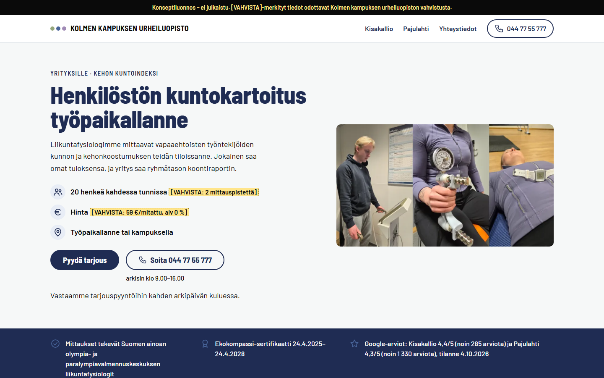

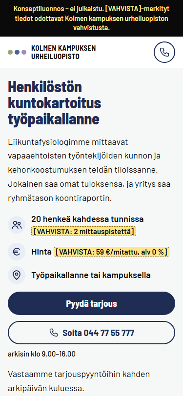

Koko sivu: [tietokone (1 440 px)](landing-pages/screenshots/lp-a-1440-full.jpg) · [puhelin (375 px)](landing-pages/screenshots/lp-a-375-full.jpg)

### 12.3 Sivu B: Johtoryhmän strategiapäivä Kisakallion villassa Lohjalla

**Lähestymistapa.** Sivu B on kolmesta visuaalisin, koska villa itse on paras todiste. Pääotsikko kulkee koko leveydellä, ja sen alla Villa SSO:n kuva on vasemmalla ja olennaiset tiedot oikealla: matka-aika, kokouspöytä, omat huoneet ja hintahaarukka. Esimerkkiaikataulu näyttää koko vuorokauden yhtenä janana, ja villataulukko korvaa kokoustilojen taulukon. Aktiviteettiluetteloa ei ole, koska johtoryhmälle tarjotaan vain palautumisharjoitusta tai luontopolkua.

| # | Osio | Keskeinen teksti |
|---|---|---|
| 1 | Yläpalkki | Kolmen kampuksen urheiluopisto · Kisakallio · Villat · Majoitus · Saapuminen · 044 77 55 777 |
| 2 | Pääosio | **Johtoryhmän strategiapäivä Kisakallion villassa Lohjalla** · ”6–10 hengen johtoryhmälle 24 tuntia villassa: kokous, sauna ja illallinen. Neljä makuuhuonetta ja yhden hengen huoneita Hotelli Omenatarhassa.” · Noin tunti Helsingin keskustasta autolla · Kokouspöytä 24 hengelle · Hintahaarukka `[VAHVISTA]` · **Pyydä alustava varaus** |
| 3 | Todisterivi | Google-arvio 4,4/5 (Kisakallio) · Kolmen kampuksen urheiluopisto on Suomen ainoa olympia- ja paralympiavalmennuskeskus · yksi nimetty yhteyshenkilö |
| 4 | Hinnat ja paketit | 24 tunnin strategiapäivä Villa SSO:ssa, joka on vain ryhmän käytössä (kortissa myös yhden hengen huoneet Omenatarhassa oman huoneen tarvitseville `[VAHVISTA]` ja esimerkkihinta 8 hengelle `[VAHVISTA]`) · Päiväkokous villassa · Lisäpalvelut |
| 5 | Esimerkkiaikataulu | Vuorokausi villassa klo 10.00 – seuraavana päivänä klo 14.00 (aikajana) |
| 6 | Kisakallion villat | Seitsemän villan taulukko: pinta-ala, makuuhuoneet, yöpyjät, pöytä, poreallas, anniskeluoikeudet, ruokapalvelu |
| 7–8 | Majoitus · Ruoka ja juomat | Makuuhuoneiden jako (villassa ei ole yhden hengen huoneita) ja Omenatarha · ruoka tarjoillaan villaan, ja Villa SSO:ssa on anniskeluoikeudet |
| 9 | Kuvat ja pohjapiirros | Villa SSO ulkoa ja paikkamerkit (sauna, talvi, pohjapiirros) |
| 10 | Saapuminen | Autolla noin tunti; julkisilla ei pääse kätevästi, joten auto tai tilausbussi `[VAHVISTA]` |
| 11 | Usein kysyttyä | Yhdeksän kysymystä, esimerkiksi ”Onko villa vain meidän käytössämme?”, ”Saako jokainen oman huoneen?” ja ”Voiko villaan tuoda omia juomia?” |
| 12–13 | Yhteyshenkilö ja lomake | Sama avainasiakasvastaava kuin viestissä · ”Alustava varaus on maksuton, voimassa 14 vuorokautta eikä sido teitä.” `[VAHVISTA]` · **Pyydä alustava varaus** |
| 14–16 | Miksi sain tämän viestin? · Tietosuojaseloste · Alatunniste | Kuten sivulla A |

Tiedosto: [landing-pages/lp-b-strategiapaiva-kisakallio.html](landing-pages/lp-b-strategiapaiva-kisakallio.html)

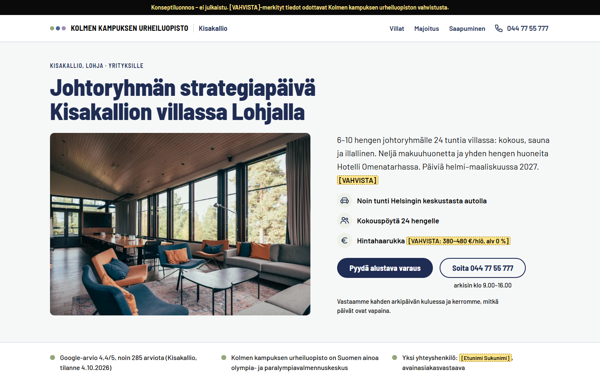

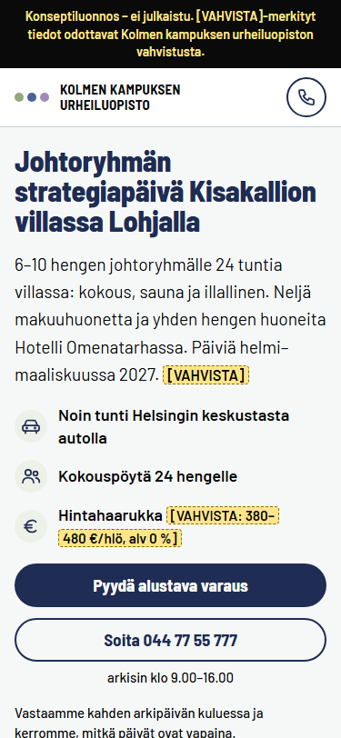

Koko sivu: [tietokone (1 440 px)](landing-pages/screenshots/lp-b-1440-full.jpg) · [puhelin (375 px)](landing-pages/screenshots/lp-b-375-full.jpg)

### 12.4 Sivu C: Liittokokous Pajulahdessa Lahden Nastolassa

**Lähestymistapa.** Sivu C on kolmesta asiapitoisin ja muistuttaa hyvin jäsenneltyä kokousmuistiota. Esteettömyys ja saapuminen on nostettu heti todisterivin jälkeen, koska toiminnanjohtaja ja hallitus kysyvät niitä ensimmäisenä. Hinnat näytetään arvonlisäverollisina, sillä yhdistys vertailee verollisia hintoja. Etäosallistuminen kuvataan vakiomallina, joka on merkitty vahvistettavaksi.

| # | Osio | Keskeinen teksti |
|---|---|---|
| 1 | Yläpalkki | Kolmen kampuksen urheiluopisto · Pajulahti · Majoitus · Saapuminen · Yhteystiedot · 044 77 55 777 |
| 2 | Pääosio | **Liittokokous Pajulahdessa Lahden Nastolassa** · ”Pidätte 1–2 päivän kokouksen, majoitutte ja syötte samalla kampuksella, jossa myös paraurheilijat leireilevät.” · Auditorio 136 hengelle · Kahden päivän liittokokous majoituksineen: alk. 127 €/hlö (sis. alv) · Noin 20 minuutin ajomatka Lahden keskustasta · **Pyydä alustava varaus** |
| 3 | Todisterivi | Kolmen kampuksen urheiluopisto on Suomen ainoa olympia- ja paralympiavalmennuskeskus · Suomen paralympiajoukkueen pääyhteistyökumppani · Ekokompassi |
| 4 | Esteettömyys ja saapuminen | Kalliopaju täysin esteetön, Puistopajussa 16 esteetöntä huonetta, induktiosilmukka, auditorion esteettömyys `[VAHVISTA]` · bussi 11 Lahden matkakeskukselta kerran tunnissa, maksuton pysäköinti |
| 5 | Hinnat ja paketit | Kahden päivän liittokokous majoituksineen (hinta sis. alv ja esimerkki 80 hengelle: alk. 10 160 €) · Liittokokous, 1 päivä (alk. 47 €/hlö sis. alv) · Hallituksen strategiapäivä |
| 6 | Etäosallistuminen ja äänestys | ”Jos sääntönne sallivat etäosallistumisen, kokous lähetetään auditoriosta etäosallistujille, ja etä-äänestys järjestetään liiton valitsemalla äänestyspalvelulla.” · kokouskamera, mikrofonit ja tukihenkilö `[VAHVISTA]` |
| 7 | Tilat ja kapasiteetti | Kymmenen rivin taulukko auditoriosta (136 paikkaa) ryhmätyötiloihin: pinta-ala, henkilömäärä, kalustus, päivänvalo ja tekniikka |
| 8 | Esimerkkiohjelma | Kahden päivän liittokokous: kokous, majoittuminen, rantasauna tai paralajit, illallinen ja seuraavana päivänä koulutus (aikajana) |
| 9 | Majoitus ja ruoka | Majoitusrakennukset nimeltä, ja tarjouksessa kerrotaan, missä ryhmä majoittuu · ravintolapalveluista vastaa Kanresta |
| 10 | Usein kysyttyä | Kahdeksan kysymystä, esimerkiksi etäosallistuminen, alustava varaus, jäsenten omat huoneet, arvonlisävero, kilpailutus ja peruutusehdot |
| 11–12 | Yhteyshenkilö ja lomake | Sama myyntipäällikkö kuin viestissä · ehdotuksen voi liittää hallituksen kokousaineistoon · lisätiedoissa kysytään, milloin hallitus päättää · **Pyydä alustava varaus** |
| 13–15 | Miksi sain tämän viestin? · Tietosuojaseloste · Alatunniste | Kuten sivulla A |

Tiedosto: [landing-pages/lp-c-liittokokous-pajulahti.html](landing-pages/lp-c-liittokokous-pajulahti.html)

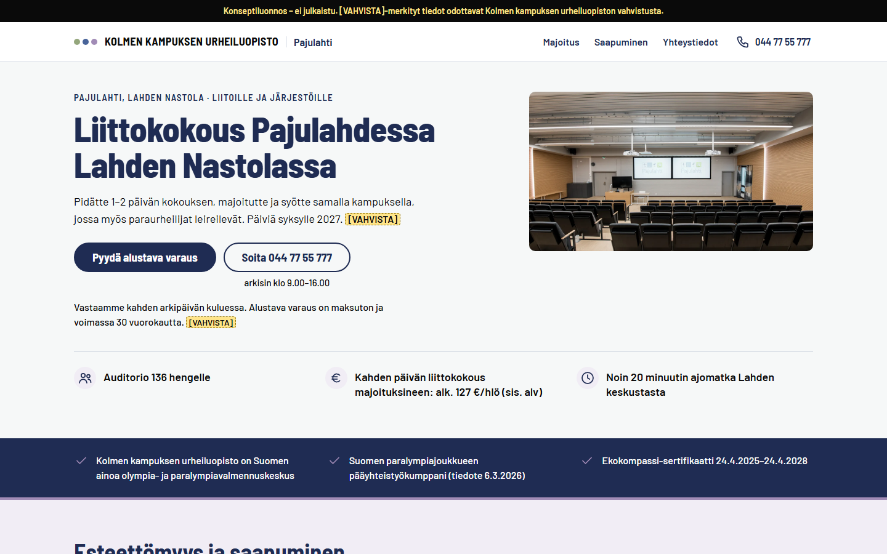

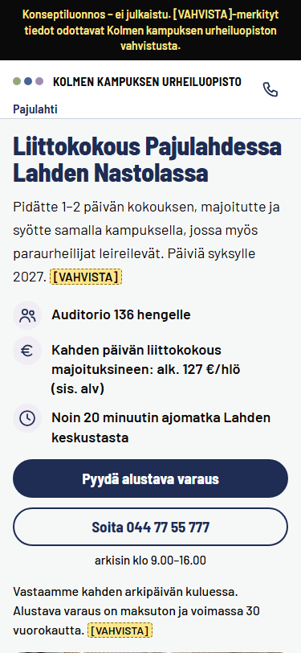

Koko sivu: [tietokone (1 440 px)](landing-pages/screenshots/lp-c-1440-full.jpg) · [puhelin (375 px)](landing-pages/screenshots/lp-c-375-full.jpg)

### 12.5 Tarkistukset

| Tarkistus | Tulos |
|---|---|
| Avaaminen selaimessa ja kuvakaappaukset 1 440 px ja 375 px | Tehty kaikille neljällätoista sivulle; kuvat kansiossa `landing-pages/screenshots/` |
| Konsolivirheet | 0 kaikilla sivuilla ja leveyksillä (1 440, 375 ja 360 px) |
| Kontrasti | 0 alitusta. Tekstin värejä on neljä, ja pienin suhde on 5,72:1 (virheteksti) |
| Näppäimistö | 68–69 kohdistusaskelta sivua kohden; jokaisessa on näkyvä kohdistus, eikä mikään jää kiinnittyvän palkin alle |
| Lomake | Tyhjä lähetys kohdistaa virheyhteenvetoon. Virheelliset arvot saavat oikeat ilmoitukset, ja kelvollinen lähetys näyttää vahvistuksen. Verkkopyyntöjä ei synny |
| Tekstit | Kaikki tekstikäsikirjoituksen tekstit löytyvät sivuilta sanatarkasti |
| Saavutettavuuden rakenne | Yksi pääotsikko, otsikkotasot ilman hyppyjä, maamerkit, ohituslinkki, nimetyt kentät, taulukoiden otsikot, ei vaakavieritystä 320 px:n leveydellä ja tekstivälien suurennus toimii |
| Simuloitu paneeli ja vertaisarvio | Havaintojen perusteella korjattiin muun muassa sivun ja viestin lupausten erot, omat huoneet sivulla B, verolliset hinnat sivulla C ja noin 15 sanamuotoa (luku 11.6) |

Tarkistukset ajettiin uudelleen 5.10.2026 kahdesti: loppuarvioinnin korjausten jälkeen (selkeämpi peruutusehtojen vastaus ja kaupparekisterin postiosoite alatunnisteessa) ja sen jälkeen, kun organisaation vastaukset (hinnat, vastausaika, villan käyttö sekä olympia- ja paralympiastatus) oli viety sivuille. Tulokset olivat molemmilla kerroilla samat, ja kuvakaappaukset päivitettiin. Tarkistusten yksityiskohdat ja käytetyt työkalut ovat työtiedostoissa `work/samples/verification-log.md` ja `work/final/acceptance.md`.

### 12.6 Lisäsivut D–N

Yksitoista lisäsivua käyttää samaa ilmettä ja komponenttikirjastoa kuin sivut A–C. Jokaisen sivun pääotsikko toistaa viestin tilaisuuden, ja aikajana piirretään sivun oman sisällön mukaan. Kaikki sivut läpäisivät samat neljä tarkistusta (avaus selaimessa, lomake, tekstit ja saavutettavuuden rakenne) 1 440, 375 ja 360 px:n leveydellä: konsolissa ei ole virheitä, vaakavieritystä ei ole 320 px:n leveydelläkään, kontrastivirheitä ei ole ja jokaisessa on 69 kohdistusaskelta ilman ongelmia. Sivu N on englanninkielinen.

| Sivu | Pääotsikko | Painotus ja aikajana | Tiedosto |
|---|---|---|---|
| D | Tyky-päivä valmiina Kisakalliossa Lohjalla | Päivä aikatauluna: vaaka-aikajana, jossa valinnainen sauna ja illallinen on merkitty katkoviivalla | `lp-d-tyky-paiva-kisakallio.html` |
| E | Asiakasilta Kisakalliossa Lohjalla | Osio ”Hinnat ja verotus” ja Verohallinnon lainaukset; kaksikaistainen aikajana (ohjelma ja bussi) | `lp-e-asiakasilta-kisakallio.html` |
| F | Koulutuspäivä Pajulahdessa Lahden Nastolassa | Ohjelma ensin, huonetaulukko ja tarpeet sidottuna ohjelman osiin; aikajanassa bussirivit | `lp-f-koulutuspaiva-pajulahti.html` |
| G | Kehittämispäivä Pajulahdessa Lahden Nastolassa | Rauhallinen, asiakirjamainen sivu; oppimistavoite jokaisella aikajanan osiolla ja laatikko ”Hinta ja hankinta” | `lp-g-kehittamispaiva-pajulahti.html` |
| H | Työhyvinvoinnin vuosisuunnitelma 2027 | Vuosikello: kahdentoista kuukauden jana ja esimerkkivuosi, komponenttihinnasto | `lp-h-tyohyvinvoinnin-vuosisuunnitelma.html` |
| I | Hyvinvointivalmennus henkilöstölle etänä tai työpaikallanne | Kuukausijana kuuden kuukauden ohjelmalle, vaihepalkki ja tietosuojalaatikko | `lp-i-hyvinvointivalmennus.html` |
| J | Hyvinvointiaamut Kisakalliossa, palautumisillat Pajulahdessa | Päivämäärälista heti ensimmäisen näkymän jälkeen ja kaksikaistainen ohjelma | `lp-j-hyvinvointiaamut-ja-palautumisillat.html` |
| K | Viikkoliikunta henkilöstölle Pajulahdessa Lahden Nastolassa | Viikkotaulukko ja kymmenen viikon jana, syysloma viivoitettuna; kortti ”yksi hinta ryhmälle” | `lp-k-viikkoliikunta-pajulahti.html` |
| L | Johtoryhmän suorituskykyohjelma kuudeksi kuukaudeksi | Kuukausijana (kk 0–6) ja osio ”Mitä mitataan ja kuka näkee tulokset”; vähän osioita ja väljä asettelu | `lp-l-johtoryhman-suorituskykyohjelma.html` |
| M | Luento työhyvinvoinnista henkilöstöpäiväänne | Luentolista heti pääosion jälkeen, ennen todisterivia, koska valikko on tarjous | `lp-m-luennot-tyopaikalle.html` |
| N | Training camps at Pajulahti and Kisakallio, Finland | Englanninkielinen sivu: neljän päivän ohjelma, tilataulukko ja hinta kahtena | `lp-n-training-camps-finland.html` |

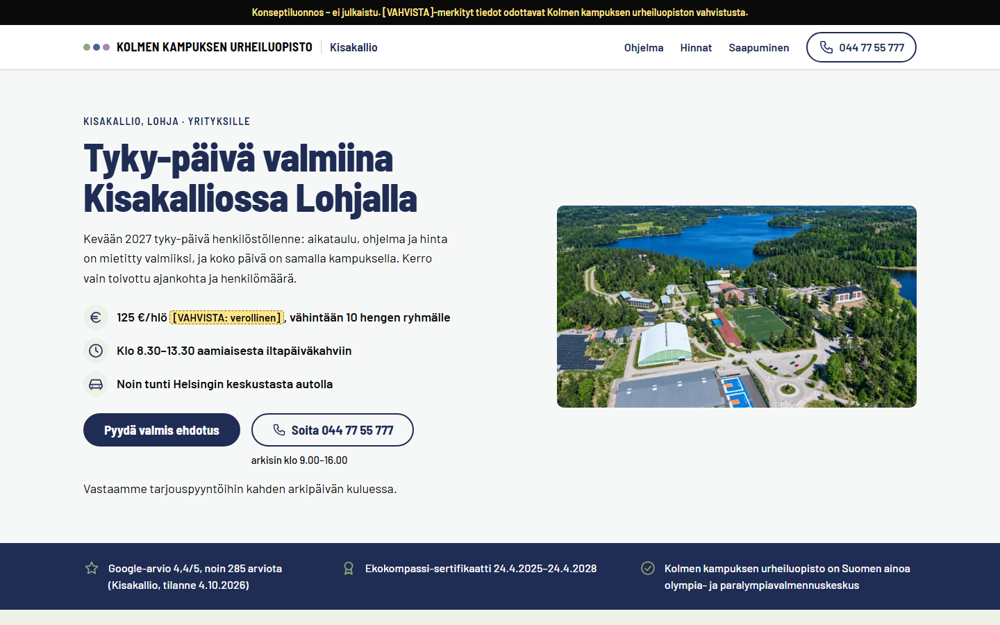

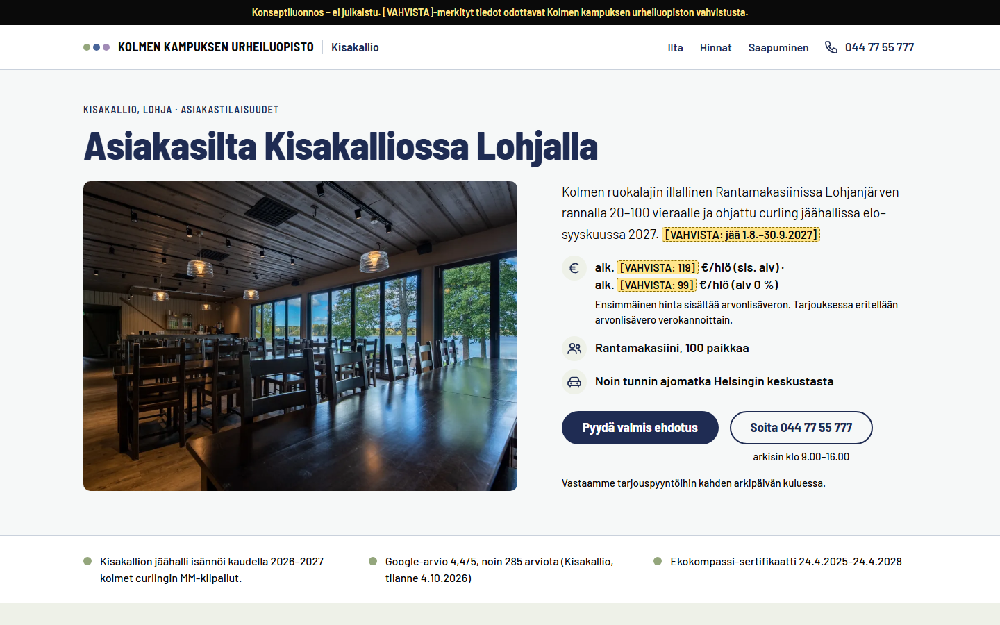

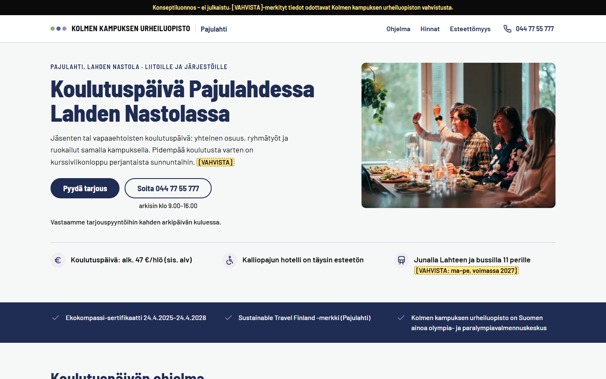

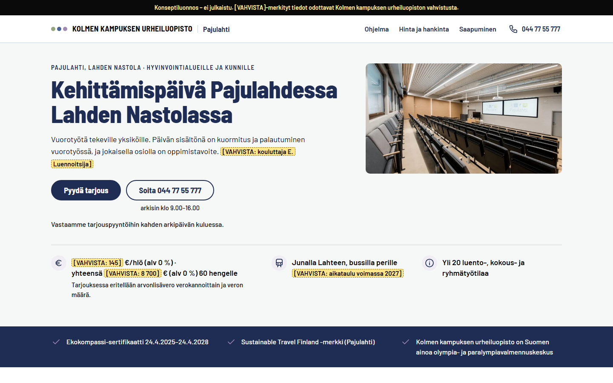

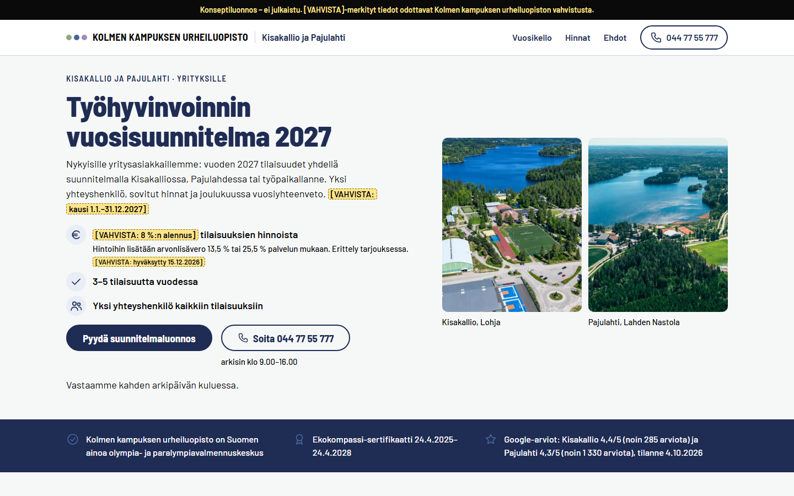

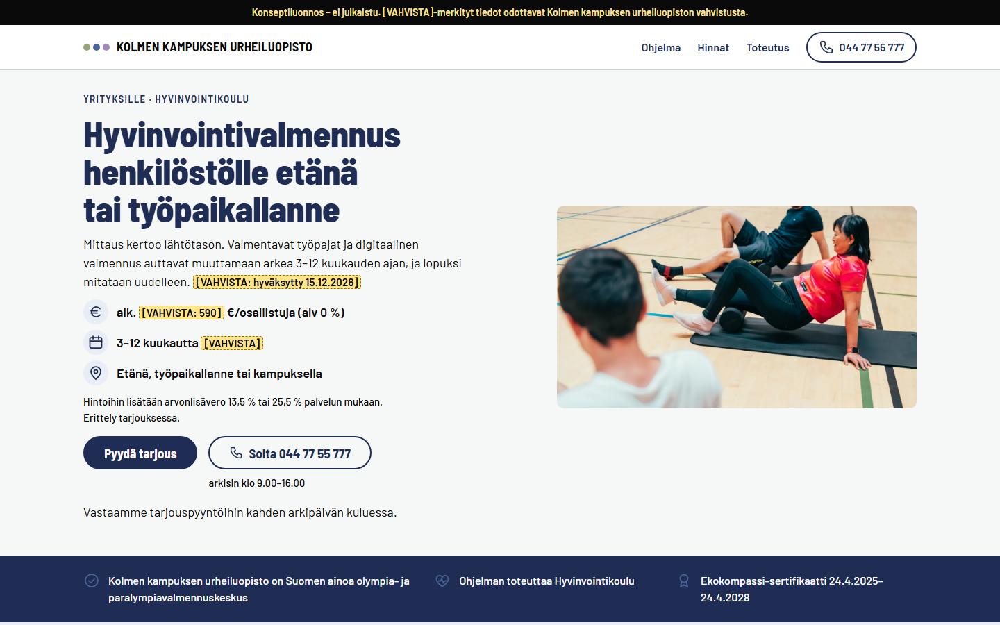

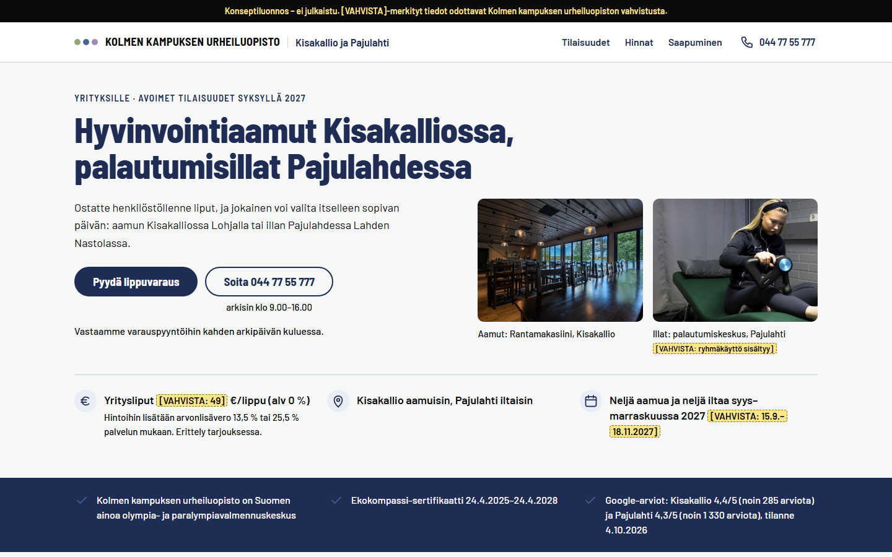

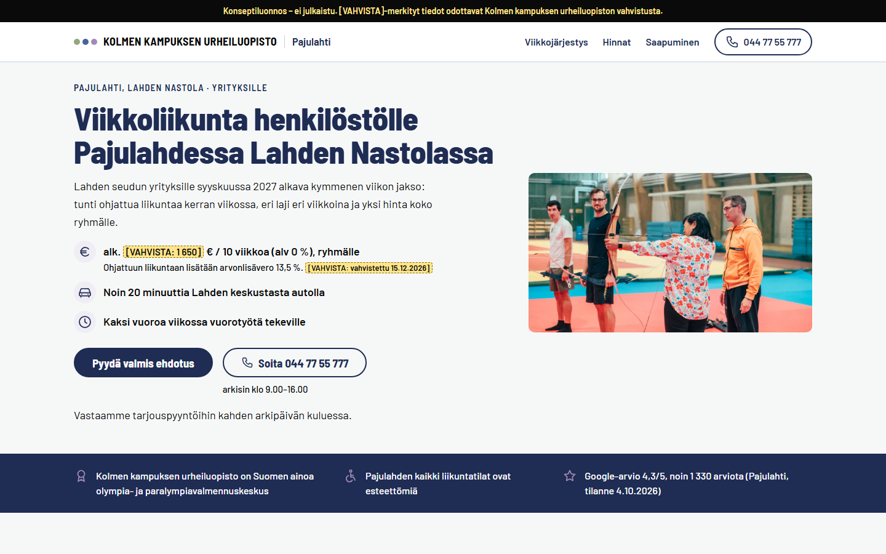

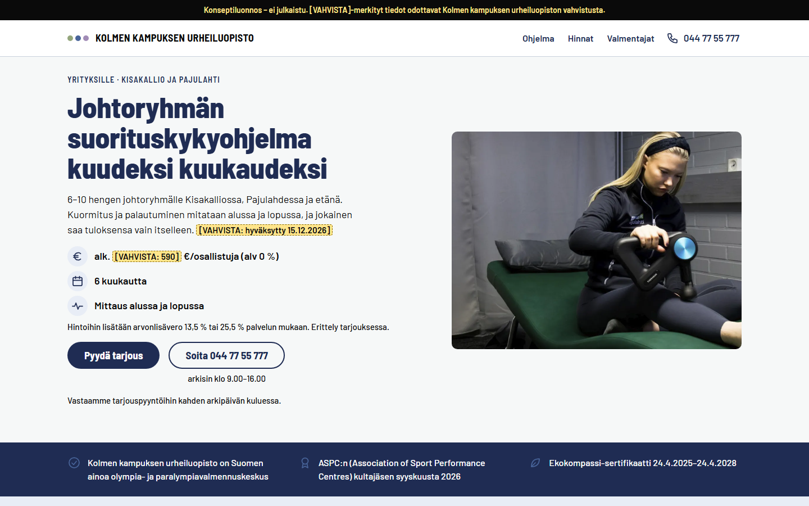

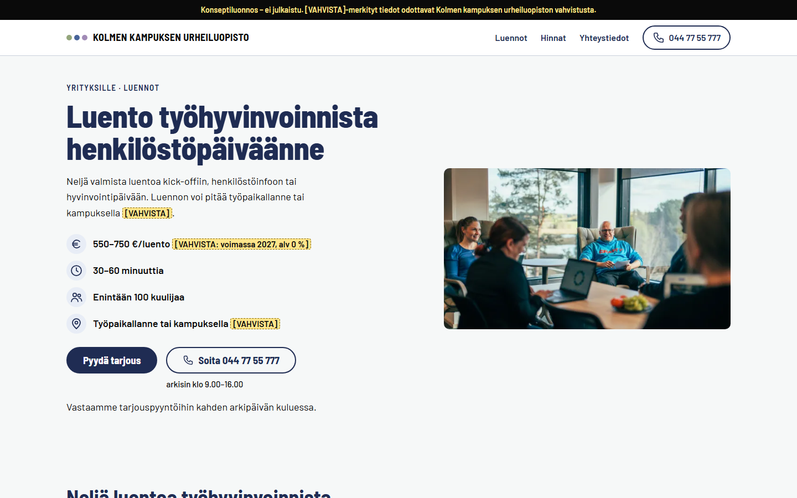

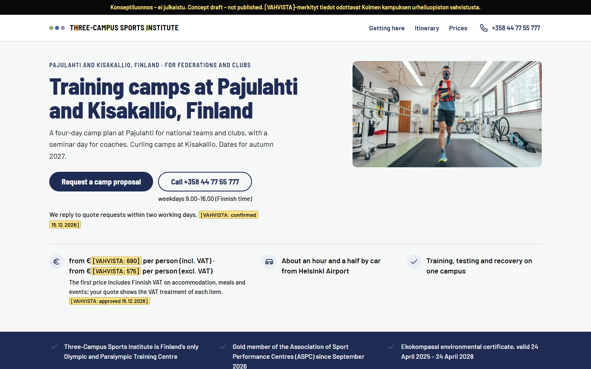

### Suositukset

1. **Verkkopalvelujen vastaava:** rakenna kolme kampanjasivua kolmekampusta.fi-sivustolle näiden luonnosten pohjalta 13.11.2026 mennessä. Fontit tulevat omalta palvelimelta, ja sivut merkitään noindex-sivuiksi. Sivupohja ei lataa Tag Manageria, Mauticia tai Leadoota ennen suostumusta.
2. **Myyntipäälliköt:** toimita sivujen `[VAHVISTA]`-tiedot sekä kuvat villan makuuhuoneesta, saunasta ja talvesta, mittauksesta työpaikalla ja Villa SSO:n pohjapiirroksesta 6.11.2026 mennessä. Varmista samalla, että kuvissa näkyviltä ihmisiltä on lupa käyttää kuvia markkinoinnissa.
3. **Tietosuojavastaava:** hyväksy ”Miksi sain tämän viestin?” -teksti, lomakkeen tietosuojaseloste ja käsittelyperuste ennen julkaisua.
4. **Verkkopalvelujen vastaava:** tarkista jokainen sivu ennen julkaisua 1 440 px:n ja 375 px:n leveydellä. Tarkista kontrasti ja näppäimistökäyttö, ja varmista, ettei konsolissa ole virheitä ja että sivu ei lataa mitään ennen suostumusta.
5. **Yritysmyynnin vastuuhenkilö:** lue jokainen tarjouspyyntö aallon lopussa, kirjaa, mitä sivu ei kertonut, ja päivitä sivut aaltojen välissä.

---

## 13. Toteutussuunnitelma: 90 päivää, mittarit ja testaus

### Keskeiset havainnot

- **Suunnitelmia on kaksi.** Nopeassa suunnitelmassa 90 päivää kestää 2.11.2026–31.1.2027, ja sitä edeltää päätösviikko 26.–30.10.2026. Jos hinnoista ja lähettäjistä ei ole päätetty perjantaina 30.10.2026, siirrytään oletussuunnitelmaan: ensimmäinen viesti lähtee 12.1.2027 ja arviointi on 19.3.2027 [P].
- **Ensimmäinen kylmäsähköposti lähtee nopeassa suunnitelmassa tiistaina 17.11.2026**, kun lähtöportti on vihreä: verkkotunnukset, sivujen ylläpito, tietosuojaseloste, kampanjasivut ja HR-sarjalle hyväksytty testitietojen käsittelymalli. Rikkinäiseen asiakaspolkuun lähettäminen haaskaisi pienen kohderyhmän [P].
- **Ensimmäinen aalto (17.11.–17.12.2026)** sisältää kolme sarjaa, joissa kussakin on noin sata yhteystietoa: HR-päälliköt (kuntokartoitus työpaikalla; ensin Uusimaa, Lahden seudulta enintään noin 40), johtoryhmät (Kisakallion villat) ja lajiliitot (Pajulahti). **Toinen aalto alkaa 12.1.2027.**
- **Kummallakin kampuksella yksi myyjä jää hoitamaan saapuvia tarjouspyyntöjä.** Lähettäjiksi ehdotetaan Kisakallion kaksi avainasiakasvastaavaa ja Pajulahden myyntipäällikkö [P].
- **Tavoite on oppia ja rakentaa ensimmäinen myyntiputki.** Suunnitteluoletus on 5–17 ehdotusta ja 1–7 varausta, joiden arvo on noin 25 000–120 000 € [H].
- **Volyymit eivät riitä A/B-testeihin.** Kahtia jaetussa sadan yhteystiedon sarjassa kumpikin versio saisi noin 50 yhteystietoa ja 0,25–0,75 myönteistä vastausta. Siksi kokeillaan yhtä muutosta kerrallaan aallosta toiseen [P].

### 13.1 Vaiheet (nopea suunnitelma)

| Vaihe | Ajankohta | Tavoite |
|---|---|---|
| 0 Päätökset | 26.–30.10.2026 (viikko 44) | Johdon päätökset, joista kaikki muu riippuu |
| 1 Korjaukset ja rakentaminen | 2.–13.11.2026 (viikot 45–46) | Lähtöportti vihreällä; sivut, listat ja hinnastot valmiina |
| 2 Ensimmäinen aalto | 17.11.–17.12.2026 (viikot 47–51) | Kolme sarjaa, ensimmäiset 300 yhteystietoa, pilotin tulkinta |
| 3 Lähetyskatko | 18.12.2026–11.1.2027 | Ei uusia kylmäviestejä; vastaukset ja ehdotukset, haastattelut 18.12. asti |
| 4 Toinen aalto ja pilotit | 12.–31.1.2027 (viikot 2–4) | Toinen aalto, julkisen sektorin pilotti, palvelupilotit ja 90 päivän arviointi |

### 13.2 Viikkosuunnitelma (nopea suunnitelma)

| Viikko | Päivät | Tehtävät | Vastuu |
|---|---|---|---|
| 44 | 26.–30.10. | Päätökset: Kisakallion ja kuntokartoituksen hinnat ja niiden arvonlisäveroperuste sekä kaikkien hintojen kustannusperuste; kolme lähettäjää ja saapuvien tarjouspyyntöjen hoitaja kummallakin kampuksella; aineistotoimittaja; palvelupilottien hinnoittelu; testitietojen käsittelymallin vastuuhenkilö. DMARC-raportointi kolmekampusta.fi:hin. Pajulahden kevätnosto pois | Yritysmyynnin vastuuhenkilö, IT, verkkosisällöt |
| 45 | 2.–6.11. | DMARC muille verkkotunnuksille; pajulahti.com korjattu; Google-profiilit päivitetty; arvosteluihin vastaaminen alkaa. Oikeutetun edun arviointi, tietosuojaselosteen osio ja testitietojen käsittelymalli luonnoksina. Asiakasrekisterin lähdekentät ja yhteinen kieltolista. Hinnastot: kuntokartoitus, liittopaketti ja villapäivän hintahaarukka. Yhteystietojen keruu alkaa (noin 130 sarjaa kohden varalla; HR-sarjan Lahden seudun osuus enintään noin 40) | IT, tietosuojavastaava, myynti, testausvastaava |
| 46 | 9.–13.11. | Kolme kampanjasivua ja lomake piilokenttineen valmiina; ”Miksi sain tämän viestin?” -osio julki; tietosuojaseloste ja testitietojen käsittelymalli hyväksytty; testilähetykset; 1–3 tähden arvioihin vastattu. **Lähtöportin tarkistus perjantaina 13.11.** Jos vain testitietojen käsittelymalli on kesken, HR-sarja siirtyy toiseen aaltoon | Verkkopalvelut, tietosuojavastaava, yritysmyynnin vastuuhenkilö |
| 47 | 16.–20.11. | **Ensimmäinen aalto alkaa tiistaina 17.11.** Enintään 10 uutta viestiä postilaatikkoa kohden päivässä. Palveluhaastattelut alkavat (6 HR-päällikköä, 8 liiton toiminnanjohtajaa) | Lähettäjät |
| 48 | 23.–27.11. | Enintään 20 uutta viestiä päivässä; toiset viestit lähtevät; ensimmäinen viikkoraportti | Lähettäjät, yritysmyynnin vastuuhenkilö |
| 49 | 30.11.–4.12. | Viimeiset ensimmäiset viestit: HR-sarja ja johtoryhmät torstaina 3.12., liitot jo tiistaina 24.11., koska liittojen viestien välit ovat pidempiä. Ehdotukset kahden arkipäivän kuluessa myönteisestä vastauksesta | Lähettäjät |
| 50 | 7.–11.12. | Toiset ja kolmannet viestit; **alustava pilotin tulkinta perjantaina 11.12.** | Yritysmyynnin vastuuhenkilö ja lähettäjät |
| 51 | 14.–18.12. | Viimeiset kolmannet viestit torstaina 17.12.; lopullinen tulkinta perjantaina 18.12.; suunnitteluoletukset korvataan havaituilla luvuilla | Yritysmyynnin vastuuhenkilö |
| 52–1 | 21.12.–8.1. | Lähetyskatko. Vastauksiin ja ehdotuksiin vastataan arkipäivisin. Toisen aallon yhteystiedot kerätään | Lähettäjät |
| 2 | 11.–15.1.2027 | **Toinen aalto alkaa tiistaina 12.1.:** kevään tyky-päivät (Kisakallio Uudellemaalle, Pajulahti Päijät-Hämeeseen), liittojen toinen erä, julkisen sektorin pilotti (noin 60 yhteystietoa, vain Pajulahti), kuntokartoituspilotit haastatelluille ja vuosisuunnitelma viidelle nykyiselle asiakkaalle | Lähettäjät, avainasiakasvastaavat |
| 3 | 18.–22.1. | Toiset viestit; kuntokartoituspilotit sovitaan helmi–maaliskuulle | Lähettäjät, testausvastaava |
| 4 | 25.–29.1. | **90 päivän arviointi perjantaina 29.1.2027:** mittarit, palvelujen portit ja päätös kolmannesta aallosta (16.3.–22.4.2027) | Yritysmyynnin vastuuhenkilö, johtoryhmä |

Toisen aallon ensimmäisiä viestejä lähetetään torstaihin 4.2.2027 asti, jonka jälkeen alkaa talvilomien lähetyskatko (22.2.–14.3.2027) [V 95].

### 13.3 Oletussuunnitelma

| Vaihe | Nopea suunnitelma | Oletussuunnitelma |
|---|---|---|
| Päätökset | 26.–30.10.2026 | Viimeistään 13.11.2026 (viikko 46) |
| Korjaukset ja rakentaminen | 2.–13.11.2026 | 16.11.–11.12.2026 |
| Ensimmäinen viesti | Tiistai 17.11.2026 | Tiistai 12.1.2027 |
| Ensimmäisen aallon ensimmäiset viestit | 17.11.–3.12.2026 | 12.1.–4.2.2027 |
| Talvilomien lähetyskatko | 22.2.–14.3.2027 | 22.2.–14.3.2027 |
| Toisen aallon ensimmäiset viestit | 12.1.–4.2.2027 | 16.3.–22.4.2027 |
| Arviointi ja palvelujen portit | 29.1. ja 31.1.2027 | 19.3.2027 (noin kymmenen viikkoa ensimmäisestä viestistä) |

**Vaihtosääntö:** jos päätös hinnoista tai lähettäjistä on auki perjantaina 30.10.2026, siirrytään oletussuunnitelmaan, ja myynnille kerrotaan siitä samana päivänä. Oletussuunnitelmassa menetetään keskisuurten yritysten tammikuun kick-off-ikkuna, mutta liitot (joiden kokoukset ovat syksyllä 2027) ja kevään tyky-ikkuna säilyvät [P].

### 13.4 Volyymi ja resurssit

| Asia | Arvio [P] |
|---|---|
| Lähettäjät | Kolme: Kisakallion avainasiakasvastaava 1 yhdessä testausvastaavan kanssa (HR-sarja), Kisakallion avainasiakasvastaava 2 tai myyntipäällikkö (johtoryhmät) ja Pajulahden myyntipäällikkö (liitot). Pajulahden avainasiakasvastaava ja Kisakallion myyntipäällikkö hoitavat saapuvat tarjouspyynnöt ja pikkujoulukauden `[VAHVISTA: nimet]` |
| Yhteystiedot | Noin 300 ensimmäisessä ja 300 toisessa aallossa. Lahden seudulla (Päijät-Häme ja Kymenlaakso) on vain noin 230 vähintään 50 hengen toimipaikkaa, Uudellamaalla noin 1 730 [V 97], joten HR-sarja suuntautuu ensin Uudellemaalle |
| Lähettäjän työaika aallon aikana | Noin 1–1,5 päivää viikossa: tausta 4–8 h, lähettäminen 2–3 h, vastaukset ja ehdotukset 3–5 h |
| Yritysmyynnin vastuuhenkilö | Noin 0,5 päivää viikossa |
| Verkkosisällöt | Noin 8–12 työpäivää viikoilla 44–46 |
| IT | Noin 0,5–1 päivä ja DMARC-raporttien luku |
| Tietosuojavastaava tai lakimies | Noin 3–5 päivää (myös testitietojen käsittelymalli) |
| Testausvastaava | 3–5 päivää valmisteluun, pilottipäivät helmikuusta alkaen |
| Asiakaspalvelu | Noin 2 päivää arvosteluihin, sitten tunti viikossa |
| Asiakasrekisteri | Jos asiakasrekisteriä ei ole, pilotissa käytetään jaettua taulukkoa samoin kentin `[VAHVISTA: onko käytössä]` |
| Rahalliset kulut | Ei maksettua mainontaa. Mahdollisia kuluja: yhteystietoaineiston lisenssi, etäosallistumisen laitteisto tai kumppani, kuljetus Kisakallioon (läpilaskutettava) |

Jos myyntitiimi ei vapauta tätä aikaa, volyymia pienennetään. Taustatyön laatua tai vastauslupausta ei heikennetä.

### 13.5 Mittarit ja tavoitealueet

**Lähtöportti (100 % ennen ensimmäistä viestiä)**

| Mittari | Tavoite |
|---|---|
| Lähetykset estävät korjaukset tehty (DNS, Pajulahden nosto, pajulahti.com, sivut, tietosuojaseloste, arviointi, kieltolista) | 100 % |
| Testitietojen käsittelymalli hyväksytty | 100 % ennen HR-sarjaa; muuten sarja siirtyy toiseen aaltoon |
| Yhteystiedoista lähde ja asemavaltuus kirjattu | 100 % |
| Testilähetykset läpäisty | 3 / 3 sarjaa |
| Viimeisen 12 kuukauden 1–3 tähden Google-arvioihin vastattu | 100 % |
| `[VAHVISTA]`-paikkamerkkejä viesteissä tai julkaistuilla sivuilla | 0 |

**Sarjojen mittarit (suunnitteluoletukset pilotin tulkintaan asti):** ks. luku 9.10.

**Tulosmittarit 90 päivälle [H]**

Mukana ovat vain sarjat, jotka päättyvät ennen arviointia: ensimmäinen aalto (noin 300 yhteystietoa) ja 12.–14.1.2027 alkavat toisen aallon sarjat (noin 100).

| Mittari | Alue | Laskelma |
|---|---|---|
| Myönteiset vastaukset kylmäsähköposteihin | 2–6 | Noin 400 yhteystietoa × 0,5–1,5 % |
| Ehdotukset | 5–17 | Myönteiset vastaukset 2–6 + haastatteluista 2–6 + kampanjasivujen tarjouspyynnöt 1–5 |
| Varaukset | 1–7 | Ehdotukset × 25–40 % (oletus; organisaation omaa onnistumisprosenttia ei ole tiedossa) |
| Myyntiputken arvo (ehdotukset, alv 0 %) | Noin 25 000–120 000 € | Keskisuuret yritykset 3 000–15 000 €, johtoryhmät 2 000–5 000 €, liitot 6 000–30 000 € kauppaa kohden; osa liittojen varauksista toteutuu syksyllä 2027 |
| Palvelujen portit 31.1.2027 (nopea) tai 19.3.2027 (oletus) | Läpäisty tai ei | Kuntokartoitus: vähintään 2 maksettua pilottia. Villa: vähintään 2 alustavaa varausta ja 1 varaus. Liittopaketti: vähintään 4 tarjouspyyntöä ja 1 alustava varaus vähintään 60 liitolta. Vuosikumppanuus: vähintään 2 viidestä allekirjoittaa (luku 8) |

**Tukimittarit**

| Mittari | Tavoite |
|---|---|
| Uusiin Google-arvioihin vastataan | 3 arkipäivän kuluessa |
| Tripadvisor-profiilit hallinnassa | Molemmat 30.11.2026 mennessä |
| Vastaväitteet kirjattu | 100 % ihmisten vastauksista |
| Kysymykseen ”Mistä saitte tietoni?” vastataan | 1 arkipäivän kuluessa |

### 13.6 Oppimiskokeilut

Sarjoissa on noin sata yhteystietoa. Jos sarja jaettaisiin kahtia, kumpikin versio saisi noin 50 yhteystietoa ja 0,25–0,75 myönteistä vastausta, joten ero ei kertoisi mitään. Yhden ja kolmen prosentin eron todentaminen vaatisi noin 760 yhteystietoa versiota kohden [P]. Siksi kussakin sarjassa muutetaan **yhtä asiaa aallosta toiseen**, ja vertailukohta on edellinen aalto. Kauden vaikutusta ei voi erottaa muutoksesta, joten tulokset ovat suuntaa antavia.

**Päätössääntö (kirjataan ennen kokeilua):** muutos jää käyttöön vain, jos (1) myönteisiä vastauksia sataa yhteystietoa kohden on vähintään kaksi kertaa edellisen aallon verran ja niitä on vähintään kolme, (2) kieltoja ei ole enemmän ja (3) vastausten sisältö tukee muutosta. Muuten pidetään oletus. Kylmäsähköposteissa ei koskaan ole `[VAHVISTA]`-paikkamerkkejä: jos hintaa ei ole vahvistettu, viestissä ei ole hintaa.

| Kokeilu | Missä | Hypoteesi [H] | Ensimmäinen aalto (oletus) | Myöhempi aalto (muutos) | Mittari |
|---|---|---|---|---|---|
| L1 | Liitot | Kysymysmuotoinen aiherivi tuo enemmän vastauksia kuin faktamuotoinen | ”Liittokokous 2027 Pajulahdessa – auditorio 136 hengelle” | Toinen aalto: ”Missä pidätte vuoden 2027 liittokokouksen?” | Myönteiset vastaukset sataa kohden, vastausten sisältö |
| L2 | HR-päälliköt | Vahvistettu lähtöhinta ensimmäisessä viestissä lisää myönteisiä vastauksia ja nopeuttaa ehdotusta | Hinta, jos se on vahvistettu, muuten ei hintaa | Toinen aalto: päinvastoin kuin ensimmäisessä (vain vahvistetulla hinnalla) | Myönteiset vastaukset, kiellot, päiviä ehdotukseen |
| L3 | HR-päälliköt | ”Kaikki pääsevät mukaan” toimii pääkulmana yhtä hyvin kuin ”mitattu hyvinvointi” | Mitattu hyvinvointi | Toisen aallon tyky-sarja: kaikki pääsevät mukaan | Myönteiset vastaukset, vastausten sisältö |
| L4 | Johtoryhmät | Valmiin ehdotuksen tarjous tuo yhtä monta vastausta kuin alustava varaus | Alustava varaus | Kolmas aalto: ”Lähetänkö valmiin ehdotuksen?” | Myönteiset vastaukset, alustavat varaukset |
| L5 | Kampanjasivut | Hinta ensimmäisessä näkymässä lisää tarjouspyyntöjä | Hinta pääosiossa | Seuraava sivuversio: hinta vain pakettikorteissa | Tarjouspyynnöt sivua kohden (palvelimen loki) |
| L6 | Lomake | Vapaaehtoinen budjettihaarukka ei vähennä tarjouspyyntöjä ja parantaa ehdotusten osuvuutta | 8 kenttää | 8 kenttää ja vapaaehtoinen budjettihaarukka | Lähetykset, uutta tarjousta vaativat ehdotukset |
| L7 | Liitot, kolmas erä | ”Paralajit tasaavat lähtökohdat” voi toimia pääkulmana, vaikka simuloitu relevanssi oli matala | Liiton kokous urheiluyhteisön keskellä | Kolmas aalto: paralajit tasaavat lähtökohdat | Myönteiset vastaukset, vastausten sisältö |

L7 testaa simuloidun paneelin merkittävimmän muutoksen oikeilla vastauksilla sen sijaan, että simuloitu pistemäärä hyväksyttäisiin sellaisenaan. Jokainen kokeilu kirjataan päätöslokiin: hypoteesi, aalto, luvut, päätös ja perustelu.

### 13.7 Raportointi

- **Viikoittain** aaltojen aikana maanantaisin: sarjojen luvut, vastauslupaus, kiellot ja vastaväitteet (15 minuuttia myyntipalaverissa).
- **Aallon lopussa:** pilotin tulkinta ja jokaisen vastauksen sisällön läpikäynti.
- **90 päivän kohdalla (29.1.2027, oletussuunnitelmassa 19.3.2027):** kaikki mittarit, palvelujen portit ja päätös kolmannesta aallosta.

### Suositukset

1. **Yritysmyynnin vastuuhenkilö:** kutsu viikolle 44 puolentoista tunnin päätöspalaveri (myynti, markkinointi, IT, talous ja tietosuojavastaava) ja käy läpi luvun 14 vahvistettavat asiat. Jos hinnat tai lähettäjät ovat auki perjantaina 30.10.2026, siirry oletussuunnitelmaan ja kerro siitä myynnille samana päivänä.
2. **IT-päällikkö:** lisää DMARC-raportointi samalla viikolla, jotta raportteja on kahden viikon ajalta 13.11. mennessä.
3. **Verkkosisällöistä vastaava:** päivitä Pajulahden kevätnosto 30.10.2026 mennessä.
4. **Yritysmyynnin vastuuhenkilö:** pidä lähtöportin tarkistus perjantaina 13.11.2026. Jos jokin estävä kohta on kesken, siirrä aloitusta. Jos vain testitietojen käsittelymalli on kesken, aloita johtoryhmä- ja liittosarjoilla.
5. **Johtoryhmä:** tee 90 päivän arvioinnin perusteella (29.1.2027 tai 19.3.2027) päätös kolmannesta aallosta ja palvelujen tuotteistamisesta.

---

## 14. Riskit, rajoitteet ja vahvistettavat asiat

### Keskeiset havainnot

- **Suurin riski on aloittaa ennen kuin perusasiat ovat kunnossa:** hinnat, verkkotunnusten todennus, sivut, tietosuojaseloste ja kuntomittauksissa testitietojen käsittely [P].
- **Oikeudellinen riski ei synny itse sähköpostista vaan dokumentoinnin puutteesta ja seurannasta.** Asemavaltuuden kirjaus ja seurannan poisjättäminen ratkaisevat [V 74, 78].
- **Kuntomittausten tulokset ovat terveyttä koskevia tietoja.** Kuntokartoitusta ei myydä ennen kuin testitietojen käsittelymalli on hyväksytty [V 76; P].
- **Alle markkinatason hinnat ovat maineriski valtionavusteiselle organisaatiolle.** Riski ei ole kilpailuneutraliteettisäännöissä vaan valtionavustuksen ja maksullisen toiminnan erottelussa sekä siinä, miltä hinnoittelu näyttää kilpailijoille ja rahoittajille. Jokaisella julkaistavalla lähtöhinnalla on oltava kustannuslaskelma [V 30, 94; P].
- **Useat organisaation omat luvut ovat ristiriidassa keskenään** (huonemäärät, tapahtumakapasiteetti, liikevaihto). Niitä ei käytetä markkinoinnissa ennen vahvistusta [V 6, 7, 9, 31].
- **Kymmenen kysymystä on vastattava ennen ensimmäistä lähetystä.** Organisaatio vastasi 5.10.2026 kysymykseen 6 kokonaan ja kysymyksiin 1, 4 ja 13 osittain. Loput vastataan viikolla 44 tai ennen palvelujen pilotointia ja laajentamista (14.4).

### 14.1 Riskit ja niiden hallinta

| Riski | Todennäköisyys / vaikutus [P] | Hallinta | Vastuu |
|---|---|---|---|
| Lähtöportti viivästyy (hinnat, sivut tai DNS kesken) | Keskitaso–suuri / suuri | Lähetyksiä ei aloiteta ennen kuin portti on vihreä; vaihtosääntö oletussuunnitelmaan 30.10.2026 (luku 13.3) | Yritysmyynnin vastuuhenkilö |
| Viestit päätyvät roskapostiin tai mainoskansioon | Keskitaso / suuri | Yksittäiset tekstimuotoiset viestit omista postilaatikoista, ei seurantaa, pieni volyymi, testilähetykset, DMARC-raportit | IT, lähettäjät |
| Nimettyyn osoitteeseen lähetetään ilman todellista asemavaltuutta tai lähde puuttuu | Pieni–keskitaso / suuri | Lähdekirjaus jokaisesta yhteystiedosta, yksi henkilö organisaatiota kohden, tietosuojavastaavan hyväksymä arviointi, kuukausitarkistus | Tietosuojavastaava, lähettäjät |
| Vastauslupausta ei pystytä pitämään tai saapuva myynti kärsii | Keskitaso / suuri | Lupaus on kaksi arkipäivää ja sisäinen tavoite saman tai seuraavan päivän vastaus; kummallakin kampuksella yksi myyjä hoitaa saapuvat tarjouspyynnöt; volyymi sidotaan vastauskapasiteettiin; nimetyt sijaiset | Yritysmyynnin vastuuhenkilö |
| Vastausprosentit jäävät selvästi oletusten alle | Keskitaso / keskitaso | Syyt käydään läpi järjestyksessä: perillemeno, kohderyhmä, tarjous ja ajoitus; yksi muutos aaltoa kohden | Yritysmyynnin vastuuhenkilö |
| Hintoja ei vahvisteta, ja sivuille jää paikkamerkkejä | Keskitaso / suuri | Paikkamerkkejä sisältäviä sivuja ei julkaista; viesteistä jätetään vahvistamaton hinta pois; hintapäätös viikolla 44 | Yritysmyynnin vastuuhenkilö, talous |
| Valtionavustuksen erottelu ja maine: valtionavusteinen organisaatio markkinoi hintoja, jotka ovat noin 20–50 % markkinatason alapuolella (Pajulahti 47 € sis. alv vs. 59–85 €, jotka ilmoitetaan useimmiten ilman arvonlisäveroa). Kilpailijat tai alan järjestöt voivat viedä asian opetus- ja kulttuuriministeriöön tai mediaan ja kysyä ristisubventiosta | **Keskitaso / suuri** | Jokaiselle julkaistavalle lähtöhinnalle täysien kustannusten laskelma ennen julkaisua; maksullinen toiminta kirjataan erikseen vapaasta sivistystyöstä ja ammatillisesta koulutuksesta; oikeudellinen arvio ennen kuin Pajulahden hinnat julkaistaan omilla sivuilla; liittojen ja julkisen sektorin viestit eivät korosta markkinaa halvempaa hintaa | Johto, talous |
| Julkisen sektorin julkisuusriski (”veronmaksajien rahoilla”) | Pieni / keskitaso | Kehittämispäivä oppimistavoitteineen; ei virkistys-, sauna- tai villasanastoa; läpinäkyvä hinta | Yritysmyynnin vastuuhenkilö |
| Kuntokartoituspilotit pysähtyvät testitietojen käsittelymalliin tai testaajien kapasiteettiin | Keskitaso / keskitaso | Käsittelymalli luonnoksena viikolla 45 ja HR-sarjan lähtöehtona; vapaat päivät vahvistetaan viikolla 45; varalla kertaluonteiset testipäivät | Testausvastaava, tietosuojavastaava |
| Strategia nojaa liikaa simuloituihin ostajiin | Keskitaso / keskitaso | Paneelin tulokset on merkitty simuloiduiksi; vain tutkimusaineistosta tarkistetut virheet korjattiin; kärkijärjestyksen merkittävin muutos testataan (L7) ja haastattelut aloitetaan ensimmäisessä aallossa | Markkinointipäällikkö |
| Lyhyt syksyn ikkuna: päätökset siirtyvät tammikuulle | Keskitaso / pieni | Toinen aalto tammikuussa kattaa kevään tilaisuudet; liittojen varaukset koskevat syksyä 2027 | – |

### 14.2 Rajoitteet

1. **Valtionavusteinen ja maksullinen toiminta.** Yrityksen tilaama koulutus, valmennus ja testaus on maksullista palvelutoimintaa, eikä sitä saa myydä valtionavustetulla kapasiteetilla tai hinnalla [V 94]. Kilpailuneutraliteettisäännöt koskevat ensisijaisesti julkisyhteisöjen määräysvallassa olevia toimijoita, ja organisaation omistavat yksityiset säätiöt [V 30], joten suora soveltuminen on epätodennäköistä. Todellinen riski on valtionavustuksen ehdoissa ja maineessa (14.1), ja se on varmistettava oikeudellisesti [P].
2. **Terveystiedot.** Kehonkoostumus ja puristusvoima ovat terveyttä koskevia tietoja (tietosuoja-asetuksen 9 artikla) [V 76; P]. Työsuhteessa suostumus ei välttämättä ole vapaaehtoinen, ja työntekijöiden terveystietojen järjestelmällinen käsittely edellyttää todennäköisesti vaikutustenarviointia. Testitietojen käsittelymalli (roolit, käsittelyperuste, vaikutustenarviointi, laki yksityisyyden suojasta työelämässä 759/2004, ryhmäraportin vähimmäiskoko ilman alaryhmiä, työntekijän tiedote ja terveyskysely ennen bioimpedanssimittausta) on hyväksyttävä ennen myyntiä [P; tietosuojavastaavan tai lakimiehen hyväksyttävä].
3. **Mäkelänrinne ei ole yritysten tapahtumapaikka.** Helsinki on yhteistyömahdollisuus Urhea-halli Oy:n kanssa, ei nykyinen tuote [V 18, 37].
4. **Kisakallioon ei pääse julkisilla kätevästi kokousaikaan** [V 39], eikä Pajulahti ole päiväretkikohde pääkaupunkiseudulta [V 38].
5. **Suomalaisia vertailulukuja ei ole** kylmäsähköpostin vastausprosenteille, ostopäätösten ajoitukselle eikä yritysten budjeteille henkeä kohden [V 124; P].
6. **Ruotsinkieliset ostajat** jäävät 90 päivän suunnitelman ulkopuolelle (luku 4.2).
7. **Simuloitu paneeli ei korvaa haastatteluja.** Persoonat ovat tekoälyagentteja, jotka perustuvat samaan aineistoon kuin strategia, joten ne vahvistavat helposti valmiita oletuksia [P].
8. **Tämä selvitys ei ole oikeudellinen lausunto.** Lakia koskevat kohdat on hyväksytettävä tietosuojavastaavalla tai lakimiehellä [P].

### 14.3 Ristiriitaiset tiedot ja käyttösäännöt

| Asia | Ristiriita | Käyttö markkinoinnissa |
|---|---|---|
| Hotellihuoneet | Pajulahti 136 (verkkosivu) tai 151 (esite); Kisakallio 72 (esite) tai 121 (rakennussivujen summa) [V 7, 9] | Ei tarkkoja lukuja; `[VAHVISTA: huonemäärä]` |
| Suurtapahtumien kapasiteetti, Kisakallio | 300, 500 tai 2 000 henkeä [V 2, 6, 7] | Ei käytetä |
| Kisakallion auditorio | 100 paikkaa 70 m²:n tilassa, eli noin 0,7 m² paikkaa kohden [V 6] | `[VAHVISTA: paikkamäärä]` |
| Pajulahden auditorio | 136 (huonesivu ja esite) tai 140 (juokseva teksti) [V 6, 7] | 136 |
| Ajomatka Pajulahteen | ”Reilu tunti” (esite) tai noin 94 minuuttia (reitinlaskenta) [V 7, 38] | ”Noin puolitoista tuntia Helsingistä”, ”noin 20 minuuttia Lahden keskustasta” |
| Ajomatka Kisakallioon | ”Alle tunti” tai ”45 min” (villaesite) [V 7, 8] | ”Noin tunti Helsingin keskustasta” |
| Olympia- ja paralympiastatus | ”Suomen ainoa olympia- ja paralympiavalmennuskeskus” (oma ilmoitus) vs. Olympiakomitean kaksi olympiavalmennuskeskusta (Helsinki ja Vuokatti-Ruka) [V 17, 23, 34] | Organisaatio vahvisti 5.10.2026, että molemmat kampukset voivat käyttää ilmausta ”Suomen ainoa olympia- ja paralympiavalmennuskeskus” [V 138]. Ilmaus kirjoitetaan organisaatiosta (”Kolmen kampuksen urheiluopisto on…”), ei yksittäisestä kampuksesta, ja perustelu (Olympiavalmennuskeskus Helsinki Mäkelänrinteen kampuksella ja Paralympiakomitean valmennuskeskus Pajulahdessa) pidetään saatavilla, koska elinkeinotoiminnassa ei saa käyttää harhaanjohtavaa ilmaisua (1061/1978, 2 §) [V 139]. Olympiavalmennuskeskus Helsinkiä ei mainita kampanjoissa |
| Booking.com-arvosanat | Henkilökunnan osa-arvosanat (8,6 ja 9,1) ovat kokonaisarvosanoja (8,3 ja 7,5) korkeampia [V 42] | Vain kokonaisarvosana lukumäärineen ja päivämäärineen; mieluummin Google-arvio |
| Liikevaihto | 26,1 M€ (Asiakastieto) tai konsernituotot 16,6 M€ (säätiön vuosikertomus) [V 30, 31] | Ei käytetä |
| Pajulahden myyntipäällikön numero | Verkkosivu ja esite eroavat [V 2, 7] | Vaihde 044 77 55 777 |
| Kehon kuntoindeksin kesto | Noin 10 minuuttia henkeä kohden ja 20 testiä kahdessa tunnissa [V 11] | Vain toinen luku tai molemmat mittauspisteiden määrän kanssa |

**Aina kiellettyjä:** ”Suomen ainoa olympia- ja paralympiavalmennuskeskus” yksittäisen kampuksen ominaisuutena, Olympiavalmennuskeskus Helsinki kampanjaviesteissä ja -sivuilla, tarkat huonemäärät, yli 136 hengen (Pajulahti) tai yli 100 hengen (Kisakallio) kapasiteetit, liikevaihtoluvut, 540 euron liikuntaetu, verotuksen lopputuloksen lupaaminen, Helsingin tapahtumapaikka, julkinen liikenne Kisakallioon, ”työkyky” Kehon kuntoindeksistä, ”kuntokatsastus”, Booking.comin osa-arvosanat, vanhentuneet tarjoukset sekä asiakkaiden nimet, lainaukset ja logot ilman kirjallista lupaa.

### 14.4 Vahvistettavat asiat

**Ennen ensimmäistä lähetystä (viikko 44)**
1. **Osin vastattu 5.10.2026:** Pajulahdessa käytetään Visit Lahden hintoja (47 / 63 / 127 €/hlö), jotka sisältävät arvonlisäveron Suomen tavanomaisin verokannoin [V 138]. Avoinna: Kisakallion hinnat (päiväkokous, yöpyvä kokous, tyky-päivä, villapäivä), kuntokartoituksen hinta ja kaikkien hintojen kustannusperuste.
2. Mihin kampukseen Tiimin virkistyspaketti (125 €/hlö) kuuluu, ja mitä hinta sisältää?
3. Kuka omistaa yritysmyynnin ja tämän suunnitelman? Julkisista lähteistä löytyi myyntipäälliköt ja avainasiakasvastaavat mutta ei myyntijohtajaa. Onko käytössä asiakasrekisteri (CRM), ja onko tietosuojavastaava nimetty?
4. **Osin vastattu 5.10.2026:** vastauslupaus on kaksi arkipäivää [V 138]. Avoinna: ketkä lähettävät viestit ja mitkä ovat heidän suorat numeronsa, kuka hoitaa saapuvat tarjouspyynnöt kummallakin kampuksella ja montako yhteydenottoa viikossa ehditään käsitellä.
5. Alustavan varauksen ehdot: kesto, maksuttomuus ja peruutus. Esimerkkisivuilla on vakiomalli: maksuton, voimassa 14 vuorokautta (villa) tai 30 vuorokautta (liittokokous).
6. **Vastattu 5.10.2026:** molemmat kampukset voivat käyttää ilmausta ”Suomen ainoa olympia- ja paralympiavalmennuskeskus” [V 138]. Perustelu pidetään saatavilla (luku 14.3).
7. Hyväksyykö tietosuojavastaava kylmäsähköpostin toimintamallin (oikeutettu etu, asemavaltuuden kirjaus, säilytysaika, tietosuojaselosteen osio)? Mitä yhteystietoaineistoa käytetään? Mikä on tietosuoja-asioiden yhteysosoite ja kampanjalomakkeen tietojen käsittelyperuste?
8. Testitietojen käsittelymalli: kuka on rekisterinpitäjä, mikä on käsittelyperuste, tehdäänkö vaikutustenarviointi, mitä laki yksityisyyden suojasta työelämässä edellyttää, mikä on ryhmäraportin vähimmäiskoko ja miten terveyskysely tehdään? Kuka laatii esimerkkikoontiraportin ja työntekijän tiedotteen, joita sarja A tarjoaa?
9. Kuka ylläpitää kisakallio.fi:n, pajulahti.fi:n ja pajulahti.com:n nimipalvelua, ja voiko DMARC-tietueet lisätä viikolla 45?
10. Voiko kampanjasivut erottaa sivuston Tag Managerista, Mauticista ja Leadoosta? Ketkä yhteyshenkilöt näkyvät sivuilla nimellä ja kuvalla? Onko kampanjasivuilla käytetyissä kuvissa näkyviltä ihmisiltä lupa markkinointikäyttöön, ja kuka kuvaa puuttuvat kuvat (villan makuuhuone, sauna ja talvi, pohjapiirros, mittaus asiakkaan tiloissa)?

**Ennen palvelupilotteja (viikko 45)**
11. Testaajien vapaat päivät tammi–huhtikuussa 2027, Kehon kuntoindeksin ryhmähinta, mittauspisteiden määrä ja mahdollisuus mitata asiakkaan tiloissa.
12. Etäosallistumisen ja etä-äänestyksen tekniikka Pajulahden auditoriossa sekä esteetön kulku auditorioon ja pyörätuolipaikat. Esimerkkisivulla C on vakiomalli (kokouskamera, mikrofonit, tukihenkilö ja liiton oma äänestyspalvelu).
13. **Osin vastattu 5.10.2026:** villa on varauksen ajan vain yhden ryhmän käytössä, eikä villassa ole yhden hengen huoneita [V 138]. Avoinna: villojen yrityshinnat ja arkipäivien saatavuus sekä Hotelli Omenatarhan yhden hengen huoneiden hinta ja saatavuus villaryhmille (majoitushinnastossa 145 €/vrk).
14. Kuljetusvaihtoehdot: tilausbussi Helsingistä Kisakallioon ja ryhmäkuljetus Lahden matkakeskukselta Pajulahteen.

**Ennen laajentamista (helmikuu 2027)**
15. Todelliset huonemäärät kampuksittain, Kisakallion auditorion paikkamäärä ja suurten tilaisuuksien kapasiteetti (myös Nikula-halli).
16. Lupa nimetä asiakkaita (esimerkiksi Kauppakamaripäivät ja Hyvinvointikoulun asiakastarinoiden yritykset) sekä mahdolliset suositteluindeksi- ja uusintavarausluvut.
17. Onko organisaatio Hanselin tai CaPSin toimittaja tai Venuussa tai MeetingPackagessa, ja käyvätkö ePassi, Smartum ja Edenred Kisakalliossa?
18. Miten valtionavusteinen ja maksullinen toiminta erotetaan kirjanpidossa ja hinnoittelussa, ja onko alle markkinatason hinnoista oikeudellinen arvio?
19. Search Consolen ja Google Adsin tiedot yrityssivuilta, aiempien kampanjoiden tulokset ja uutiskirjeen yrityssegmentin koko.
20. Varausdatasta läpimenoajat, ryhmäkoot ja kausivaihtelu segmenteittäin.
21. Julkaistavat liikevaihto- ja henkilöstöluvut.
22. Kuka vastaa arvosteluihin ja Tripadvisor-profiileista?
23. Onko organisaatio Kelan Kiila-palveluntuottaja, ja onko Urhea kiinnostunut yhteisestä Helsingin päivätuotteesta?
24. Koskeeko digipalvelulaki organisaatiota (saavutettavuusseloste)?
25. **Osin vastattu 5.10.2026 (luku 5.4):** liitto ei yleensä voi vähentää kokouksensa arvonlisäveroa [V 141], ja jäsenten itse maksamat hinnat ilmoitetaan veroineen [V 143]. Avoinna: kokoustilojen vuokran arvonlisäverokanta, pakettihintojen jako verokantoihin ja jäsenten huoneiden verolliset hinnat.
26. Palveleeko myynti yritys- ja järjestöasiakkaita ruotsiksi?

### Suositukset

1. **Toimitusjohtaja:** nimeä tämän suunnitelman omistaja viikolla 44 ja anna hänelle valtuudet päättää hinnoista ja lähettäjien ajankäytöstä.
2. **Yritysmyynnin vastuuhenkilö:** hanki vastaukset kysymyksiin 1–10 päätöspalaverissa viikolla 44 ja kysymyksiin 11–14 viikon 45 loppuun mennessä.
3. **Talousjohtaja ja lakimies:** laskekaa kustannusperuste jokaiselle julkaistavalle lähtöhinnalle ja arvioikaa valtionavusteisen ja maksullisen toiminnan erottelu ennen kuin Pajulahden hinnat julkaistaan.
4. **Tietosuojavastaava tai lakimies:** hyväksy kylmäsähköpostin toimintamalli ja testitietojen käsittelymalli 13.11.2026 mennessä.
5. **Markkinointipäällikkö:** poista ristiriitaiset luvut omilta sivuilta ja esitteistä 31.1.2027 mennessä.

---

## Liite A. Lähteet

Kaikki verkkolähteet on luettu 4.10.2026, ellei toisin mainita. (T) = toimittajan tai kaupallisen toimijan aineisto. (Vanha) = julkaistu ennen vuotta 2024.

Päätöksiin vaikuttavat lähteet (lait ja viranomaisohjeet, hinnat, kapasiteetit, yhteystiedot ja suositusten taustaluvut) avattiin uudelleen 5.10.2026, ja korjaukset tehtiin tekstiin (työtiedosto `work/final/fact-check-log.md`). Lähteitä 36, 108, 116, 126, 132 ja 133 käytettiin tutkimusvaiheessa taustana, eikä tekstissä viitata niihin suoraan.

**Kolmen kampuksen urheiluopiston omat lähteet**

1. Yritykset. https://www.kolmekampusta.fi/fi/yritykset
2. Kokoukset; Kokoukset Kisakalliossa; Kokoukset Pajulahdessa. https://www.kolmekampusta.fi/fi/yritykset/kokoukset ; https://www.kolmekampusta.fi/fi/kokoukset-kisakalliossa ; https://www.kolmekampusta.fi/fi/kokoukset-pajulahdessa
3. Työhyvinvointi. https://www.kolmekampusta.fi/fi/yritykset/tyohyvinvointi
4. Villamaailma yrityksille. https://www.kolmekampusta.fi/fi/yritykset/villamaailma-yrityksille
5. Yritysmyynnin tarjouspyyntölomake. https://www.kolmekampusta.fi/fi/yritykset/yritysmyynnin-tarjouspyyntolomake
6. Tilat (tilahakemisto ja huonesivut). https://www.kolmekampusta.fi/fi/meista/tilat
7. Kolmen kampuksen kokousesite 2026 (PDF). https://www.kolmekampusta.fi/sites/default/files/2026-02/kolmen-kampuksen-kokousesite-2026-aukeamittain.pdf
8. Kisakallion villaesite 2026 (PDF). https://www.kolmekampusta.fi/sites/default/files/2026-02/kisakallio-villaesite-2026.pdf
9. Majoitus: Kisakallio ja Pajulahti. https://www.kolmekampusta.fi/fi/majoitus/kisakallio ; https://www.kolmekampusta.fi/fi/majoitus/pajulahti
10. Aktiviteetit yritysryhmille, Pajulahti ja Kisakallio. https://www.kolmekampusta.fi/fi/pajulahden-aktiviteetit-yritysryhmille ; https://www.kolmekampusta.fi/fi/kisakallion-aktiviteetit-yritysryhmille
11. Kehon kuntoindeksi. https://www.kolmekampusta.fi/fi/kehon-kuntoindeksi
12. Testauspalveluiden hinnasto; Testauspalvelut Pajulahdessa. https://www.kolmekampusta.fi/fi/urheilu/urheilun-palvelut/testauspalvelut/testauspalveluiden-hinnasto ; https://www.kolmekampusta.fi/fi/testauspalvelut-pajulahdessa
13. Hyvinvointikoulu. https://www.kolmekampusta.fi/fi/yritykset/hyvinvointikoulu
14. Luennot työhyvinvoinnin tueksi (PDF, 9/2025). https://www.kolmekampusta.fi/sites/default/files/2025-09/kolme-kampusta-luennot-tyohyvinvoinnin-tueksi.pdf
15. Pajulahden tilaustarjoilulista 2026 (PDF). https://www.kolmekampusta.fi/sites/default/files/2026-06/pajulahti-tilaustarjoilulista-2026.pdf
16. Yritysasiakkaiden, järjestöjen ja rippileirien varaus- ja peruutusehdot. https://www.kolmekampusta.fi/fi/yritysasiakkaiden-jarjestojen-ja-rippileirien-varaus-ja-peruutusehdot
17. Meistä; Vastuullisuus. https://www.kolmekampusta.fi/fi/meista ; https://www.kolmekampusta.fi/fi/meista/vastuullisuus
18. Mäkelänrinteen kampus. https://www.kolmekampusta.fi/fi/makelanrinteen-kampus
19. Pajulahden kampus; Kisakallion kampus. https://www.kolmekampusta.fi/fi/pajulahden-kampus ; https://www.kolmekampusta.fi/fi/kisakallion-kampus
20. Kolmen kampuksen urheiluopistolle ASPC:n kultajäsenyys (24.9.2026). https://www.kolmekampusta.fi/fi/artikkelit/kolmen-kampuksen-urheiluopistolle-aspcn-kultajasenyys
21. Olemme Suomen Paralympiajoukkueen ylpeä pääyhteistyökumppani (6.3.2026); Käsipalloliiton ja Kolmen kampuksen kumppanuus (10.4.2026). https://www.kolmekampusta.fi/fi/uutiset/2026-03/olemme-suomen-paralympiajoukkueen-ylpea-paayhteistyokumppani ; https://www.kolmekampusta.fi/fi/uutiset/2026-04/kasipalloliiton-ja-kolmen-kampuksen-kumppanuus-vahvistaa-kasipallon-kehityspolkua
22. Markkinointi- ja asiakasrekisterin tietosuojaseloste. https://www.kolmekampusta.fi/fi/markkinointi-ja-asiakasrekisterin-tietosuojaseloste
23. Training center (englanninkielinen sivu). https://www.kolmekampusta.fi/en/sports/training-center
24. Sivustokartta ja englanninkieliset sivut. https://www.kolmekampusta.fi/sitemap.xml ; https://www.kolmekampusta.fi/en
25. Ravintolapalvelut. https://www.kolmekampusta.fi/fi/ravintolapalvelut
26. Artikkelit: curling-pikkujoulut (18.9.2026) ja ALE50-kampanja (24.8.2026; tarjous poistettu sivuilta 5.10.2026). https://www.kolmekampusta.fi/fi/artikkelit/pikkujouluhenkiset-curling-turnaukset-yritysryhmille-kisakalliossa ; https://www.kolmekampusta.fi/fi/artikkelit/mihin-luonto-veisi-teidan-tyoyhteisonne
27. Johtamisosaamisen kehittäminen (sisällötön sivu). https://www.kolmekampusta.fi/fi/johtamisosaamisen-kehittaiminen

**Muut lähteet urheiluopistosta**

28. Visit Lahti: Pajulahti, kokoustilat. https://visitlahti.fi/etusivu/ammattilaiset/kokous/kokoustilat/pajulahti/
29. Esimerkkitarjous 2025, majoittuva kokous Kisakalliossa (Tapiolan Honka, PDF). https://www.tapiolanhonka.fi/wp-content/uploads/2025/06/HONKA-SUOSITTELEE-_-majoittuva-kokous-ja-sporttia-Kisakalliossa-syksylla-2025.pdf
30. Urheiluopistosäätiö: Säätiön toiminta; Vuosikertomus 2025. https://www.urheiluopistosaatio.fi/saation-toiminta/ ; https://www.urheiluopistosaatio.fi/wp-content/uploads/URHEILUOPISTOSAATION-VUOSIKERTOMUS-2025.pdf
31. Kauppalehti: Kolmen kampuksen urheiluopisto oy; Asiakastieto; PRH:n avoin data. https://www.kauppalehti.fi/yritykset/yritys/kolmen-kampuksen-urheiluopisto-oy/32501029 ; https://www.asiakastieto.fi/yritykset/fi/kolmen-kampuksen-urheiluopisto-oy/32501029/yleiskuva ; https://avoindata.prh.fi/opendata-ytj-api/v3/companies?businessId=3250102-9
32. Yle 27.5.2024: Pajulahti ja Kisakallio yhdistyvät maamme suurimmaksi urheiluopistoksi. https://yle.fi/a/74-20090756
33. Yle 27.3.2018: Matti Suur-Hamari rakensi kultakuntoaan Pajulahdessa (Vanha). https://yle.fi/a/3-10133954
34. Olympiakomitea: Olympiavalmennuskeskukset. https://www.olympiakomitea.fi/tietoa-meista/verkostot/huippu-urheilun-verkostot/olympiavalmennuskeskukset/
35. Ekokompassi: sertifikaattirekisteri. https://oma.ekokompassi.fi/sertifikaattirekisteri
36. Visit Finland: Sustainable Travel Finland -tuotteet (rajapinta). https://www.visitfinland.com/api/products/?sustainable=true
37. Urhea-halli: Kokouspaketti ja yritystapahtumat. https://urhea-halli.fi/yritystapahtumat/kokouspaketti/
38. Ajoaikalaskenta, OpenStreetMap ja OSRM (oma laskenta, ei liikennettä). https://router.project-osrm.org
39. Reittioppaat: Lahden seudun liikenne / Digitransit ja Fintraffic Matka (haettu 4.10.2026 tiistain 6.10.2026 aikatauluille). https://lahti.digitransit.fi ; https://matka.fintraffic.fi
40. Google-yritysprofiilit ja -arviot: Kisakallion Urheiluopisto, Liikuntakeskus Pajulahti ja kilpailijat (OpenSEO / DataForSEO).
41. Hakusanadata: Google Suomi, 133 hakusanaa, tiedot elokuuhun 2026 asti (OpenSEO / DataForSEO).
42. Booking.com: Kisakallion Urheiluopisto, Lohja; Pajulahti. https://www.booking.com/hotel/fi/kisakallion-urheiluopisto-lohja-lohja.fi.html ; https://www.booking.com/hotel/fi/pajulahti-sports-institute.fi.html
43. Tripadvisor: Kisakallion Urheiluopisto; Pajulahti Sports Institute. https://www.tripadvisor.ie/Hotel_Review-g776232-d6215886-Reviews-Kisakallion_Urheiluopisto-Lohja_Uusimaa.html ; https://www.tripadvisor.ie/Hotel_Review-g734631-d9772177-Reviews-Pajulahti_Sports_Institute-Nastola_Tavastia_Proper.html
44. Oma DNS-kartoitus: 156 suomalaisen organisaation verkkotunnusta sekä kolmekampusta.fi, kisakallio.fi, pajulahti.fi ja pajulahti.com.
45. Google-hakutulokset, Suomi (OpenSEO / DataForSEO, 4.10.2026) ja selainhaku.

**Kilpailijat ja vertailukohteet**

46. Vierumäki: Yrityksille ja ryhmille; tarjouspyyntölomake; Kuntoanalyysit yrityksille. https://vierumaki.fi/yrityksille-ja-ryhmille ; https://vierumaki.fi/liikuntapalveluiden-paasivu/kuntotestaus/urheilu-ja-kuntotestaus-palvelut-yrityksille
47. Eerikkilä: Yrityksille; Kokouspaketit; Kuntotestaus; You.-hyvinvointipalvelut. https://eerikkila.fi/yrityksille/ ; https://eerikkila.fi/yrityksille/kokouspalvelut/kokouspaketit/ ; https://eerikkila.fi/yrityksille/hyvinvointipalvelut/
48. Kuortane: Kokous; Omaksi parhaaksi -työhyvinvointivalmennus. https://www.kuortane.com/kokous.html ; https://www.kuortane.com/tyohyvinvointivalmennus.html
49. Varala: Yrityksille; ALSO Finland Oy:n vuosi Varalassa; Energia-aamut. https://varala.fi/yrityksille/ ; https://varala.fi/also-finland-oyn-vuosi-varalassa/ ; https://varala.fi/energia-aamut-ja-palautumisillat-tampereella/
50. Santasport: Yrityksille; Työhyvinvointivalmennus. https://santasport.fi/yrityksille/ ; https://santasport.fi/yrityksille/tyohyvinvointivalmennus/
51. Vuokatti Sport: Kokous- ja virkistyspaketit. https://vuokattisport.fi/kokous-ja-virkistyspaketit/
52. Folkhälsan Solvalla: Konferenssit ja kokoukset. https://www.folkhalsan.fi/fi/varaa/kokoukset-ja-konferenssit/konferenssit-ja-kokoukset-solvallassa
53. Haikko: Kokoukset; CaPS ja Hansel -sopimuskumppanit; tiedustelulomake. https://www.haikko.fi/fi/yrityksille/kokoukset/kokoukset-haikossa ; https://www.haikko.fi/fi/yrityksille/caps-ja-hansel-sopimuskumppanit
54. Lohja Spa & Resort: Kokouspaketit. https://www.lohjaspa.fi/ryhmat/kokouspaketit/
55. Hotelli Siuntio: Kokoukset. https://hotellisiuntio.fi/kokoukset/
56. Holiday Club Vierumäki: Kokoukset ja tilaisuudet. https://www.holidayclubresorts.com/fi/kylpylahotellit-resortit/vierumaki/kokoukset-ja-tilaisuudet/
57. EnjoyNature Resort: Virkistys- ja tyky-päivät. https://enjoynature.fi/virkistyspaivat-hollolassa/
58. Haltia: Virkistyspäivät. https://haltia.com/virkistyspaivat-tyhy-paivat-ja-tyky-paivat-nuuksiossa/
59. Hawkhill: Virkistyspäivät ja tyky-päivät. https://www.hawkhill.fi/yrityksille/virkistyspaivat-ja-tyky-paivat/
60. Scandic: Kokouspaketit. https://www.scandichotels.com/fi/kokoustilat-juhlatilat/kokouspaketit
61. Valo Hotel & Work: Kokouspaketit. https://valo.fi/kokoukset/kokouspaketit/
62. Wanha Satama: Kokouspaketit. https://www.wanhasatama.fi/kokouspaketit/
63. Kytäjä Resort: Kokouspaketit. https://www.kytaja.fi/kokoukset/kokouspaketit/
64. Messilä: Kokouspaketit. https://messila.fi/kokoukset/kokouspaketit/
65. Harjulan Yrityspalvelut: Virkistyspäivät. https://www.harjulanyrityspalvelut.fi/virkistyspaivat
66. Venuu. https://venuu.fi/
67. Peurunka: Virkistyspäivät 2026 (PDF). https://peurunka.fi/wp-content/uploads/2026/01/Peurunka-Virkistyspaivat-2026.pdf
68. Logomo: Koko päivän kokouspaketti. https://logomo.fi/kokouspaketit/koko-paivan-kokouspaketti
69. Hotelli Gustavelund: Nopea hintatiedustelu. https://www.gustavelund.fi/gustavelund/tarjouspyynto/nopea-hintatiedustelu
70. Sigtunahöjden (Ruotsi): Konferenspaket. https://sigtunahojden.se/konferenspaket/
71. Tanhuvaara: Pikkujoulut. https://tanhuvaara.fi/yritykset/pikkujoulut/

**Lait, viranomaiset ja ohjeet**

72. Laki sähköisen viestinnän palveluista 917/2014, 176 § ja 200–205 §. https://www.finlex.fi/fi/lainsaadanto/2014/917
73. HE 125/2003 vp (Vanha). https://finlex.fi/fi/hallituksen-esitykset/2003/125
74. Tietosuojavaltuutetun toimisto: Usein kysyttyä suoramarkkinoinnista. https://tietosuoja.fi/usein-kysyttya-suoramarkkinointi
75. Apulaistietosuojavaltuutetun päätös 27.4.2020 (TSV 2020/702) (Vanha). https://finlex.fi/fi/viranomaiset/tietosuojavaltuutettu/2020/702
76. Yleinen tietosuoja-asetus (EU) 2016/679, 4 artiklan 15 kohta sekä 9, 14, 21, 30 ja 35 artikla. https://eur-lex.europa.eu/legal-content/FI/TXT/HTML/?uri=CELEX:32016R0679
77. EDPB, Guidelines 1/2024 on processing based on Art. 6(1)(f) GDPR. https://www.edpb.europa.eu/system/files/2024-10/edpb_guidelines_202401_legitimateinterest_en.pdf
78. EDPB, Guidelines 2/2023 on Technical Scope of Art. 5(3) ePrivacy Directive. https://www.edpb.europa.eu/system/files/2024-10/edpb_guidelines_202302_technical_scope_art_53_eprivacydirective_v2_en_0.pdf
79. EU:n tuomioistuin C-621/22 KNLTB, 4.10.2024. https://eur-lex.europa.eu/legal-content/EN/TXT/HTML/?uri=CELEX:62022CJ0621
80. Microsoft Learn: Bulk complaint level (BCL). https://learn.microsoft.com/en-us/defender-office-365/anti-spam-bulk-complaint-level-bcl-about
81. Google: Email sender guidelines. https://support.google.com/a/answer/81126
82. Kyberturvallisuuskeskus: Näin suojaat Microsoft 365 -palvelusi (11.9.2026). https://kyberturvallisuuskeskus.fi/fi/ohjeet-ja-oppaat/ohjeet-ja-oppaat-organisaatioille-ja-yrityksille/nain-suojaat-microsoft-365-palvelusi
83. Traficom: Evästeohje palveluntarjoajille (2021, Vanha); Kyberturvallisuuskeskus: Evästeet (23.4.2026). https://www.traficom.fi/sites/default/files/media/file/Ev%C3%A4steohjeistus_palveluntarjoajille.pdf ; https://www.kyberturvallisuuskeskus.fi/fi/toimintamme/saantely-ja-valvonta/evasteet
84. Kyberturvallisuuskeskus: Korkein hallinto-oikeus vahvisti Traficomin tulkintoja evästeiden käytöstä (28.8.2026). https://www.kyberturvallisuuskeskus.fi/fi/uutiset/korkein-hallinto-oikeus-vahvisti-traficomin-tulkintoja-evasteiden-kaytosta
85. Laki digitaalisten palvelujen tarjoamisesta 306/2019. https://opendata.finlex.fi/finlex/avoindata/v1/akn/fi/act/statute-consolidated/2019/306/fin@
86. Verohallinto: Henkilökuntaedut verotuksessa (VH/7540/00.01.00/2024). https://www.vero.fi/syventavat-vero-ohjeet/ohje-hakusivu/62486/henkilokuntaedut-verotuksessa9/
87. Verohallinto: Liikuntapalvelujen arvonlisäverokanta (VH/7417/00.01.00/2025). https://www.vero.fi/syventavat-vero-ohjeet/ohje-hakusivu/60609/liikuntapalvelujen-arvonlisaverokanta4/
88. Verohallinto: Arvonlisäveroprosentit. https://vero.fi/yritykset-ja-yhteisot/verot-ja-maksut/arvonlisaverotus/arvonlisaveroprosentit/
89. Verohallinto: Edustusmenot tuloverotuksessa; Markkinointi- ja edustustilaisuudet arvonlisäverotuksessa. https://www.vero.fi/syventavat-vero-ohjeet/ohje-hakusivu/48743/edustusmenot-tuloverotuksessa2/ ; https://www.vero.fi/syventavat-vero-ohjeet/ohje-hakusivu/48462/
90. hankinnat.fi: Kynnysarvot (17.12.2025); Hankintalaki 1397/2016, liite E. https://www.hankinnat.fi/mika-julkinen-hankinta/kynnysarvot ; https://opendata.finlex.fi/finlex/avoindata/v1/akn/fi/act/statute-consolidated/2016/1397/fin@
91. Hansel: Kokous- ja tapahtumapalvelut 2024–2026 (2028); Kotimaan majoituspalvelut 2025–2026 (2028). https://www.hansel.fi/
92. Hilma: Kurssipalveluiden hankinta (Allergia-, Iho- ja Astmaliitto ry, 16.8.2026). https://www.hankintailmoitukset.fi/fi/public/procedure/35845/enotice/54678/
93. Kela: Mikä on korvattavaa työterveyshuoltoa? (9.6.2026). https://www.kela.fi/tyonantajat-korvattava-tyoterveyshuolto
94. Opetushallitus: Liikunnan koulutuskeskukset, täyttöohje (2019, Vanha). https://www.oph.fi/sites/default/files/documents/p10_s19.pdf
95. Opetushallitus: Koulujen työ- ja loma-ajat lukuvuonna 2026–2027 (10.4.2026). https://www.oph.fi/fi/uutiset/2026/koulujen-tyo-ja-loma-ajat-lukuvuonna-2026-2027
96. Kuntalaki 410/2015, 110 §. https://www.finlex.fi/fi/laki/ajantasa/2015/20150410

**Tilastot ja tutkimus**

97. Tilastokeskus: toimipaikat maakunnittain ja kokoluokittain 2024 (13x3); yritykset kokoluokittain (13w1); julkisyhteisöjen toimipaikat (11ge); voittoa tavoittelemattomat yhteisöt (13wa, 13wb). https://pxdata.stat.fi/PXWeb/api/v1/fi/StatFin/
98. SOSTE: Sosiaali- ja terveysalan järjestöt Suomessa 2025. https://www.soste.fi/wp-content/uploads/2025/04/Sote-jarjestot-Suomessa-tammikuu-2025.pdf
99. Työterveyslaitos: Miten Suomi voi? -tuloskooste (3/2026). https://www.ttl.fi/sites/default/files/2026-03/miten-suomi-voi-tuloskooste-maaliskuu-2026.pdf
100. EK: Uusi selvitys: Sairauspoissaolot maksavat Suomelle miljardeja (11.6.2026). https://ek.fi/ajankohtaista/tiedotteet/uusi-selvitys-sairauspoissaolot-maksavat-suomelle-miljardeja/
101. Keva: Sairauspoissaolot hyvinvointialueilla vuosina 2023–2025. https://www.keva.fi/globalassets/uutishuone/uutisten-tiedostoliitteet/2026/sairauspoissaolot-vuosina-2023-2025-hyvinvointialueet.pdf
102. Yle 2026: Eniten potkuja sitten laman. https://yle.fi/a/74-20209291
103. Mänttä-Vilppulan kaupunginhallitus 17.2.2025 § 55. https://mantta-vilppulad10.oncloudos.com/kokous/2025364-9.PDF
104. MTV Uutiset 16.11.2022 (Vanha); Duunitori 1.3.2019: Tyky-päivät muuttuivat (Vanha). https://www.mtvuutiset.fi/artikkeli/kolme-tyonantajaa-paljastaa-mtv-lle-miten-pikkujouluja-juhlitaan-viimein-erityisen-kurjalta-on-tuntunut-kun-niista-on-jouduttu-pidattaytymaan/8568526 ; https://duunitori.fi/tyoelama/tyky-paivat-muuttuivat
105. Tehy-lehti 31.1.2024: Työaivot narikkaan. https://www.tehylehti.fi/fi/toissa/tyoaivot-narikkaan
106. Visit Finland / Finland Convention Bureau: Yritystapahtumatutkimus 2021–2022 (Vanha). https://www.visitfinland.fi/493ad1/globalassets/visitfinland.fi/vf-julkaisut/2023/yritystapahtumatutkimus.pdf
107. Lyyti: Event Trends 2026 (T); myyntipaikkojen ohjeet pikkujoulujen varaamisesta (T). https://itbranschen.com/wp-content/uploads/2026/02/Lyyti_Trend_Report_2026_V2.pdf ; https://ahlstrominruukki.fi/milloin-kannattaa-varata-henkilokunnan-virkistyspaiva/
108. Suomen Yrittäjät: Pk-yritysbarometri syksy 2026, alueraportit. https://www.yrittajat.fi/app/uploads/public/2026/09/11499-PK-baro-syksy-2026-ALUE-Maakunta-Uusimaa.pdf
109. Valtiovarainministeriö: Taloudellinen katsaus, syksy 2026. https://vm.fi/taloudellinen-katsaus-syksy-2026
110. Suomen Pankki: Suomen talouden hyvä vire jatkuu (15.9.2026). https://www.eurojatalous.fi/artikkeli/ennuste/2026/suomen-talouden-hyva-vire-jatkuu/
111. PTT: Kansantalous, syksy 2026. https://www.ptt.fi/ennusteet/kansantalous-syksy-2026/
112. ETLA: Suhdanne syksy 2026. https://www.suhdanne.fi/ennusteet/suhdanne-syksy-2026/
113. MaRa: Suhdannebarometri (heinäkuu 2026); tiedote 31.3.2026. https://www.mara.fi/toimiala/suhdanteet-2/suhdannebarometri.html
114. Castellum / Aura Insight: Tulevaisuuden työelämä (19.9.2026, kiinteistöyhtiön kysely). https://www.stara.fi/2026/09/19/selvitys-suomalaiset-haluavat-taas-toimistolle-mutta-eivat-koko-viikoksi/
115. Tilastokeskus: Työolot 2023. https://stat.fi/fi/julkaisu/cln0hlj6d8jlh0avttwdum2g2
116. Tilastokeskus: Suomalaisten matkailu 2025 (24.3.2026). https://stat.fi/fi/julkaisu/cmfuz7epg1znd08vzahdmhclv
117. Castrén & Snellman / SYS ry: EU:n yritysvastuulainsäädännön omnibus-uudistus (21.4.2026). https://www.sysry.fi/wp-content/uploads/sites/10/2026/04/Kuusniemi-Laine.pdf
118. Epassi Group: The Great Employee Benefits Study 2025 (T). https://mb.cision.com/Public/68/4150444/8ceda46b2b309626.pdf
119. Liittokokousten paikat: Suomen Judoliitto (Varala 2025), Suomen Keilailuliitto (Lapin Urheiluopisto 2024), Ampumahiihtoliitto (Vuokatti 2023). https://vanha.judo.fi/judoliitto/hallitus/liittokokoukset/ ; https://www.keilailu.fi/wp-content/uploads/2024/10/Liittokokouksen-poytakirja-12.10.2024-.pdf ; https://www.biathlon.fi/uutiset/page/42/

**Viestintä, kylmäsähköposti ja konversio**

120. Kielitoimiston ohjepankki: Sähköposti, kirje ja muut viestit; Miten viitata tekstin vastaanottajaan?; Teitittely. https://kielitoimistonohjepankki.fi/ohje/sahkoposti-kirje-ja-muut-viestit/ ; https://kielitoimistonohjepankki.fi/vk/sopiva-savy-toimivat-ohjeet-ja-kysymykset/miten-viitata-tekstin-vastaanottajaan/
121. Kielikello 2/2014: Sinä vai te viranomaisviestinnässä? (Vanha). https://kielikello.fi/sina-vai-te-viranomaisviestinnassa/
122. Mäkelä, E. (2023): Sähköposti B2B-myyjän työkaluna uusasiakashankinnassa. Pro gradu, Vaasan yliopisto. https://osuva.uwasa.fi/bitstreams/798c240c-8f94-4a9b-89b6-8a38d5a66b2f/download
123. Kemppainen, T. (2024): Kylmäkontaktoinnin tehokkuus B2B-uusasiakashankinnassa. AMK-opinnäytetyö. https://www.theseus.fi/server/api/core/bitstreams/f6cfe978-a785-497a-be8f-511f6b77127d/content
124. Belkins: B2B cold email response rates, 2026 (T). https://belkins.io/blog/cold-email-response-rates
125. Instantly: Cold Email Benchmark Report 2026 (T); Woodpecker: Cold email statistics 2026 (T). https://instantly.ai/cold-email-benchmark-report-2026 ; https://woodpecker.co/blog/cold-email-statistics/
126. ASML: B2B-sähköpostimarkkinoinnin hyvä tapa (2018, Vanha). https://www.asiakastieto.fi/media/ohje_b2b_markkinointi.pdf
127. Nielsen Norman Group: State the Price to Give B2B Sites a Competitive Advantage (2013, Vanha); ”Contact Us” Page Guidelines (2019, Vanha); Web Form Design Guidelines (2016, Vanha). https://www.nngroup.com/articles/show-price/ ; https://www.nngroup.com/articles/contact-us-pages/ ; https://www.nngroup.com/articles/web-form-design/
128. Baymard Institute: Checkout flow average form fields (2024). https://baymard.com/blog/checkout-flow-average-form-fields
129. Cvent: What Event Planners Are Really Looking For in a Venue Profile (7.5.2026, T); Cvent: 390 Event Statistics Shaping the Industry in 2026 (9.3.2026, T; Planner Sourcing Report 2026); Cendyn ja ConferenceDirect: 2025 State of the Meetings Industry (T). https://www.cvent.com/en/blog/hospitality/what-event-planners-look-for-venue-profile ; https://www.cvent.com/en/blog/events/event-statistics ; https://cendyn.com/wp-content/uploads/2025/02/Cendyn-2025-State-of-the-Meetings-Industry-Planner-Survey.pdf
130. web.dev: Web Vitals. https://web.dev/articles/vitals
131. Suomalainen työ ry ja Aula Research: Avainlippu 60 vuotta -tutkimus (2025, toimeksiantajana merkin omistaja). https://suomalainentyo.fi/wp-content/uploads/2025/05/Avainlippu-60-vuotta-tutkimuksen-tulokset.pdf
132. Hintsa: ultimate Programme; Aalto EE: Global Leader (hinta-ankkurit). https://www.hintsa.com/ultimate/ ; https://www.aaltoee.fi/ohjelmat/global-leader
133. Unbounce: Conversion Benchmark Report 2024 (T). https://unbounce.com/conversion-benchmark-report/

**Toimeksiantajan tiedot**

134. Toimeksiantajan ilmoitus 4.10.2026: arvonlisäverokannat ovat Kisakalliossa ja Pajulahdessa samat.

**Lisälähteet**

135. Teollisuusliitto: Teollisuuden ja palvelualojen työsuojeluvaaliohjeet (2024; laki 44/2006 kynnysarvoineen). https://www.teollisuusliitto.fi/wp-content/uploads/2024/03/Teollisuuden-ja-palvelualojen-tyosuojeluvaaliohjeet.pdf
136. Työmarkkinatori: Uusi YT-laki tuli voimaan 1.7.2025 – mikä muuttui? (27.8.2025). https://tyomarkkinatori.fi/uutiset/2025-08-27-uusi-yt-laki-tuli-voimaan-1-7-2025-mika-muuttui
137. Duunitori: Ammattiopas, assistentti. https://duunitori.fi/ammattiopas/hallinto-yleiset-toimistotyot/assistentti
138. Toimeksiantajan vastaukset 5.10.2026: Pajulahden hinnat ovat Visit Lahden hinnat (47 / 63 / 127 €/hlö), ja ne sisältävät arvonlisäveron Suomen tavanomaisin verokannoin; vastauslupaus on kaksi arkipäivää; villa on varauksen ajan vain yhden ryhmän käytössä, eikä villassa ole yhden hengen huoneita; molemmat kampukset voivat käyttää ilmausta ”Suomen ainoa olympia- ja paralympiavalmennuskeskus”.
139. Laki sopimattomasta menettelystä elinkeinotoiminnassa 1061/1978, 2 § (luettu 5.10.2026). https://www.finlex.fi/fi/lainsaadanto/1978/1061
140. Verohallinto: Arvonlisäverovelvollisen opas (VH/5455/00.01.00/2024), kohta ”Työnantajan järjestämät virkistystilaisuudet” (luettu 5.10.2026). https://www.vero.fi/syventavat-vero-ohjeet/ohje-hakusivu/335806/arvonlisaverovelvollisen-opas/
141. Verohallinto: Yleishyödyllisten yhteisöjen arvonlisäverotus (VH/5599/00.01.00/2024), kohdat 2.2 ja 5 (luettu 5.10.2026). https://www.vero.fi/syventavat-vero-ohjeet/ohje-hakusivu/82116/yleishyodyllisten-yhteisojen-arvonlisaverotus3/
142. Verohallinto: Kunnan ja hyvinvointialueen palautus (luettu 5.10.2026). https://www.vero.fi/yritykset-ja-yhteisot/verot-ja-maksut/omaaloitteiset-verot/kuntapalautus/
143. Kilpailu- ja kuluttajavirasto: Tavaroiden ja palveluiden hinnan ilmoittaminen, kuluttaja-asiamiehen linjaus (kuluttajansuojalaki 2 luku 8 §; luettu 5.10.2026). https://www.kkv.fi/kuluttaja-asiat/tietoa-ja-ohjeita-yrityksille/kuluttaja-asiamiehen-linjaukset/tavaroiden-ja-palveluiden-hinnan-ilmoittaminen/
144. Verohallinto: Arvonlisäveroton liiketoiminta (luettu 5.10.2026). https://www.vero.fi/yritykset-ja-yhteisot/verot-ja-maksut/arvonlisaverotus/arvonlisaveroprosentit/arvonlisaveroton-liiketoiminta/
145. Verohallinto: Laskutusvaatimukset arvonlisäverotuksessa (VH/3634/00.01.00/2023), kohta veron peruste ja veron määrä verokannoittain (luettu 5.10.2026). https://www.vero.fi/syventavat-vero-ohjeet/ohje-hakusivu/48090/laskutusvaatimukset-arvonlisaverotuksessa3/
146. Kolmen kampuksen urheiluopisto: Terveysliikkujan kuntokartoitus (luettu 5.10.2026). https://www.kolmekampusta.fi/fi/yritykset/tyohyvinvointi/terveysliikkujan-kuntokartoitus
147. Kolmen kampuksen urheiluopisto: Firstbeat Life -verkkokauppa (luettu 5.10.2026). https://kauppa.kolmekampusta.fi/tuote/firstbeat/
148. Kolmen kampuksen urheiluopisto: Hyvinvointikoulun palvelut (luettu 5.10.2026). https://www.kolmekampusta.fi/fi/yritykset/hyvinvointikoulu/hyvinvointikoulun-palvelut
149. Kolmen kampuksen urheiluopisto: Pajulahden palautumiskeskus (luettu 5.10.2026). https://www.kolmekampusta.fi/fi/meista/tilat/pajulahden-palautumiskeskus
150. Kolmen kampuksen urheiluopisto: Kisakallion jäähalli ja curlingrata (luettu 5.10.2026). https://www.kolmekampusta.fi/fi/meista/tilat/kisakallion-jaahalli-ja-curlingrata
151. Kolmen kampuksen urheiluopisto: Kolme kampusta isännöi ennätykselliset viisi curlingin arvokilpailua kaudella 2026–2027 (4.8.2026; luettu 5.10.2026). https://www.kolmekampusta.fi/fi/artikkelit/kolme-kampusta-isannoi-ennatykselliset-viisi-curlingin-arvokilpailua-kaudella-2026-2027
152. Kolmen kampuksen urheiluopisto: Rantamakasiini (luettu 5.10.2026). https://www.kolmekampusta.fi/fi/meista/tilat/rantamakasiini
153. Kolmen kampuksen urheiluopisto: Korkeanpaikan harjoittelu (luettu 5.10.2026). https://www.kolmekampusta.fi/fi/urheilu/urheilun-palvelut/korkeanpaikan-harjoittelu
154. Kolmen kampuksen urheiluopisto: englanninkielinen etusivu ja Training Center -sivu (luettu 5.–6.10.2026). https://www.kolmekampusta.fi/en ; https://www.kolmekampusta.fi/en/training-center
155. Verohallinto: Value-added taxation of cross-border supply and acquisition of services (luettu 5.10.2026). https://www.vero.fi/en/detailed-guidance/guidance/48679/value-added-taxation-of-cross-border-supply-and-acquisition-of-services/

## Liite B. Hakusanadata

Lähde: Google Suomi, kuukausittaiset keskimääräiset hakumäärät ja trendi tammi–elokuu 2026 verrattuna tammi–elokuuhun 2025 [V 41]. Lähes samanlaisilla hakusanoilla (esimerkiksi ”tyky päivä”, ”tyky-päivä” ja ”tykypäivä”) on yhteinen volyymi, eikä niitä saa laskea yhteen. Volyymit ovat Google Adsin arvioita, ja pienet luvut pyöristyvät karkeasti.

**B.1 Tilaisuutta kuvaavat hakusanat**

| Hakusana | Hakuja / kk | Huippukuukaudet | Muutos |
|---|---|---|---|
| pikkujoulut | 2 900 | marras, loka, joulu | –26 % (osittainen vuosi) |
| tyky päivä / tyky-päivä / tykypäivä | 1 300 | syys, touko, loka | –27 % |
| tyhy päivä / tyhy-päivä | 1 000 | syys, touko, loka | –24 % |
| kick off | 880 | tammi, elo, syys | –16 % |
| virkistyspäivä | 320 | syys, elo, touko | –29 % |
| virkistyspäivä ideoita | 210 | syys, maalis, huhti | –10 % |
| tyhy-päivä ideoita | 210 | – | – |
| tyky-päivä helsinki | 210 | – | – |
| tyky päivä ideoita | 170 | syys, loka, elo | –26 % |
| virkistyspäivä helsinki | 170 | – | – |
| tiimipäivä | 110 | syys, loka, touko | –40 % |
| työhyvinvointipäivä | 110 | loka, syys, marras | –26 % |
| kehittämispäivä | 90 | syys, loka, touko | –26 % |
| liittokokous | 50 | loka, marras, maalis | –13 % |
| yritystapahtuma | 40 | maalis, marras, tammi | –31 % |
| virkistyspäivä lahti | 30 | syys, elo, touko | +65 % (pieni perusta) |
| strategiapäivä | 20 | syys, elo, tammi | –42 % |

**B.2 Kokouspaikkaa kuvaavat hakusanat**

| Hakusana | Hakuja / kk | Muutos |
|---|---|---|
| kokoustilat helsinki | 590 | –29 % |
| juhlatilat lahti | 590 | –13 % |
| kokoustila | 260 | –27 % |
| kokoustilat | 170 | –26 % |
| juhlatila lohja | 140 | –12 % |
| kokoustilat espoo | 110 | –42 % |
| kokoustilat lahti | 90 | –41 % |
| kokoushotelli | 50 | –41 % |
| kokouspaikka | 50 | –51 % |
| kokouspaketti | 40 | –30 % |
| kokoustilat lohja | 20 | –15 % |

**B.3 Hyvinvointi, testaus ja valmennus**

| Hakusana | Hakuja / kk | Huomio |
|---|---|---|
| kuntokartoitus | 390 | Aineiston vakain hakusana (–6 %); huiput touko- ja maaliskuussa |
| firstbeat mittaus | 390 | Kysyntää mitattavalle hyvinvoinnille |
| liikuntaetu | 260 | – |
| hyvinvointivalmennus | 140 | – |
| työhyvinvointikysely | 140 | – |
| esihenkilövalmennus | 70 | Kova kilpailu |
| yritysvalmennus | 50 | –23 % |
| työhyvinvointi luento | 20 | –35 % |
| työhyvinvointivalmennus | 20 | –48 % |

**B.4 Nimihaut**

| Hakusana | Hakuja / kk | Muutos |
|---|---|---|
| pajulahti | 6 600 | –12 % |
| kisakallio | 3 600 | –16 % |
| kolmen kampuksen urheiluopisto | 720 | +16 % |
| vierumäki | 22 200 | – |
| haikon kartano | 18 100 | – |
| korpilampi | 12 100 | – |
| messilä | 12 100 | – |
| eerikkilä | 5 400 | – |

**B.5 Ei mitattavaa hakuvolyymia**

Seuraavilla hauilla ei ollut mitattavaa volyymia: kokouspaikka lähellä helsinkiä, kokous ja sauna, kokousvilla, kick-off paikka, johtoryhmän strategiapäivä, kisakallio kokous, pajulahti kokous, urheiluopisto kokous, kuntotestaus yritykselle, johdon terveystarkastus, villa vuokraus yritykselle, virkistyspäivä hinta ja seminaaritilat. Tämä ei tarkoita, ettei näitä haeta lainkaan, vaan että niistä ei kerry hakukoneoptimoinnilla merkittävää liikennettä [P].

**B.6 Kahden vuoden trendi**

| Hakusana | Tammi–elo 2024 | Tammi–elo 2025 | Tammi–elo 2026 | Muutos kahdessa vuodessa |
|---|---|---|---|---|
| tyky päivä | 15 780 | 12 120 | 8 860 | –44 % |
| virkistyspäivä | 4 850 | 3 520 | 2 500 | –48 % |
| kokoustilat helsinki | 7 100 | 5 750 | 4 090 | –42 % |

Nimihaut laskivat vähemmän (–12…–16 %), ja organisaation oma nimi kasvoi. Lasku on siis koko toimialan muutos eikä urheiluopiston oma ongelma [P].

## Liite C. Asiakasarvioiden analyysi

**C.1 Aineisto**

- Google: Kisakallion 100 uusinta arviota (36 tekstillistä, joulukuu 2022 – lokakuu 2026) ja Pajulahden 150 uusinta (77 tekstillistä, heinäkuu 2024 – lokakuu 2026) [V 40].
- Booking.com ja Tripadvisor: 30 arviotekstiä, pääosin vuosilta 2024–2026 [V 42, 43].
- Kilpailijat: 40 ”osuvinta” Google-arviota Eerikkilästä, Hotel Korpilammelta ja Holiday Club Vierumäeltä [V 40].
- Teemat on luokiteltu hakusanoilla ja tarkistettu käsin. Määrät ovat suuntaa antavia.

**C.2 Arvosanat (luettu 4.10.2026)**

| Paikka | Google | Booking.com | Tripadvisor | Omistaja vastaa arvioihin |
|---|---|---|---|---|
| Kisakallio | 4,4 (≈ 285) | 8,3 (186) | 3,4 (11), profiili omistamatta | 0 / 100 |
| Pajulahti | 4,3 (≈ 1 330) | 7,5 (25) | 3,8 (11), profiili omistamatta | 0 / 150 |
| Eerikkilä | 4,5 (1 377) | – | – | 2 / 40 |
| Varala | 4,3 (390) | – | – | – |
| Holiday Club Vierumäki | 3,7 (≈ 1 200) | – | – | 1 / 40 |
| Hotel Korpilampi | 4,0 (≈ 1 650) | – | – | 18 / 40 |
| Hotelli Siuntio | 4,2 (273) | – | – | – |

**C.3 Teemat Googlen arvioissa**

| Teema | Kisakallio (n = 36) | Pajulahti (n = 77) |
|---|---|---|
| Luonto, järvi, ympäristö (+) | 13 | 18 |
| Monipuolinen liikunta ja aktiviteetit (+) | 8 | 23 |
| Hyvä, monipuolinen tai edullinen ruoka (+) | 4 | 18 |
| Ystävällinen henkilökunta (+) | 3 | 11 |
| Sauna ja avanto (+) | 2 | 9 |
| Vanhat, kuluneet tai likaiset huoneet (–) | 0 | 10 |
| Varaus-, vastaanotto- tai huoneenjakovirheet (–) | 0 | 6 |
| Pysäköinti (–) | 0 | 4 |
| Selvästi kokous- tai työtilaisuus | 3 | 4 |

**C.4 Muiden alustojen teemat (n = 30)**

Kiitosta saivat luonto ja sijainti (14 mainintaa), ruoka (7), liikuntatilat (7) ja henkilökunta (6). Kritiikki koski siisteyttä (5), kuluneita tai rikkinäisiä kalusteita (4), vaatimatonta aamiaista (3) ja puuttuvia huonetarvikkeita (3). Ainoa yksityiskohtainen kokousarvio (Tripadvisor, toukokuu 2024) kiitti Omenatarhaa, Rantamakasiinia ja kokoustarjoilua ja moitti kokoustilan ilmanvaihtoa [V 43].

**C.5 Yritysasiakkaan kannalta olennaisia lainauksia (ilman arvioijan nimeä)**

- ”Erittäin hyvä paikka pitää niin yritysten ja muiden organisaatioiden työhyvinvointipäiviä tai kokouksia. Hyvät järjestelyt ja mukava henkilökunta.” (Kisakallio, Google, 4/5, 2023) [V 40]
- ”Hieno paikka työpaikan hyvinvointipäiville. Henkilökunta oli mukavaa, ruoka todella hyvää, tilat mukavat ja sauna avantoineen aivan huippu.” (Kisakallio, Google, 5/5, 2023) [V 40]
- ”Hyvä kokous paikka. Tuolit huonot.” (Kisakallio, Google, 4/5, 2026) [V 40]
- ”Kabinetin voi varata omaan käyttöön. Kabineteista on hienot maisemat ja tekniikka toimii.” (Pajulahti, Google, 5/5, 2025) [V 40]
- ”Urheilupuitteet huippuluokkaa. Ei design-roskaa, vaan kaikki tehty käytettävyys edellä.” (Pajulahti, Google, 4/5, 2024) [V 40]
- ”Huoneet, vanha siipi, nähnyt parhaat päivänsä.” (Pajulahti, Google, 3/5, 2025) [V 40]
- ”Vastaanotto ruuhkautui usein ja puhelimella kannattaa yrittää soittaa vain, kun arvelee, että ei ole ruuhka-aika.” (Pajulahti, Google, 5/5, 2025) [V 40]
- Pajulahden lounas sai pyytämättä myönteisen hintavertailun Vierumäkeen nähden (Google, 5/5, 2026) [V 40].

Lainauksia ei pidä käyttää markkinoinnissa ilman lupaa. Niistä voi kuitenkin poimia ostajan omaa kieltä, kuten ”hyvät järjestelyt” ja ”kaikki tehty käytettävyys edellä”.

**C.6 Johtopäätökset**

1. Vahvuudet (luonto, ruoka, sauna, henkilökunta, liikuntamahdollisuudet) tukevat yrityspäivän lupausta. Pajulahden lounas on kilpailuetu lähimpään kilpailijaan nähden [P].
2. Heikkoudet ovat käytännön asioita: Pajulahden vanhimmat majoitussiivet, vastaanoton ruuhkat ja huoneiden jakaminen. Yritysryhmille kannattaa kertoa tarjouksessa majoitusrakennuksen nimi [P].
3. Arvioihin vastaamattomuus näkyy jokaiselle ostajalle, joka tarkistaa paikan. Korjaus on halpa ja nopea (luku 2) [P].

## Liite D. Persoonakortit

Persoonat ovat näyttöön perustuvia luonnoksia, eivät tutkimushenkilöitä. Nimet ovat kuvitteellisia. Lainausmerkeissä olevat sitaatit ovat julkisista lähteistä; muut kuvaukset ovat kirjoittajan tiivistyksiä [P].

**P1 Henna, HR-päällikkö, 80–250 hengen yritys (segmentit S2 ja S8)**
- *Rooli ja tilanne:* usein organisaation ainoa HR-ammattilainen. Vastaa rekrytoinnista, työhyvinvoinnista ja vuoden virkistyskalenterista ja tekee yhteistyötä työsuojelutoimikunnan kanssa. Raha on työnantajan omaa [V 93].
- *Tehtävä ja laukaisijat:* osoittaa johdolle ja henkilöstölle, että hyvinvointiin panostetaan uskottavasti. Laukaisijoita ovat henkilöstökyselyn tulokset, sairauspoissaolojen tarkastelu, seuraavan vuoden suunnittelu loka–joulukuussa ja paluu toimistolle.
- *Päätöskriteerit:* sisältö, jonka voi perustella johdolle; ohjelma, johon kaikki pääsevät mukaan; hinta henkeä kohden ilman arvonlisäveroa; mittausten tietosuoja; käytännön järjestelyt yhden yhteyshenkilön kautta.
- *Vastaväitteet:* ”yksi päivä ei muuta mitään”, ”liian urheilullinen meidän porukalle”, ”henkilöstö haluaa mieluummin ePassin”, ”työterveys hoitaa tämän”.
- *Ennen tarjouspyyntöä:* esimerkkiohjelma kellonaikoineen, mitä mitataan ja mitä koontiraportissa on, hinta ja vähimmäisryhmä, aktiviteettien tasot, esteettömyys, kuka toteuttaa.
- *Sävy ja vastaaminen:* asiallinen ja kollegiaalinen, ei pelottelua. Vastaa, kun viesti nimeää tutun ongelman hänen omin sanoin (palautuminen, jaksaminen, yhteinen tekeminen) ja tarjoaa valmiin esimerkin [H].
- *Parhaat kulmat:* mitattu hyvinvointi, kaikki pääsevät mukaan.

**P2 Mikko, toimistopäällikkö tai assistentti, 50–249 hengen yritys (S2)**
- *Rooli ja tilanne:* tilaisuuksien ja kokousten järjestäminen on osa työtä [V 137]. Varaa kick-offin, kevään tyky-päivän ja pikkujoulut; budjetin ja perustelun antaa toimitusjohtaja tai HR.
- *Tehtävä ja laukaisijat:* järjestää päivän, joka toimii, ilman että siitä tulee toinen työ. Laukaisijana on esimiehen pyyntö ja tammikuussa vahvistuva budjetti.
- *Päätöskriteerit:* helppous ja nopeus [V 106], lähtöhinta ja ”Hinta sisältää”, tilatiedot ja kuvat, kuljetus ja pysäköinti, erikoisruokavaliot, vastaus päivän tai kahden sisällä.
- *Vastaväitteet:* hinta ylittää budjetin, liian kaukana, Kisakallioon ei pääse julkisilla, ”meillä on vakiopaikka”.
- *Ennen tarjouspyyntöä:* pakettihinta ja vähimmäisryhmä, kapasiteetti, esimerkkiaikataulu, matka-aika ja kuljetus, peruutusehdot, vastauslupaus.
- *Sävy ja vastaaminen:* käytännöllinen ja lyhyt. Vastaa, kun viestissä on valmis paketti, päivämääräikkuna ja tarjous lähettää valmis ehdotus [H].
- *Parhaat kulmat:* valmiiksi suunniteltu päivä, kaikki samassa paikassa.

**P3 Laura, johdon assistentti, 100–500 hengen yritys (S4)**
- *Rooli ja tilanne:* järjestää johtoryhmän strategiapäivät 2–4 kertaa vuodessa ja hallituksen seminaarin. Häntä arvioidaan virheettömän toteutuksen perusteella.
- *Tehtävä ja laukaisijat:* löytää yksityinen paikka noin tunnin päästä Helsingistä ja varmistaa, ettei tule yllätyksiä. Laukaisijoita ovat strategiakausi (tammi–maaliskuu ja elo–syyskuu) ja uusi toimitusjohtaja.
- *Päätöskriteerit:* yksityisyys, kokouspöytä ja tekniikka, ruoan laatu, sauna, majoitustaso, noin tunnin matka, yksi nimetty yhteyshenkilö, laskutus.
- *Vastaväitteet:* ”urheiluopisto kuulostaa leirikoululta”, anniskeluoikeudet vain Villa SSO:ssa, hinta ei tiedossa, ”olemme aina menneet kartanoon”, jaetut huoneet [SIM].
- *Ennen tarjouspyyntöä:* kuvat ja pohjapiirros, makuuhuoneiden jako, esimerkkimenu, 24 tunnin ohjelma, hintahaarukka, vapaat päivät, kuljetusvaihtoehto.
- *Sävy ja vastaaminen:* hiottu, lyhyt ja täsmällinen. Vastaa, kun viestissä on saatavuus, valmis ohjelma ja nimetty yhteyshenkilö, joka vastaa viimeistään seuraavana arkipäivänä [H]. Simuloidun paneelin johdon assistentti edusti suurempaa, noin 1 500 hengen yritystä [SIM].
- *Paras kulma:* villa johtoryhmälle.

**P4 Jari, alle 50 hengen yrityksen toimitusjohtaja (S1, S4, S7)**
- *Rooli ja tilanne:* päättää ja usein varaa itse yrityksen omalla rahalla. Pienet ryhmät (6–40 henkeä). Kaksi muunnelmaa: asiantuntijayritys Espoossa tai Helsingissä (Kisakallio) ja valmistava yritys Päijät-Hämeessä (Pajulahti).
- *Tehtävä ja laukaisijat:* viedä tiimi tai johtoryhmä pois toimistolta ilman turhaa rahaa tai aikaa. Laukaisijoita ovat uusi strategiakausi, budjetointi syys–marraskuussa ja kasvu.
- *Päätöskriteerit:* kokonaishinta ryhmälle, lyhyt matka, käytännöllisyys, kaikki järjestettynä. Henkilöstö ei arvosta ”makkaranpaistoa ja muuta höpönlöpöä” [V 105].
- *Vastaväitteet:* ”ei ole nyt aikaa”, ”pidämme strategiapäivän mökillä”, pienen ryhmän hinta.
- *Ennen tarjouspyyntöä:* yksi hinta koko ryhmälle, valmis päivä- tai 24 tunnin ohjelma, matka-aika, kaksi tai kolme päivämäärävaihtoehtoa.
- *Sävy ja vastaaminen:* hyvin lyhyt viesti nimetyltä ihmiseltä hänen yrityksestään ja alueestaan. ”Jos se saa tuntemaan, että viesti on oikeasti kirjoitettu, juuri minulle … otan sen vakavammin” [V 122].
- *Parhaat kulmat:* villa johtoryhmälle (Uusimaa), avoin hinta ja kuntokartoitus työpaikalla (Päijät-Häme).

**P5 Satu, valtakunnallisen liiton toiminnanjohtaja (S5)**
- *Rooli ja tilanne:* valmistelee sääntömääräisen liittokokouksen, jäsenten ja valmentajien koulutusviikonloput ja hallituksen strategiaseminaarin; hallitus hyväksyy paikan. Raha tulee jäsenmaksuista ja avustuksista, joten hinta ratkaisee. Lajiliitot pitävät liittokokouksiaan urheiluopistoilla, ja kokouksiin voi usein osallistua etänä ”sääntöjen sallimalla” tavalla [V 119].
- *Tehtävä ja laukaisijat:* pitää kokous jäsenten hyväksymällä hinnalla ja ilman järjestelyongelmia. Laukaisijana on edellisen kokouksen päättyminen ja hallituksen kysymys seuraavan vuoden paikasta.
- *Päätöskriteerit:* hinta jäsentä kohden täysihoidolla, auditorio ja ryhmätilat 30–136 hengelle, esteettömyys, juna- ja bussiyhteys, viikonloppujen saatavuus, uskottavuus urheiluyhteisössä.
- *Vastaväitteet:* ”olemme sitoutuneet toiseen paikkaan”, ”kilpailutamme”, etä-äänestys, matka jäsenille eri puolilta Suomea, vanhojen majoitussiipien taso.
- *Ennen tarjouspyyntöä:* kapasiteettitaulukko, majoitusmäärät `[VAHVISTA]`, hinta täysihoidolla verottomana ja verollisena, etäosallistumisen järjestelmä, esteettömät huoneet, kuljetus Lahden matkakeskukselta, esimerkkiohjelma ja mahdollisuus varata päivä alustavasti.
- *Sävy ja vastaaminen:* kollegiaalinen ja selkeä, organisaatio monikossa. Vastaa, kun viesti tulee 9–12 kuukautta ennen kokousta ja kysyy ensin kokouksen ajankohdasta; alustavaa varausta tarjotaan toisessa viestissä [H].
- *Paras kulma:* liiton kokous urheiluyhteisön keskellä.

**P6 Petri, kehittämispäällikkö, hyvinvointialue tai kunta (S6)**
- *Rooli ja tilanne:* järjestää 30–100 hengen yksikölle koulutus- ja kehittämispäiviä julkisella rahalla. Ala säästää ja irtisanoo; hyvinvointialueilla oli vuonna 2025 keskimäärin 16,1 sairauspoissaolopäivää työntekijää kohden [V 101, 102]. Virkistysbudjetit ovat 20–50 euroa henkeä kohden vuodessa, koulutusbudjetit erikseen [V 103].
- *Tehtävä ja laukaisijat:* järjestää kehittämispäivä, jonka voi perustella veronmaksajille. Laukaisijoita ovat joulukuussa hyväksytty talousarvio ja organisaatiomuutokset.
- *Päätöskriteerit:* sisältö ja oppimistavoitteet, läpinäkyvä kokonaishinta ilman arvonlisäveroa, verkkolasku, hankintasääntöjen noudattaminen, esteettömyys ja julkinen liikenne.
- *Vastaväitteet:* ”veronmaksajien rahoilla”, hankintasäännöt ja puitesopimukset, pieni budjetti, matkaan kuluva työaika.
- *Ennen tarjouspyyntöä:* hinta henkeä kohden ilman arvonlisäveroa, ohjelma oppimistavoitteineen, laskutus- ja hankintatiedot, esteettömyys ja bussiaikataulu, mahdollisuus järjestää sama päivä kahdesti vuorojen vuoksi [SIM].
- *Sävy ja vastaaminen:* neutraali ja asiallinen. Vastaa, kun viesti tulee talousarvion hyväksymisen jälkeen ja tarjoaa vaatimattoman, läpinäkyvän hinnan [H].
- *Paras kulma:* kaikki pääsevät mukaan, sisältönä kuormitus ja palautuminen vuorotyössä.

## Liite E. Sanasto

| Termi | Selitys |
|---|---|
| A/B-testi | Kahden version vertailu: puolet vastaanottajista tai kävijöistä näkee version A, puolet version B. Tämän suunnitelman volyymit ovat liian pieniä A/B-testeihin, joten käytetään oppimiskokeiluja. |
| Alv 0 % | Hinta ilman arvonlisäveroa. Yritysostaja vertailee yleensä verottomia hintoja. |
| Asemavaltuus | Tietosuojavaltuutetun tulkinta: nimettyyn työsähköpostiin saa lähettää suoramarkkinointia ilman ennakkosuostumusta vain, jos tarjous liittyy olennaisesti henkilön työtehtäviin. Arvio tehdään ja kirjataan ennen lähettämistä. |
| CaPS | Kuntien ja hyvinvointialueiden yhteishankintayksikkö. |
| CRM | Asiakkuudenhallintajärjestelmä, johon kirjataan yhteystiedot, viestit, vastaukset ja tarjoukset. |
| DMARC, SPF, DKIM | Sähköpostin todennustekniikat, joilla vastaanottajan palvelin tarkistaa, että viesti tulee oikeasti lähettäjän verkkotunnuksesta. DMARC:n rua-osoitteeseen tulevat raportit kertovat, kuka lähettää postia organisaation nimissä. |
| Hansel | Valtion yhteishankintayksikkö, joka kilpailuttaa puitejärjestelyjä, myös kokous- ja majoituspalveluja. |
| Hybridiosallistuminen | Osa osallistujista on paikalla ja osa etänä; liitoissa usein ”sääntöjen sallima etäosallistuminen”. |
| Kehon kuntoindeksi | Urheiluopiston ryhmämittaus (kehonkoostumus, kuntoarvio, puristusvoima), noin 10 minuuttia henkeä kohden; yritys saa koontiraportin. |
| Kick-off | Vuoden tai kauden aloitustilaisuus, tavallisesti tammi–maaliskuussa. |
| Koontiraportti | Yritykselle annettava ryhmätason yhteenveto mittaustuloksista. |
| Kylmäsähköposti | Ensimmäinen myyntiviesti vastaanottajalle, jolla ei ole asiakassuhdetta lähettäjään. |
| Kynnysarvo | Hankinnan arvo, jonka ylittyessä hankintalakia ja kilpailutusvelvoitetta sovelletaan. Hotelli- ja ravintolapalveluissa kansallinen kynnysarvo on 300 000 €, yleisissä palveluissa 60 000 €. Arvoon lasketaan myös säännöllisesti toistuvat samanlaiset hankinnat. |
| Laskeutumissivu | Verkkosivu, jolle sähköpostin linkki ohjaa ja joka on rakennettu yhtä tavoitetta, tässä tarjouspyyntöä, varten. |
| Liidi | Mahdollinen asiakas, joka on osoittanut kiinnostusta, esimerkiksi vastannut viestiin tai lähettänyt tarjouspyynnön. |
| Maksullinen palvelutoiminta | Urheiluopiston kaupallinen toiminta, joka pidetään erillään valtionavustetusta koulutuksesta. Yrityksen tilaama koulutus kuuluu tähän. |
| Microsoft 365 (M365) | Yleisin suomalaisten organisaatioiden sähköpostipalvelu (83 % tarkastelluista verkkotunnuksista). Merkitsee joukkopostiksi tunnistetut viestit heinäkuusta 2026 alkaen Promotions-tunnisteella, ja organisaatio voi ohjata ne erilliseen kansioon. |
| NPS | Suositteluindeksi: kuinka todennäköisesti asiakas suosittelisi palvelua asteikolla 0–10. |
| Oppimiskokeilu | Yksi muutos sarjaan aallosta toiseen; vertailukohta on edellinen aalto (luku 13.6). |
| Oikeutettu etu | Tietosuoja-asetuksen käsittelyperuste, jonka käyttö edellyttää kirjattua arviota (LIA) siitä, että käsittely on tarpeellista ja kohtuullista. |
| Pienhankinta | Kynnysarvon alittava julkinen hankinta, johon sovelletaan hankintayksikön omaa ohjetta. |
| Saavutettavuusseloste | Verkkopalvelun julkinen kuvaus sen saavutettavuudesta ja puutteista. |
| Sinuttelu, teitittely | Puhuttelu sinä- tai te-muodossa. Suositus: yksittäistä henkilöä puhutellaan kohteliaasti sinutellen ilman sinä-pronominia, organisaatiota monikossa (”Järjestättekö…?”). |
| Testitietojen käsittelymalli | Kuntomittausten tietosuojaratkaisu: roolit, käsittelyperuste, vaikutustenarviointi, ryhmäraportin vähimmäiskoko, työntekijän tiedote ja terveyskysely. Kuntokartoitusta ei myydä ilman sitä. |
| Toimintakehote | Kehotus, joka ohjaa lukijan yhteen seuraavaan askeleeseen, kuten ”Pyydä tarjous” tai ”Lähetänkö valmiin ehdotuksen?”. |
| Tyky- ja tyhy-päivä | Työkykyä ylläpitävä (tyky) tai työhyvinvointia edistävä (tyhy) henkilöstöpäivä. Molempia sanoja haetaan paljon. |
| Virkistyspäivä | Koko henkilöstön yhteinen päivä, joka on verovapaa etu, kun se on tavanomainen ja kohtuullinen ja suunnattu koko henkilökunnalle. |
| VST | Vapaa sivistystyö: valtionavustettu koulutustoiminta, jota ei saa sekoittaa yritysmyyntiin. |
| WCAG 2.2 AA | Verkkosisällön saavutettavuusohjeiden taso, jota laskeutumissivuilla noudatetaan. |

## Liite F. Tunnisteiden kartta

Työtiedostot ja tämän raportin taulukot viittaavat lyhyisiin tunnisteisiin. Tutkimusvaiheen yhteenvedossa (`work/research/00-synthesis.md`) numerointi on erilainen: siellä liitot ovat S4 ja pienen yrityksen toimitusjohtaja P3. Alla oleva numerointi on strategiavaiheen, ja sitä käytetään tästä eteenpäin.

| Tunniste | Mitä tarkoittaa | Missä |
|---|---|---|
| S1–S10 | Segmentit: S1 pienet yritykset, S2 keskisuuret yritykset, S3 suurten organisaatioiden tiimit, S4 johtoryhmät, S5 liitot ja järjestöt, S6 julkinen sektori ja korkeakoulut, S7 Päijät-Hämeen ja Kymenlaakson työnantajat, S8 mitattavan hyvinvoinnin ostajat, S9 tapahtumatoimistot, S10 pohjoismaiset ja eurooppalaiset ryhmät | Luku 4.2; `work/strategy/segments.md` |
| P1–P6 | Ostajapersoonat: P1 HR-päällikkö, P2 toimistopäällikkö tai assistentti, P3 johdon assistentti, P4 pienen yrityksen toimitusjohtaja, P5 liiton toiminnanjohtaja, P6 julkisen sektorin kehittämispäällikkö | Luku 4.4, liite D; `personas.md` |
| K1–K5 | Simuloidun paneelin persoonat: K1 HR-päällikkö, K2 pk-yrityksen toimitusjohtaja, K3 johdon assistentti, K4 lajiliiton toiminnanjohtaja, K5 hyvinvointialueen kehittämispäällikkö | Luvut 4.4 ja 7.4; `buyer-panel-1.md` |
| A1–A20 | Markkinointikulmat | Luku 7; `angles.md` |
| C1–C3 | Paneelissa arvioidut palvelukonseptit: C1 kuntokartoitus sopimuksella, C2 liittopaketti, C3 vuosikumppanuus | Luku 8.6; `buyer-panel-1.md` |
| Ideat 1–18 ja N19–N22 | Palveluideat: 1–18 tutkimusvaiheen pitkästä listasta, N19–N22 strategiavaiheessa lisätyt (N19 liittopaketti) | Luku 8; `new-services.md` |
| L1–L7 | Oppimiskokeilut | Luku 13.6; `rollout.md` |
| Esimerkkiparit A–N | A–C perusparit (A kuntokartoitus työpaikalla, B johtoryhmän strategiapäivä Kisakallion villassa, C liittokokous Pajulahdessa), D–G segmenttien parit ja H–N palveluideoiden parit | Luvut 11–12; `sample-specs.md`, `sample-specs-2.md` |
| R1–R32 | Kriittisen vertaisarvion havainnot ja niiden käsittely | `red-team-findings.md`, `red-team-response.md` |
